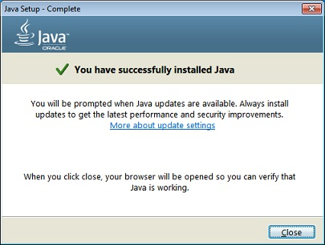

# 1. Installation

## 1.1 Qu'est-ce qu'un Java?
---
Plutôt nous devrions poser la question qu'est ce que Java? Java est un langage de programmation nécessitant un **compilateur** et un **environnement d'exécution**. Nous devons donc télécharger ces éléments avant de continuer. 

## 1.2 Comment installer Java?
---

La procédure d'installation de Java consiste à:
1. Télécharger et installer le logiciel nécessaire
2. Tester l'installation

En faisant des recherches sur internet, vous trouverez un grand nombre de sources qui expliquent cette procédure. Je vous dirige vers la documentation officielle qui explique les étapes mieux que quiconque.

https://java.com/en/download/help/windows_manual_download.xml