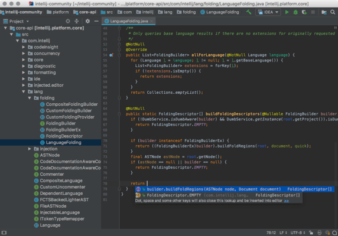

# 2. Installation IntelliJ
## 2.1. Quest-ce qu'un *IDE*?
---

Un environnement de développement (*IDE*) regroupe un ensemble d'outils facilitant le développement d'un programme. Le *IDE* regroupe un éditeur de texte et un gestionnaire de fichiers aux fonctionnalités permettant d'exécuter le programme.

Il existe plusieurs *IDE* spécifiquement conçus pour la programmation Java. Parmi les plus populaires, *IntelliJ community edition* peut être utilisé gratuitement et est l'outil recommandé pour ce projet. 

## 2.2. Comment installer IntelliJ?
---

Encore une fois la meilleure façon de télécharger et configurer un logiciel est de se référer à la documentation officielle.

https://java.com/en/download/help/windows_manual_download.xml