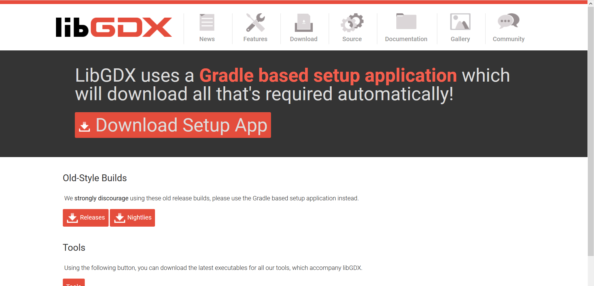
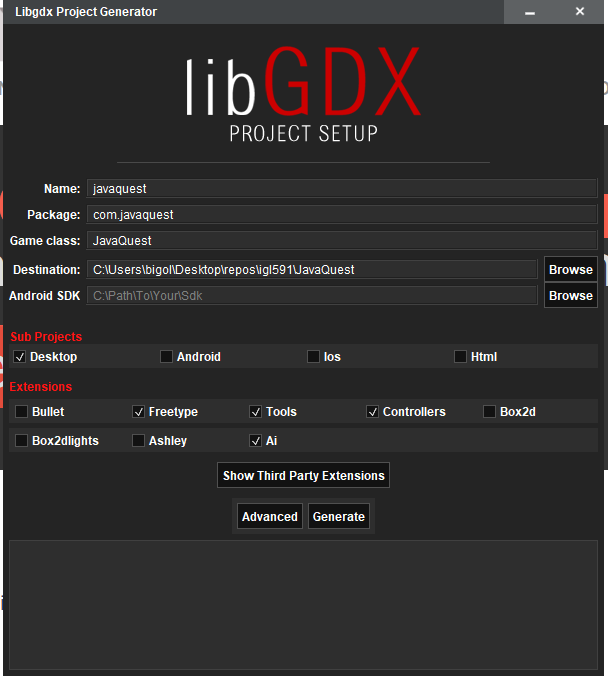
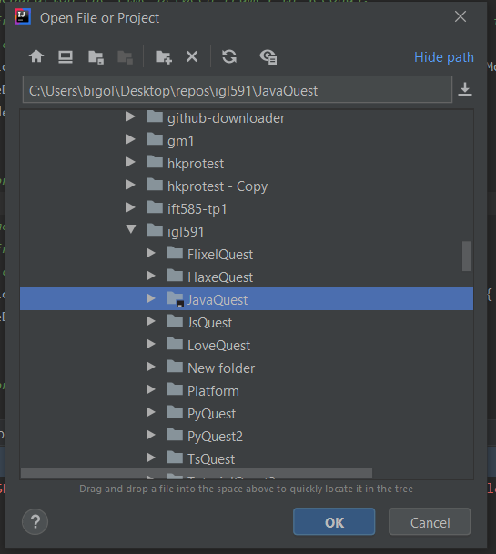
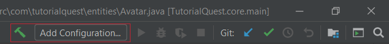
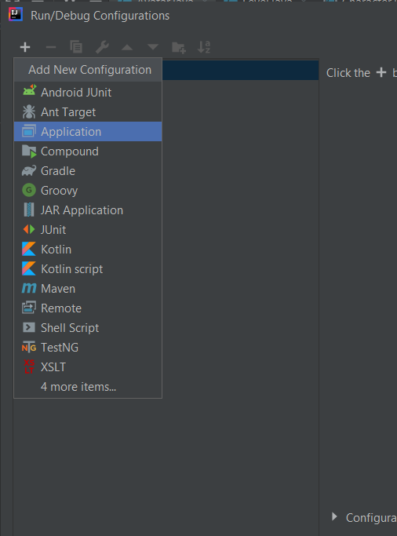
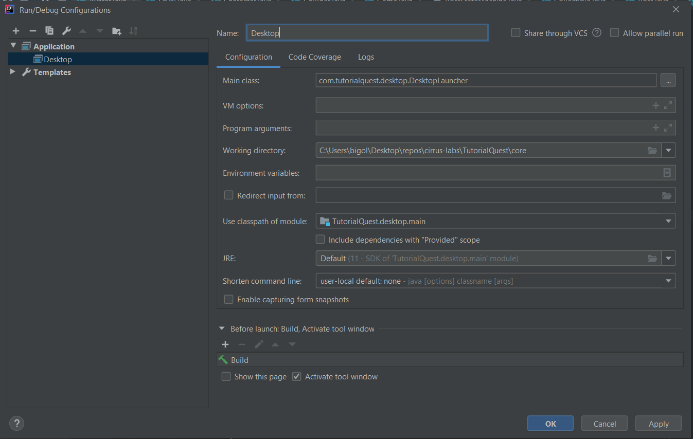
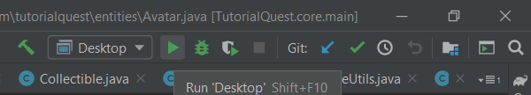
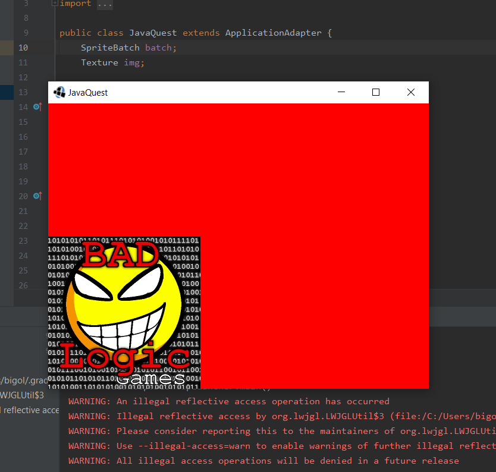

# 3. Installation de LibGDX

## 3.1 Quest-ce qu'une librairie?
---

Une **librairie** est une collection de modules déjà compilés utilisés pour accélérer le développement d'un programme.

*LibGDX* est une librairie gratuite, développé par la communauté,facilitant l'affichage de graphiques à l'écran.

## 3.2 Installation de LibGDX
---
> Téléchargez *LibGDX* ici https://libgdx.badlogicgames.com/download.html



> Utilisez le générateur de projet et remplissez les champs selon vos besoins. 



> À l'aide de *IntelliJ*, ouvrez le projet qui a été généré..



> Le fichier `JavaQuest.java` est le **point d'entrée** du programme

```java
/* JavaQuest.java */
package com.tutorialquest;

import com.badlogic.gdx.ApplicationAdapter;
import com.badlogic.gdx.Gdx;
import com.badlogic.gdx.Screen;
import com.badlogic.gdx.graphics.Color;

public class JavaQuest extends ApplicationAdapter {

    @Override
    public void create () {
        batch = new SpriteBatch();
    }

    @Override
    public void render () {
        Gdx.gl.glClearColor(1, 0, 0, 1);
        Gdx.gl.glClear(GL20.GL_COLOR_BUFFER_BIT);
    }
}
```

> Afin d'exécuter le programme, créez une nouvelle configuration...





> Modifiez les paramètres de lancements.




> Exécutez le programme en cliquant sur l'icône *play*






