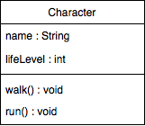
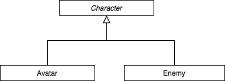

# 10. La programmation orientée objet

Jusqu'à présent, nous avons vu la programmation dite procédurale. C'est-à-dire que les différents éléments sont exécutés dans l'ordre, telle une procédure. Nous allons maintenant voir la **programmation orientée objet** (OOP) ; cette pratique amène une notion d'entité, elle permet de créer des **objets** qui ont chacun des **données** (variables) et des **traitements** (méthodes) spécifiques.

Une meilleure lisibilité, modularité et cohérence du programme est garantie avec la OOP. C'est en partie grâce au lien explicite qu'il existe désormais entre les données et traitements. La OOP repose sur quatre concepts principaux que nous allons voir ci-dessous :

1. l'encapsulation
2. l'abstraction
3. l'héritage
4. le polymorphisme

>  Une entité est, en programmation, une classe comportant des données et des traitements.

## 10.1 Encapsulation et abstraction
---
De manière générale, l'encapsulation et l'abstraction consistent à dissimuler certains détails d'implémentation à l'utilisateur. Il y a ainsi deux niveaux de perception d'un objet : 

1. le niveau externe : concerne le programmeur utilisateur, ce qu'il voit
   - le détail des méthodes lui sont par exemple caché puisqu'il n'a pas besoin de savoir comment fonctionne une méthode mais simplement ce qu'elle fait
2. le niveau interne : concerne le programmeur concepteur, ce qu'il développe
   - c'est lui qui se charge des détails d'implémentation, comment fonctionne une méthode par exemple

**Encapsulation** : c'est le fait de regrouper en une seule et même entité des données et des traitements. Les données sont désignées par le terme "**attribut**", et les traitements sont appelés "**méthode**". Le tout, c'est-à-dire l'entité est défini au sein d'une **classe**. Celle-ci représente un objet et devient alors un nouveau type évolué.

**Abstraction** : c'est le fait d'avoir une descritpion générique (abstraite) d'une entité qui comporte des caractéristiques communes (données et traitements). C'est-à-dire que deux mêmes entités contiennent les mêmes caractéristiques, ont accès aux mêmes actions.

Exemple : imaginons que nous voulons représenter l'entité "personnage". Avant de se lancer dans la définition de cette nouvelle classe, il est important de réfléchir aux quelles caractéristiques que comporte une personnage :

- il porte un nom (attribut)
- il a un niveau de vie (attribut)
- il peut marcher (méthode)
- il peut courir (méthode)
- ...



```java
class Character {
    // Attributs
    String name;
    int lifeLevel;

    // Méthodes
    void walk() {
        // ...
    }

    void run() {
        // ...
    }
}
```

## 10.2 Classes, attributs et méthodes
---

#### Classes

Comme nous l'avons déjà vu, une classe est un nouveau type de données évolué dont les instances sont des objets. 

- La déclaration se fait avec le mot-clé `class`
  - `class NomClass { ... }`
- La déclaration d'une variable du nouveau type peut se faire après que la classe ait été déclarée
  - `NomClass nomInstance;`

>  Une instance de classe est une variable dont le type est une classe. 
> 
> Rappel : étant donné que ce type est considéré comme évolué, l'instance stocke alors la référence à l'objet et non l'objet lui-même.

Comme pour les variables, l'initialisation d'une instance peut se faire en même temps que la déclaration ou dans un deuxième temps : 

```java
// Déclaration-initialisation
NomClasse nomInstance = new NomClasse(...);

// Déclaration, puis initialisation
NomClasse nomInstance;
nomInstance = new NomClasse(...);
```
>  Il est important de ne pas oublier le mot-clé `new`.

#### Attributs

La déclaration des attributs se fait de la même manière que celle des variables : `type nomAttribut;`

Une instance peut accéder aux valeurs des attributs assez simplement : `nomInstance.nomAttribut`

#### Méthodes

Les méthodes des classes sont déclarées de la même manière que les méthodes vues au module précédent. Elles comportent également un type de retour, un nom, une liste de paramètres et un corps. 

Ce sont les instances de classes qui vont pouvoir appeler et utiliser ces méthodes. Les paramètres passés en argument à la méthode peuvent alors être externe à la classe.

Un appel de méthode se fait à travers l'instance de classe, de façon similaire que l'accès à l'attribut : `nomInstance.nomMethode(argument1, argument2, ...);`

#### `public` et `private`

Nous avons vu qu'avec l'encapsulation et l'abstraction, nous avions différents niveaux de perception. Certains éléments sont dissimulés à l'utilisateur et gardé pour le concepteur, tandis que pour d'autres éléments, l'implémentation est accessible pour tout utilisateur.

Pour représenter ces niveaux interne et externe, il existe deux mots-clés : 
- `private` indique que l'implémentation de l'élément est *inaccessible* au programmeur utilisateur
  - de manière générale, tous les attributs sont privés ainsi que certains méthodes
- `public` indique que l'implémentation de l'élément est *visible* et que l'élément lui-même est *utilisable* par le programmeur utilisateur
  - de manière générale, seules quelques méthodes sont publiques

>  La bonne pratique est d'indiquer pour tout élément (classe, attribut et méthode) s'il est privé ou public. Sans spécification, l'élément aura le droit d'accès par défaut, c'est-à-dire visible, accessible et utilisable partout : `public`.

Du fait qu'un attribut soit `private`, on ne peut plus y accéder par l'instance avec `nomInstance.nomAttribut`. Il nous faut désormais ce qu'on appelle des getters et des setters pour chaque attribut privé qui en ont besoin.

- getter : méthode publique permettant d'accéder à l'attribut
- setter : méthode publique permettant de modifier l'attribut

>  La bonne pratique est d'implémenter des getters et setters pour les attributs privés plutôt que de mettre les attributs publics.
> 
>  Les getters et setters sont utiles uniquement si les attributs ont besoin d'être accessibles ou modifiables hors de la classe !

```java
/* Character.java */
// package ...

public class Character {
    // Attributs
    private String name;
    private int lifeLevel;

    // Getters et setters
    public String getName() {
        return this.name;
    }

    public void setName(String newName) {
        this.name = newName;
    }

    public int getLifeLevel() {
        return this.lifeLevel;
    }

    public void setLifeLevel(int newLifeLevel) {
        this.lifeLevel = newLifeLevel;
    }

    // Autres méthodes
    public walk() {
        // ...
    }

    public run() {
        // ...
    }
}
```

>  `this` désigne l'instance courante, c'est-à-dire un attribut de classe. La syntaxe sera toujours `this.attribut`. 
> 
> Ceci permet de distinguer l'attribut d'un paramètre de méthode qui pourrait porter le même nom. 

#### Constructeurs

Lorsque nous initialisons un objet, c'est-à-dire une instance de classe, nous utilisons en réalité le constructeur de l'objet qui permet d'initialiser les attributs également. 

Un constructeur est donc une méthode publique qui permet de créer un objet et d'initialiser les attributs de l'objet. Cette méthode possède alors un paramètre par attribut de classe.

Schéma du constructeur : 

```java
NomClasse (type1 param1, type2 param2, ...) {
    // Initialisation des attributs en utilisant les paramètres
    this.attribut1 = param1;
    this.attribut2 = param2;
    // ...
}
```

Exemple : 

```java
public class Character {
    // Attributs
    private String name;
    private int lifeLevel;

    // Constructeur
    Person(String name, int lifeLevel) {
        this.name = name;
        this.aglifeLevele = lifeLevel;
    }

    // ...
```

>  Le constructeur est une méthode spéciale : elle porte le même nom que la classe et n'a pas de type de retour.

Déclaration et initialisation d'un objet avec attributs :

```java
NomClasse nomInstance = new NomClasse(argument1, argument2, ...);
```

Déclaration et initialisation d'un objet sans attribut ou utilisant le constructeur par défaut :

```java
NomClasse nomInstance = new NomClasse();
```

Il existe deux constructeurs par défaut : 

1. le constructeur par défaut (explicite)
2. le constructeur par défaut par défaut

Le premier constructeur par défaut est celui qui ne demande aucun paramètre puisqu'il précise lui-même des valeurs par défaut à ces attributs. 

```java
public class Character {
    // Attributs
    private String name;
    private int lifeLevel;

    // Constructeur par défaut
    Person() {
        this.name = "Charlie";
        this.lifeLevel = 100;
    }

    // ...
```

Le second constructeur par défaut est celui que le compilateur génère automatiquement si aucun constructeur n'a été spécifié. Sa version est minimale et les attributs sont initialisés avec des valeurs par défaut.

- `0` pour les nombres entiers
- `0.0` pour les nombres décimaux
- `false` pour les booléens
- `null` pour les objets

```java
public class Character {
    // Attributs
    private String name;
    private int lifeLevel;

    // ...
```

---

### 10.3 Héritage

L'héritage permet une notion de spécialisation. Une super-classe contient des caractéristiques communes dont une sous-classe hérite si nous les lions par l'héritage. La sous-classe est alors une version spécialisée et enrichie de la super-classe.

Concrètement, cela signifie que la sous-classe hérite de tous les attributs et méthodes de la super-classe, à l'exception du constructeur. L'héritage se fait grâce au mot-clé `extends`.



```java
public class Character {
    // ...
}

public class Avatar extends Character {
    // ...
}

public class Enemy extends Character {
    // ...
}
```

La classe `Avatar` hérite des attributs et des méthodes de `Character`. Même si elle dispose des attributs de sa super-classe, elle n'y a pas directement accès, elle doit passer par les getters et setters.

**Spécialisation** : la redéfinition est le fait de redéfinir une méthode dans la sous-classe qui est héritée de la super-classe. Une sous-classe peut aussi se spécialiser en ayant ses propres attributs et méthodes.

**Constructeur** : bien qu'il y ait un constructeur dans la super-classe, chaque sous-classe doit avoir son propre constructeur. Cependant, les attributs hérités de la super-classe doivent être initialisés avec le constructeur de la super-classe. Cela se fait grâce au mot-clé `super`.

```java
/* Avatar.java */
// package ...

public class Avatar extends Character {
    private String strategy;

    public Avatar(String name, int lifeLevel, String strategy) {
        // Initialisation des attributs hérités
        super(name, lifeLevel);

        // Initialisation des attributs propres à Avatar
        this.strategy = strategy;
    }
}
```

>  On distingue alors la relation "est-un" de la relation "a-un".
>
> - "est-un" : un `Avatar` est un `Character` (HERITAGE)
> - "a-un" : un `Character` a un `name` (ATTRIBUT)

## 10.4 Polymorphisme
---

Le polymorphisme est étroitement lié à la notion d'héritage. Il permet qu'un même code puisse s'exécuter de façon différente selon l'entité à laquelle il s'applique.

Imaginons, par exemple, que notre super-classe `Character` possède la méthode `defend()`. Cette méthode doit être redéfinie dans chaque sous-classe car chaque type de personnage a sa propre manière de se défendre. Il est alors difficile pour `Character` de définir sa méthode `defend()`. La solution est d'abstraire cette méthode dans la super-classe avec le mot-clé `abstract`.

```java
/* Character.java */
// package ...
public class Character {
    // ...

    public abstract void defend();
}
```

Ainsi, à ce niveau-là, la méthode ne possède pas de corps et cela force toutes les sous-classes à la redéfinir.

>  Du moment qu'une classe possède une méthode abstraite, alors la classe elle-même devient abstraite. Cela signifie qu'il n'est pas possible d'avoir une instance de cette classe. Elle permet de définir des concepts génériques pour ses sous-classes.

```java
/* Character.java */
// package ...
public abstract class Character {
    // ...

    public abstract void defend();
}

// Ce n'est plus possible de faire :
// Character character;
```

Désormais, toute classe héritant de `Character` doit définir la méthode `defend()`. Sinon, la sous-classe sera elle-même abstraite et ne pourra pas être instanciée.