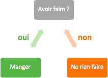
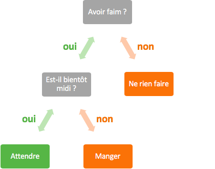

# 3. Les branchements conditionnels

On parle de branchement conditionnel lorsqu'à un moment donné on peut prendre un chemin ou l'autre selon une condition remplie ou non. 

On peut représenter cela avec la situation suivante : si j'ai faim, alors je mange, sinon je ne mange pas.



- La condition : avoir faim
- Si vrai : manger
- Si faux : ne rien faire

Prenons un exemple informatique : 

```java
/* FirstProgram.java */
// package ...
import java.util.Scanner;

class FirstProgram {
    public static void main(String[] args) {
        Scanner scan = new Scanner(System.in);
        System.out.println("Quel âge as-tu ? ");
        int age = scan.nextInt();

        // Partie intéressante
        if (age < 18) {
            System.out.println("Tu es mineur");
        } else {
            System.out.println("Tu es majeur");
        }
    }
}
```

Nous allons maintenant analyser la partie qui nous intéresse. 

- `if` est le mot clé qui permet de débuter un branchement conditionnel. Il est toujours suivi d'un espace et d'une paire de parenthèses qui contient la condition.
- Ici la condition est `n < 10`. Après celle-ci, on retrouve une accolade ouvrante, une instruction, puis une accolade fermante. Il peut y avoir plusieurs instructions entre les deux accolades `{...}`.
- Après la première partie `if`, on peut retrouver le mot-clé `else`. Entre les accolades le suivant, il y a alors les instructions à exécuter lorsque la condition initiale n'est pas valide. Cette deuxième partie n'est pas obligatoire.
  - Si on reprend notre premier exemple, on peut simplement dire "si j'ai faim, alors je mange", sans préciser le "sinon je ne mange pas".

Schéma : 

````java
if (condition) {
    // Instruction(s) A à exécuter si la condition est vraie
} else {
    // Instruction(s) B à exécuter si la condition est fausse
}
````

>  Il n'y a pas de `;` après la condition !

Comment le programme agit-il ?

1. La condition est évaluée
2. Si la condition est vraie
   - Alors les instructions A sont lues et exécutées, puis le branchement se termine sans même passer par le `else`
3. Si la condition est fausse
   - Alors les instructions A ne sont même pas lues, le programme va directement lire les instructions B et les exécuter


## 3.1 Choix imbriqués
---

On vient de voir le schéma que suit l'instruction `if` et que ce sont les accolades qui délimitent un bloc d'instructions. Celles-ci peuvent contenir toutes sortes d'éléments, y compris d'autres instructions `if`.



````java
if (condition1) {
    if (condition2) {
        // Instructions
    } else {
        // Instructions
    }
} else {
    if (condition3) {
        // Instructions
    } else {
        if (condition4) {
            // Instructions
        } else {
            // Instructions
        }
    }
}
````

>  Il ne faut pas abuser de cette solution, à partir de 3 niveaux, le code devient illisible ! 


## 3.2 Conditions
---
Une condition dite simple compare deux expressions à l'aide d'**opérateurs de comparaison** : 

| Opérateur de comparaison | Signification |
| :---: | :---: |
| `<` | inférieur à |
| `>` | supérieur à |
| `==` | égal à |
| `<=` | inférieur ou égal à |
| `>=` | supérieur ou égal à |
| `!=` | différent de |

>  Il ne faut pas confondre le simple `=` du double `==`
> - `=` représente l'affectation d'une variable
> - `==` représente l'opérateur  qui teste si deux valeurs sont égales

````java
/* FirstProgram.java */
// package ...
import java.util.Scanner;

class FirstProgram {
    public static void main(String[] args) {
        Scanner scan = new Scanner(System.in);
        System.out.println("Quel âge as-tu ? ");
        int age = scan.nextInt();

        // Partie intéressante
        if (age < 0) {
            System.out.println("On ne peut pas avoir un âge négatif !");
        }
    }
}
````

Il existe aussi des **opérateurs logiques** qui permettent de relier des conditions simples entre elles.

| Opérateur logique | Signification |  |
| :---: | :---: | --- |
| `&&` | ET | les deux conditions doivent être vraies |
| `||` | OU | au moins une des deux conditions doit être vraie |
| `!` | NON | la condition doit être fausse vu que c'est le contraire qui est retourné |

1. Table de vérité pour l'opérateur ET logique : `&&`

    | C1 \ C2 | VRAI | FAUX
    | --- | :---: | :---: |
    | **VRAI** | V | F |
    | **FAUX** | F | F |

2. Table de vérité pour l'opérateur OU logique : `||`
   
    | C1 \ C2 | VRAI | FAUX
    | --- | :---: | :---: |
    | **VRAI** | V | V |
    | **FAUX** | V | F |

**C1** est la condition 1, sur la colonne de gauche, et **C2** est la condition 2 sur la première ligne.

Exemple avec un ET logique : 

````java
/* FirstProgram.java */
// package ...
import java.util.Scanner;

class FirstProgram {
    public static void main(String[] args) {
        Scanner scan = new Scanner(System.in);
        System.out.println("Quel âge as-tu ? ");
        int age = scan.nextInt();

        // Partie intéressante
        if ((age > 0) && (age < 18)) {
            System.out.println("Tu es mineur");
        } else {
            if (age >= 18) {
                System.out.println("Tu es majeur");
            } else {
                System.out.println("On ne peut pas avoir un âge négatif !");
            }
        }
    }
}
````

Si la première condition (`age > 0`) est fausse, alors la deuxième ne sera même pas évaluée et le tout sera considéré comme faux.<br>
Si la première condition est vraie, alors la deuxième est aussi évaluée. Si cette dernière est vraie, les instructions du `if` seront exécutées, sinon ce sont les instructions du `else` qui seront exécutées.

Exemple avec un OU logique : 

````java
/* FirstProgram.java */
// package ...
import java.util.Scanner;

class FirstProgram {
    public static void main(String[] args) {
        Scanner scan = new Scanner(System.in);
        System.out.println("Quel âge as-tu ? ");
        int age = scan.nextInt();

        // Partie intéressante
        if ((age < 0) || (age > 100)) {
            System.out.println("Age incohérent");
        }
    }
}
````

Si la première condition (`age < 0`) est vraie, alors la deuxième n'a pas besoin d'être évaluée, le tout est considéré comme vrai.
Si la première condition est fausse, alors la deuxième est évaluée. C'est le résultat de la deuxième condition (`age > 100`) qui définit si le tout est considéré comme vrai ou faux.

Exemple avec un NON logique : 

````java
/* FirstProgram.java */
// package ...
import java.util.Scanner;

class FirstProgram {
    public static void main(String[] args) {
        Scanner scan = new Scanner(System.in);
        System.out.println("Quel âge as-tu ? ");
        int age = scan.nextInt();

        // Partie intéressante
        if (!(age < 0)) {
            System.out.println("Age cohérent");
        }
    }
}
````

Il faut voir l'opérateur logique `!` comme "ne pas". Avec notre exemple, le texte "Age cohérent" est affiché si l'âge donné n'est pas négatif (< 0). 


## 3.3 Type booléen
---

Il existe un type qui permet les valeurs "vrai" et "faux". On dit que c'est le type des conditions, il permet donc de déclarer des variables contenant la valeur d'une condition. Une variable ayant ce type dit booléen est simplement appelé un "**booléen**".

Un booléen ne peut prendre que deux valeurs possibles : `true` pour vrai, `false` pour faux.

Exemple :
````java
/* FirstProgram.java */
// package ...
class FirstProgram {
    public static void main(String[] args) {
        int age = 26;
        boolean condition1 = (age > 0) && (age < 18); // condition1 vaut false
        boolean condition2 = (age < 0) || (age > 100); // condition2 vaut false
        boolean condition3 = !(age < 0); // condition3 vaut true
    }
}
````

Les booléens sont fréquemment utilisés pour les conditions des branchements conditionnels.

````java
/* FirstProgram.java */
// package ...
import java.util.Scanner;

class FirstProgram {
    public static void main(String[] args) {
        Scanner scan = new Scanner(System.in);
        System.out.println("Quel âge as-tu ? ");
        int age = scan.nextInt();
        boolean major;

        if (age >= 18) {
            major = true;
        } else {
            major = false;
        }

        if (major) {
            System.out.println("Tu es majeur");
        }
    }
} 
````