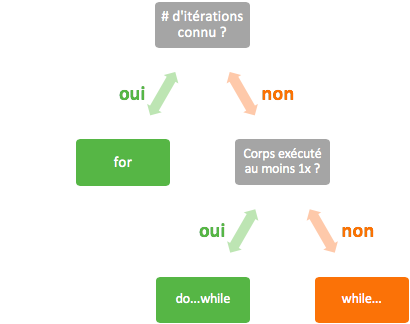

# 5. Les boucles conditionnelles

La boucle conditionnelle, tout comme l'itération, permet de répéter une série d'instructions. La différence avec la boucle `for` que l'on a vu au module précédent, c'est qu'on ne connaît pas à l'avance le nombre de répétition. C'est pourquoi, on utilisons une condition d'exécution sur la boucle et dès que la condition n'est plus valable, alors on sort de la boucle et on passe à la suite.

## 5.1 Instruction `do...while`
---
*Boucle "fait...tant que"*

Schéma : 
````java
do {
    instructions;
} while (condition);
````

Si on regarde plus attentivement la boucle :

- le mot-clé `do` annonce le début de la boucle
- entre accolades, il y a le corps de la boucle, c'est-à-dire les instructions ; elles sont exécutées **au moins une fois**
- le mot-clé `while` annonce la condition
- la condition entre parenthèses et suivie d'un `;` ; elle est évaluée **après** chaque exécution du corps de la boucle
  - si elle retourne `true`, alors le corps de la boucle est exécuté une nouvelle fois
  - si elle retourne `false`, alors on sort de la boucle et le programme passe à la suite

>  Il ne faut pas oublier le `;` après la parenthèse fermante de la condition.
> 
> Et comme pour l'itération, si la condition ne devient jamais fausse, alors on a une boucle infinie !

Exemple :

````java
/* FirstProgram.java */
// package ...
class FirstProgram {
    public static void main(String[] args) {
        int i = 1;
        do {
            System.out.println("Hello World");
        } while (i < 0);
    }
}
````

`Hello World` n'est affiché qu'une seule fois puisque la condition `i < 0` retourne `false`.

## 5.2 Instruction `while...`
---
*Boucle "tant que..."*

Schéma : 

````java
while (condition) {
    instructions;
}
````

Fondamentalement, les boucles `do...while` et `while...` font la même chose à une différence près : cette dernière va évaluée la condition avant d'exécuter les instructions constituant le corps de la boucle. Si à la première évaluation, la condition retourne `false`, alors les instructions de la boucle ne seront même pas exécutées une seule fois. 

La condition est donc évaluée **avant** l'exécution du corps de la boucle.

>  Il n'y a pas de `;` contrairement à la première boucle, par contre, il faut toujours faire attention à ne pas mettre une condition qui sera toujours évaluée à `true`.

Exemple : 

````java
/* FirstProgram.java */
// package ...
class FirstProgram {
    public static void main(String[] args) {
        int i = 1;
        while (i < 0) {
            System.out.println("Hello World");
        }
    }
}
````

`Hello World` n'est pas affiché du tout puisque la condition `i < 0` retourne `false`.

## 5.3 Quelle boucle utilisés ?
---


Si le nombre d'itérations est connu d'avance, on utilisera plutôt une boucle `for`. Si on ne connaît pas le nombre de répétition, mais qu'on veut exécuter au moins une fois le corps de la boucle, alors on utiliser une boucle `do...while`, sinon ce sera une boucle `while`.

## 5.4 Comment trouver la condition ?
---
La boucle sera répétée tant que la condition est vraie. 

Par exemple, si l'on veut connaître l'âge de quelqu'un, on va lui demande tant qu'il nous donne un âge incorrect. Un âge est incorrect s'il est négatif (`age <= 0`) ou s'il est suppérieur à 100 (`age > 100`).

````java
/* FirstProgram.java */
// package ...
import java.util.Scanner;

class FirstProgram {
    public static void main(String[] args) {
        Scanner scan = new Scanner(System.in);
        System.out.println("Quel âge as-tu ?");
        int age = scan.nextInt();
        while (age <= 0 || age > 100) {
            System.out.println("Ce n'est pas cohérent !");
            System.out.println("Quel âge as-tu ?");
            age = scan.nextInt();
        }
    }
}
````

Exemple d'un jeu à devinette : admettons que l'utilisateur doive trouver un nombre entre 1 et 10 en 3 essais maximum. On détermine par simplicité que le nombre à deviner est 5.

Nous avons ici deux conditions :

1. le nombre donné par l'utilisateur doit être différent du nombre à deviner pour que la boucle se répète
2. le nombre d'essai de l'utilisateur doit être inférieur à 3 pour que la boucle se répète

````java
/* FirstProgram.java */
// package ...
import java.util.Scanner;

class FirstProgram {
    public static void main(String[] args) {
        Scanner scan = new Scanner(System.in);
        int numberToGuess = 5;
        int numberOfTrials = 0;
        int givenNumber;
        
        System.out.println("Jeu de la devinette !");

        do {
            System.out.println("Devine un nombre entre 1 et 10 : ");
            givenNumber = scan.nextInt();
            ++numberOfTrials;
        } while (givenNumber != numberToGuess && numberOfTrials < 3);

        if (givenNumber == numberToGuess) {
            System.out.println("Gagné");
        } else {
            System.out.println("Perdu, le nombre était : " + numberToGuess);
        }
    }
}
````

Après la boucle conditionnelle, nous avons mis un branchement conditionnel qui dit à l'utilisateur s'il a gagné et, le cas échéant, quel nombre était à deviner s'il a perdu.