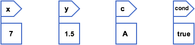
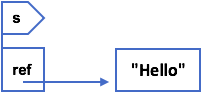

# 7. Les types de données

Jusqu'à présent, nous avons vu 4 types de données différents : 

- `int` pour les nombres entiers
- `double` pour les nombres décimaux
- `char` pour les caractères
- `boolean` pour vrai/faux

Ces types-là permettent de représenter des concepts symboles comme des dimensions, des résultats mathématiques, des âges, des expressions logiques, des conditions, etc. Cependant, il existe des données plus complexes qu'une variable doit pouvoir contenir : on parle de **données structurées**.

Exemples : 

- chaînes de caractères, ex. un prénom
- structures de données hétérogènes, ex. plusieurs données de types différents
- tableaux ou liste, ex. les notes d'un bulletin scolaire

## 7.1 Types de base
---

On parle de type de base, ou type élémentaire, lorsque la variable stocke directement une valeur.

````java
int x = 7;
double y = 1.5;
char c = 'A';
boolean cond = true;
````



>  Astuce pour s'en souvenir : les mot-clés pour désigner un type de base comme toujours par une minuscule.

## 7.2 Types évolués
---
Contrairement aux types élémentaires, la variable ne va pas directement stocker la valeur, mais la **référence** (adresse) vers la valeur.

Exemples de types élémentaires fréquemment utilisés : 

- `String` pour les chaînes de caractères
- `ArrayList` pour les listes dynamiques

Nous verrons ces types en détail par la suite.

>  Quelle est la différence entre `char` et `String` ?
> 
> `char` permet de stocker un seul caractère, tandis que `String` permet de stocker une chaîne de caractères, c'est-à-dire plusieurs caractères dans une seule variable.

````java
String s = "Hello";
````



>  Astuce pour s'en souvenir : les mot-clés pour désigner un type évolué comme toujours par une majuscule.

>  Stocker une référence plutôt qu'une valeur a une influence sur l'utilisation et la signification des variables.
> 
> Alors que `int x = 7;` affecte la valeur de `7` à `x`, <br>
> `String s = "Hello";` affecte la référence à `"Hello"` à `s`.
> 
> Il faut également faire attention aux opérateurs `=` et `==` : <br>
> `s1 = s2` affecte la référence de `s2` à `s1`, <br>
> tandis que `s1 == s2` compare les références de `s1` et `s2`.