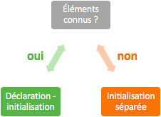
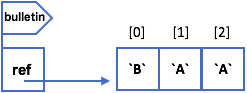
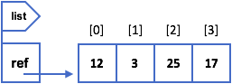
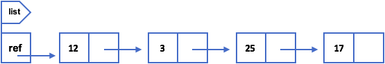

# 8. Les structures de données

Les structures de données que nous allons voir sont des collections de valeurs **homogènes**, c'est-à-dire des valeurs de mêmes types. On utilise une collection lorsqu'on veut stocker plusieurs variables de même type, exemple : un bulletin de notes.

En Java, il existe différentes collections. Pour savoir laquelle utiliser, il faut se poser des questions concernant sa taille :

| | taille initiale inconnue | taille initiale connue |
| --- | --- | --- |
| **taille peut varier** | `ArrayList` / `LinkedList` | `ArrayList` / `LinkedList` |
| **taille ne peut pas varier**| *tableau de taille fixe* | *tableau de taille fixe* |


## 8.1 Tableaux de taille fixe
---
La taille de ce type de tableau n'a pas besoin d'être déterminée à la création du tableau. Par contre, une fois choisie, elle ne peut plus changer !

Il y a deux manières d'initialiser un tableau de taille fixe. Celle que nous allons choisir dépend de si l'on connaît la valeurs de chacun des éléments à stocker au moment de la déclaration du tableau.



#### Déclaration-initialisation

Dans ce cas, nous connaissons toutes les valeurs des éléments de notre tableau.

1. Déclarer le type du tableau
2. Indiquer les éléments entre accolades
3. Séparer les éléments par des virgules

```java
char[] bulletin = {'B', 'A', 'A'};
```

#### Déclaration, puis initialisation

Dans ce cas, comme dans la majorité des situations, on ne connaît pas les valeurs des éléments de notre tableau. On va alors déclarer notre tableau en lui indiquant sa taille, c'est-à-dire le nombre d'éléments qu'il pourra contenir, puis on pourra remplir le tableau.

1. Déclarer le type du tableau
2. Constuire le tableau en lui indiquant sa taille <br>
   `new type[taille]`
3. Remplir le tableau élément par élément

Etape 1 & 2 :

```java
char[] bulletin = new char[3]; // déclaration-construction
// OU
char[] bulletin;               // déclaration
bulletin = new char[3];        // construction
```

Etape 3 :

```java
bulletin[0] = `B`;
bulletin[1] = `A`;
bulletin[2] = `A`;
```



Nous pouvons voir sur la figure ci-dessus que chaque case du tableau possède un index. Peu importe le type que contient le tableau, les index seront de type `int` et commenceront toujours de `0`.

>  Pour un tableau de taille `n`, les index vont de `0` à `n-1`.

C'est d'ailleurs grâce aux index que nous remplissons le tableau (voir l'exemple de code de l'étape 3 ci-dessus).

>  Même si un tableau contient des éléments dont le type est élémentaire, le tableau lui-même reste un type évolué ! Ce qui est stocké dans la variable du tableau est une référence au tableau.

#### À savoir

```java
int[] tab = [1, 2, 3];
```

- Accès au i+1e élément de `tab` : `tab[i]`
  - Accès au 2e élément : `tab[1]`
- Taille de `tab` : `tab.length`
- Itération sur un tableau
  - `for(int i = 0; i < tab.length; ++i)`
  - `for(int element : tab)`


## 8.2 `ArrayList`
---
Une liste dynamique est collection de données homogènes dont le nombre d'éléments peut changer au cours du déroulement du programme, exemple : ajout ou retrait d'un élément de la liste.

Le mot-clé réservé par Java pour ce type de données est `ArrayList`. Et pour pouvoir utiliser ce type de données, il faut importer la classe `ArrayList` au tout début de notre fichier : `import java.util.ArrayList;`

```java
// Déclaration-initialisation
ArrayList<type> identificateur = new ArrayList<type>();

// Déclaration, puis initialisation
ArrayList<type> identificateur;
identificateur = new ArrayList<type>();
```

>  Le type des éléments doit obligatoirement être un type évolué, exemple : `ArrayList<String> list = new ArrayList<String>();`

Il existe une série de méthodes qui permettent d'agir sur une liste de type `ArrayList`. Ces méthodes sont définies dans la classe `ArrayList` et sont à disposition de toute collection de ce type. 

| Méthode | Description |
| --- | --- |
| `list.size()` | renvoie la taille de la liste, retourne un `int` |
| `list.get(i)` | renvoie l'élément de la liste dont l'index est `i`* |
| `list.set(i, value)` | affecte `value` à la `i`* de la liste |
| `list.isEmpty()` | détermine si `list` est vide ou non, retourne un `boolean` |
| `list.clear()` | supprime tous les éléments de `list` |
| `list.remove(i)` | supprime l'élément dont l'index est `i`* |
| `list.add(value)` | ajoute l'élément `value` à la fin de `list`, c'est-à-dire la première case vide |

*`i` est compris entre `0` et `list.size()-1`

**Comparaison d'éléments** : la comparaison ne se fait pas avec l'opérateur `==` mais à l'aide d'une méthode. Comme `ArrayList` est un type évolué, la variable stocke la référence, pas la liste elle-même.

```java
list.add("Hello"); // list.get(0) contient "Hello"
list.add("Hello"); // list.get(1) contient "Hello"

list.get(0) == list.get(1); // retourne false
(list.get(0)).equals(list.get(1)) // retourne true
```




## 8.3 `LinkedList`
---
Tout comme `ArrayList`, `LinkedList` est collection de données homogènes dont le nombre d'éléments peut changer au cours du déroulement du programme.

Sa structure est cependant un peu plus complexe. Chaque élément stocke deux informations : sa valeur et la référence (adresse) de l'élément suivant.



Nous vous épargnons les détails techniques pour l'instant, néanmoins, il est pertinent de savoir que les `LinkedList` peuvent être plus performantes et donc plus utilisées que les `ArrayList`. Nous verrons plus tard quand utiliser une `ArrayList` plutôt qu'une `LinkedList`, et inversément.