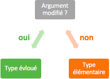
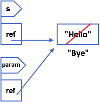

# 9. Les méthodes

Les méthodes regroupent une suite d'instructions, dans un bloc, qui est **réutilisable** à plusieurs endroits dans un programme. Chaque méthode décrit le comportement d'une fonctionnalité, on parle également de fonction, et une méthode peut appeler une autre méthode dans son corps.

>  Si dans ton programme, tu te retrouves à vouloir dupliquer du code, alors c'est certainement qu'une méthode serait adéquate. Pour rappel, il est important de ne pas faire de copier-coller !

Une méthode est donc une portion de programme réutilisable. Elle comporte 4 caractéristiques importantes : 

1. un **corps** : portion de programme réutilisable ou importante qui nécessaire la création d'une méthode
2. un **nom** : comme l'identificateur d'une variable, le nom d'une méthode permet de la référencer
3. des **paramètres** typés : ensemble de variables, qu'on appelle *arguments*, qui sont extérieures à la méthode et que son corps utilise 
   - les *entrées*
4. un **type** : certaines méthodes peuvent retourner une valeur de retour au reste du programme, dans ce cas, la valeur de retour doit correspondre au type de la méthode
   - les *sorties* 

```java
type nom(type1, paramètre1, type2, paramètre2, ...) {
    corps
    return valeur de retour
}
```

Une fois que la méthode est clairement définie, il est possible de l'appeler à tout moment dans le programme. Son appel et son exécution suit un ordre précis : 

1. les expressions passées en arguments sont évaluées
2. les valeurs correspondantes sont affectées aux paramètres
3. le corps de la méthode est exécuté
4. l'expression de la valeur de retour est évaluée
5. la valeur de retour est retournée comme réponse à l'appel de la méthode

>  On sort de la méthode lorsqu'on rencontre un `return` qui indique l'expression de la valeur de retour. Si une méthode contient plusieurs `return` (ça peut être le cas avec une branchement conditionnel `if`), alors la méthode "s'arrête" au premier `return rencontré`.
> 
>  La valeur de retour doit être de même type que la méthode, sinon une erreur sera générée et le programme s'arrête.

Exemple : 

```java
int sum(int x, int y) {
    return x + y;
}

// ...

int z = sum(3, 5); // sum(3, 5) retourne 8, z vaut donc 8
```

>  Il existe le type `void` uniquement pour les méthodes qui n'ont pas de valeur de retour (pas de `return` dans le corps de la méthode).

## 9.1 Passage des arguments
---
Nous avons vu qu'il y avait des types élémentaires ainsi que des types évolués, et que chaque argument de méthode est typé. Est-ce que l'argument passé à la méthode en paramètre peut être modifié au sein de la méthode ?



| | Type élémentaire | Type évolué |
| --- | --- | --- |
| **Argument modifié ?** | non ; passage par valeur | oui ; passage par référence |

Lorsqu'une argument est passé en paramètre, il s'agit en fait de copier la valeur d'une variable ou d'une expression. Si on reprend l'exemple ci-dessus, lorsque le programme lit `sum(3, 5)`, il va copier la valeur de `3` et l'affecter à `x`, de même pour y qui va recevoir la valeur copiée de `5`. 

C'est pourquoi, dans le cas d'un argument de type élémentaire, la valeur de la variable initiale ne peut pas être modifiée, vu qu'une copie de sa valeur est fait.

Par contre, dans le cas d'un argument de type évolué, la situation est différente. Rappelle-toi qu'une variable de ce type ne contient pas directement la valeur mais une référence (adresse) à la valeur. C'est donc la référence qui sera copiée et affectée au paramètre.

Exemple : 

```java
String test(String param) {
    param = "Bye";
    // ...
}

// ...

String s2 = test(s); // s est passé en argument
```



Déroulement de cet exemple : 

1. la référence de `s` pointe vers `"Hello"`
2. lorsque que la méthode `test` est appelée et `s` est passé en argument, sa référence est alors copiée et affectée à `param`
3. la référence de `param` pointe également vers `"Hello"`
4. dans le corps de la méthode, `param` modifie son contenu par `"Bye"`
5. cette modification affecte aussi `s` puisque que `s` et `param` pointent les deux vers la même case mémoire

## 9.2 Comment construire sa méthode
---

Pour définir efficacement une méthode, voici une marche à suivre : 

1. réfléchir à ce que fait la méthode et trouver un nom en fonction de son rôle 
2. quels arguments la méthode nécessitent pour ce qu'elle a à faire
3. que va retourner la méthode 
4. et finalement, comment fonctionne la méthode et dans quel ordre