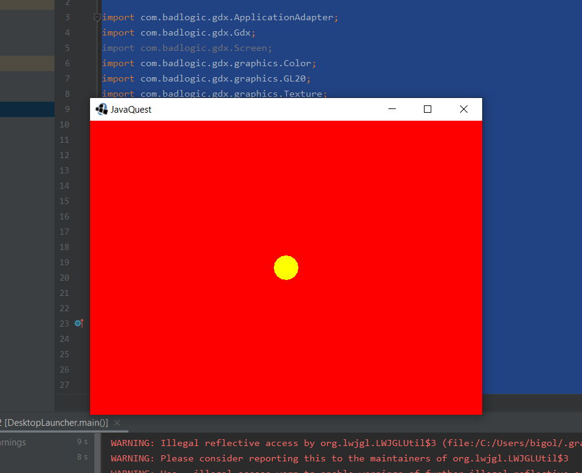

## 0.1 Le point d'entrée *LibGDX*
---
Similairement au point d'entrée `FirstProgram`, le fichier `JavaQuest.java` est le **point d'entrée** du programme que nous développons avec *LibGDX*.

```java
/* JavaQuest.java */
package com.tutorialquest;

import com.badlogic.gdx.ApplicationAdapter;
import com.badlogic.gdx.Gdx;
import com.badlogic.gdx.Screen;
import com.badlogic.gdx.graphics.Color;

public class JavaQuest extends ApplicationAdapter {

    @Override
    public void create () {
    }
}
```

Un programme LibGDX contient deux méthodes principales.

* La méthode `create` est exécutée au commencement de l'application et sert à initialiser des valeurs.

* La méthode `render` est exécutée 60 fois par seconde et sert à mettre à jour les dessins à l'écran.

## 0.2 Introduction à la programmation LibGDX
---
Afin de dessiner un cercle à l'écran, modifiez le point d'entrée.



```java
/* JavaQuest.java */
package com.tutorialquest;
// import ...

// AJOUT: Importez la classe `ShapeRenderer`
import com.badlogic.gdx.graphics.glutils.ShapeRenderer;

public class JavaQuest extends ApplicationAdapter {
    SpriteBatch batch;
    Texture img;

    // AJOUT:
    // Déclarez la variable
    private ShapeRenderer shapeRenderer;

    @Override
    public void create () {
        batch = new SpriteBatch();

        // AJOUT:
        // Initializez la variable
        shapeRenderer = new ShapeRenderer();
    }

    @Override
    public void render () {
        Gdx.gl.glClearColor(1, 0, 0, 1);
        Gdx.gl.glClear(GL20.GL_COLOR_BUFFER_BIT);

        // AJOUT:
        // Dessinez un cercle à l'écran
        shapeRenderer.begin(ShapeRenderer.ShapeType.Filled);
        shapeRenderer.setColor(Color.YELLOW);
        shapeRenderer.circle(
                Gdx.graphics.getWidth()/2,
                Gdx.graphics.getHeight()/2,
                20);
        shapeRenderer.end();
    }
}
```