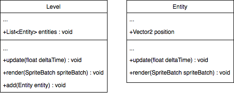
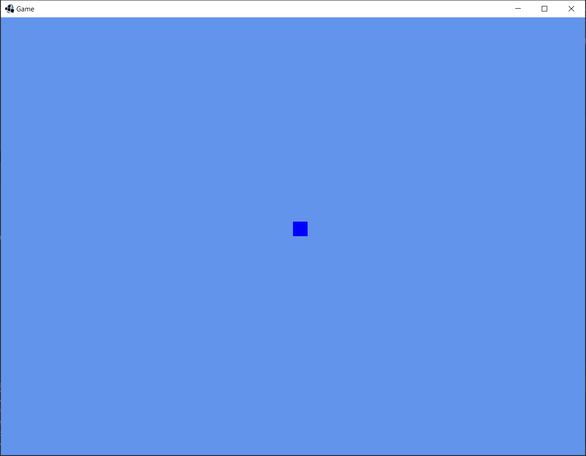
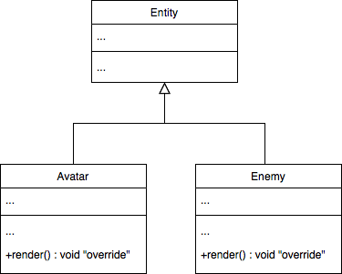

# 1. Représentation du monde
> | Téléchargement fichiers référence |
> | ------------- |:-------------:|
> | <a href="" download>desktop.zip</a> |
> | <a href="" download>core.src.zip</a> |
> | <a href="" download>core.assets.zip</a> |

## 1.1. Les entités et le monde
---
Comme nous l'avons vue, en programmation orientée objet, la déclaration d'une classe regroupe des attributs et des méthodes à un ensemble d'objets. Ainsi, en spécifiant les comportements et les attributs associés à une classe il est possible de coïncider la représentation du programme avec la représentation du monde réel ce qui facilite la compréhension.

Lorsqu'il s'agit d'une application de jeu vidéo, il est donc avantageux de représenter le monde à l'aide d'une hiérarchie de classes reflétant les différentes composantes de notre monde virtuel. À cet effet nous utilisons dans ce projet la classe `Level` et `Entity`



L'objectif principal de `Level` est de contenir les différentes entités ainsi que d'assurer leurs affichages à l'écran conformément aux requêtes d'un utilisateur ou aux modifications apportées par un sous-système de notre jeu. Par exemple un acteur intelligent comme un ennemi.

Il doit être possible de retirer une entité de la scène (e.g. retirer un ennemi qui à été vaincu) ou d'ajouter une entité (e.g. ajouter une récompense que le joueur pourra récupérer).

---
> ### Étapes à suivre
> 1. Créez la classe `Level`
> 2. Ajoutez un attribut `entities` de type `LinkedList<Entity>`
> 3. Spécifiez une méthode `add` pour ajouter un objet dans le monde
> 4. Spécifiez une méthode `remove` pour retirer un objet du monde
> 5. Spécifiez une méthode `update` pour la mise-à-jour.
> 6. Spécifiez une méthode `render` pour l'affichage

```java
/* Level.java */
package com.tutorialquest;
// import ...

public class Level {
    
    public List<Entity> entities = new ArrayList<Entity>();
    
    public Avatar avatar;

    public Level() {}

    public void add(Entity entity) {
        entities.add(entity);
        entity.start();
    }

    public void remove(Entity entity) {
        entities.remove(entity);
        entity.dispose();
    }

    public void dispose() {
        for (Entity ent : entities) {
            ent.dispose();
        }
    }

    public void update(float deltaTime) {
        for (Entity ent : entities) {
            ent.update(deltaTime);
        }
    }

    public void render(SpriteBatch batch) {
        for (Entity ent : entities) {
            ent.render(batch);
        }
    }
}


```
---
Afin de parvenir à l'affichage, il est nécessaire que les entités possèdent une position dans le niveau ainsi qu'une méthode par laquelle nous spécifierons les détails de l'affichage. Par exemple pour certains objets il sera suffisant de dessiner qu'un simple carré tandis que pour d'autres nous désirons plutôt afficher un personnage.

> ### Étapes à suivre
> 1. créez la classe `Entity`
> 2. ajoutez un attribut `position` de type `Vector2`
> 3. spécifiez une méthode `render` pour l'affichage

```java
/* Entity.java */
package com.tutorialquest.entities;
// import ...
public class Entity {

    public static final int WIDTH = 32;
    public static final int HEIGHT = 32;

    protected ShapeRenderer renderer = new ShapeRenderer();
    public Vector2 position = new Vector2();

    public Entity(Vector2 position) {
        this.position = position;
    }

    public void start() {

    }

    public void dispose() {
    }


    public void update(float deltaTime) {
    }

    public void render(SpriteBatch spriteBatch) {
        super.render(spriteBatch);
        renderer.setProjectionMatrix(Game.camera.combined);
        renderer.begin(ShapeRenderer.ShapeType.Filled);
        renderer.setColor(Color.BLUE);
        renderer.rect(
            position.x,
            position.y,
            WIDTH,
            HEIGHT);
        renderer.end();
    }
}

```

Pour mettre en œuvre nos entités, il est nécessaire d'ajouter de nouvelles instances au niveau.

```java 
/* Game.java */
package com.tutorialquest;
// import ...
public class Game extends ApplicationAdapter {

    public static final int VIEWPORT_WIDTH = 640 * 2;
    public static final int VIEWPORT_HEIGHT = 480 * 2;
    public static final Color CORNFLOWER_BLUE = new Color(0.39f, 0.58f, 0.92f, 1);

    public static OrthographicCamera camera;
    private SpriteBatch spriteBatch;
    public static Level level;

    @Override
    public void create() {
        Gdx.graphics.setWindowedMode(VIEWPORT_WIDTH, VIEWPORT_HEIGHT);
        camera = new OrthographicCamera(VIEWPORT_WIDTH, VIEWPORT_HEIGHT);
        camera.zoom = 0.25f;
        spriteBatch = new SpriteBatch();
        level = new Level();
        level.add(level.avatar = new Avatar(new Vector2()));
    }

    @Override
    public void render() {
        GLUtils.glClearColor(CORNFLOWER_BLUE);
        Gdx.gl.glClear(GL20.GL_COLOR_BUFFER_BIT);
        level.update(Gdx.graphics.getDeltaTime());
        camera.position.set(Game.level.avatar.position, 0);
        camera.update();

        spriteBatch.setProjectionMatrix(camera.combined);
        level.render(spriteBatch);
    }
}
```


---
> ### Activité
> Il est utile de dériver nos entités afin d'arriver à un comportement plus spécifique.

> 1. créez une classe `Avatar` qui dérive la classe `Entity` afin de représenter le personnage du joueur de manière à le distinguer des autres personnages.
> 2. créez une classe `Enemy` qui représente un acteur opposant le joueur.
> 3. ajoutez un ennemi et l'avatar à des endroits différents.


