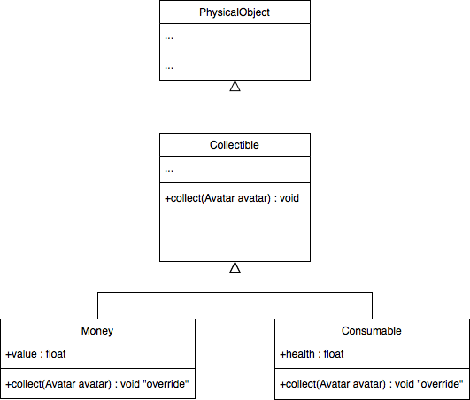

# 10.1 Trésors
> | Téléchargement fichiers référence |
> | ------------- |:-------------:|
> | <a href="" download>desktop.zip</a> |
> | <a href="" download>core.src.zip</a> |
> | <a href="" download>core.assets.zip</a> |

Très souvent dans les jeux de style RPG, lorsqu'un ennemi est vaincu, il est susceptible de laisser derrière des trésors ou des récompenses pour le joueur. Nous voulons ajouter cette fonctionnalité à notre jeu. Dans le but de pouvoir éventuellement ajouter d'autre type d'objets à collectionner comme de la nourriture ou encore des équipements, nous utiliserons la classe abstraite `Collectible` comme classe de base pour nos *items* dans le niveau.



---
> ### Étapes à suivre
> 1. ajoutez la méthode `onDefeated` à l'intérieur de `Character` dans lequel on laisse tomber les trésors lorsque l'ennemi est vaincu
> 2. ajoutez la classe `Collectible` qui hérite de `PhysicalObject`
> 3. à l'intérieur ajoutez la méthode `collect` qui sera surcharge par les différents types de *collectible*
> 4. ajoute la classe `Money` qui hérite De `Collectible`
> 5. ajoute la méthode `updateMoney` à l'intérieur de `Character` 


```java
/* Collectible.java */
package com.tutorialquest.entities;
// import ..

public class Collectible extends PhysicalObject {

    protected Sprite sprite;
    private List<PhysicalObject> collisionResults;

    public enum Type
    {
        Health,
        Money,
        Item
    }

    public Collectible(Vector2 position) {
        super(position);
        // Ajout d'une boîte de collision
        // pour permettre à l'avatar de ramasser             
        collider = new Collider(
            new Vector2(8, 8),                                
            Collider.FLAG_COLLECTIBLE);
        collider.origin.set(4, 4);
        collisionResults = new LinkedList<PhysicalObject>();
    }

    public void collect(Avatar avatar) {}

    @Override
    public void update(float deltaTime)
    {     
        // Détection de la collision
        collisionResults.clear();
        if(collider.getObjectCollisions(
            this,
            0,0,
            Collider.FLAG_AVATAR,
            collisionResults))
        {
            collect((Avatar) collisionResults.iterator().next());
            Game.level.remove(this);
            return;
        }

        collider.update(position);
    }

    @Override
    public void render(SpriteBatch spriteBatch) {
        super.render(spriteBatch);
        sprite.render(spriteBatch, position);
    }
}
```

```java
/* Money.java */
package com.tutorialquest.entities;
// import ..

public class Money extends Collectible {

    public static final Vector2 SIZE = new Vector2(16, 16);
    public static final float COPPER_COIN_VALUE = 1f;
    private int value;

    public Money(Vector2 position, float value)
    {
        super(position);

        this.value = value;
        String texturePath = "coin_copper.png";
        sprite = new Sprite(texturePath, SIZE);
    }

    @Override
    public void collect(Avatar avatar) {
        avatar.updateMoney(value);
    }
}

```

```java
/* Avatar.java */
package com.tutorialquest.entities;
// import ..

public class Avatar extends Character
{
    // ..
    @Override
    public void start() {
        super.start(); 
        // ...
        // ADDED:
        onMoneyChangedHandler.subscribe(Game.hud::onAvatarMoneyChanged);
    }
    // ..
}

```

```java
/* Character.java */
package com.tutorialquest.entities;
// import ..

public abstract class Character extends PhysicalObject {

    // ADDED:
    public EventHandler<Character> onMoneyChangedHandler = new EventHandler<>();
    
    // ADDED:
    private float money = 0;
    public float getMoney() {return money;}
    public void updateMoney(float value)
    {
        money += value;
        onMoneyChangedHandler.invoke(this);
        if(money < 0)
            money = 0;
    }


    // ...
}
```

```java
/* Enemy.java */
package com.tutorialquest.entities;
// import ..

public class Enemy extends Character {
    
    // ADDED:
    public void onDefeated()
    {
        super.onDefeated();
        Game.room.add(new Money(position, Money.COPPER_COIN_VALUE);
    }
}
```

```java
/* HUD.java */
package com.tutorialquest.ui;
// import ..

public class HUD {

    // ADDED:
    public void onAvatarMoneyChanged(Character character) {
        moneyIndicator.OnAvatarMoneyChanged(character);
    }
}
```

```java
/* MoneyIndicator.java */
package com.tutorialquest.ui;
// import ..

public class MoneyIndicator {

    // ..
    
    private float value = 0;

    // ..

    public void OnAvatarMoneyChanged(Character character) {
        value = character.getMoney();
    }
}


```


> ## Activité
> ---
> Il est possible de réutiliser le même mécanisme afin de créer un *item* capable de restaurés les points de vie de notre personnage.

> 1. créez une classe `Consumable` qui dérive la classe `Collectible`
>     * Tout comme `Money`, invoqués la méthode `collect` au contact avec le joueur.
> 2. Restaurez les points de vie du joueur à l'intérieur de la méthode `collect` 
> 3. Mettez à jour l'interface graphique `HUD`


