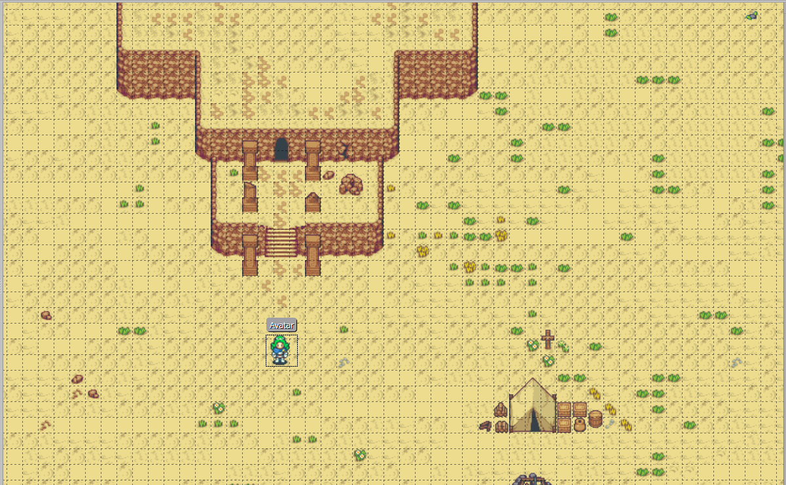
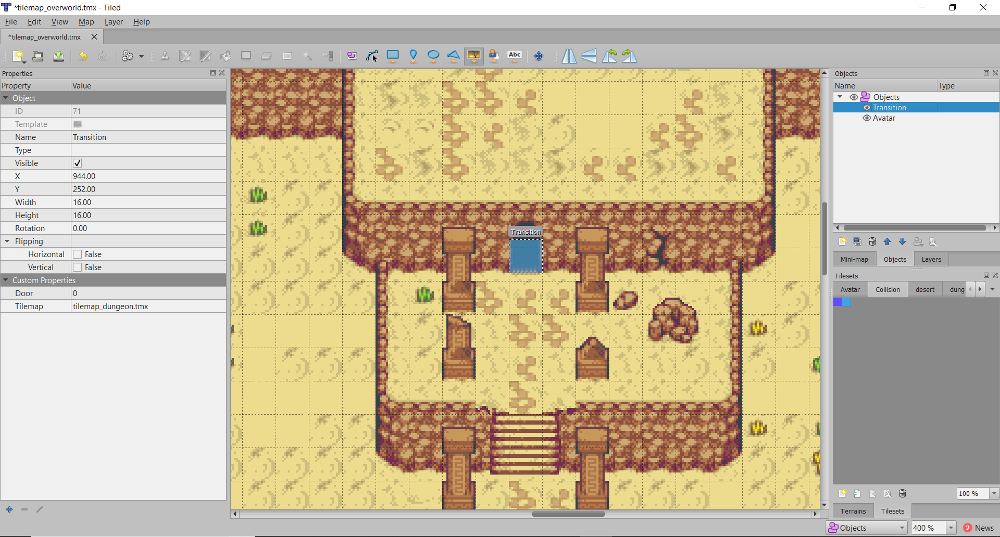
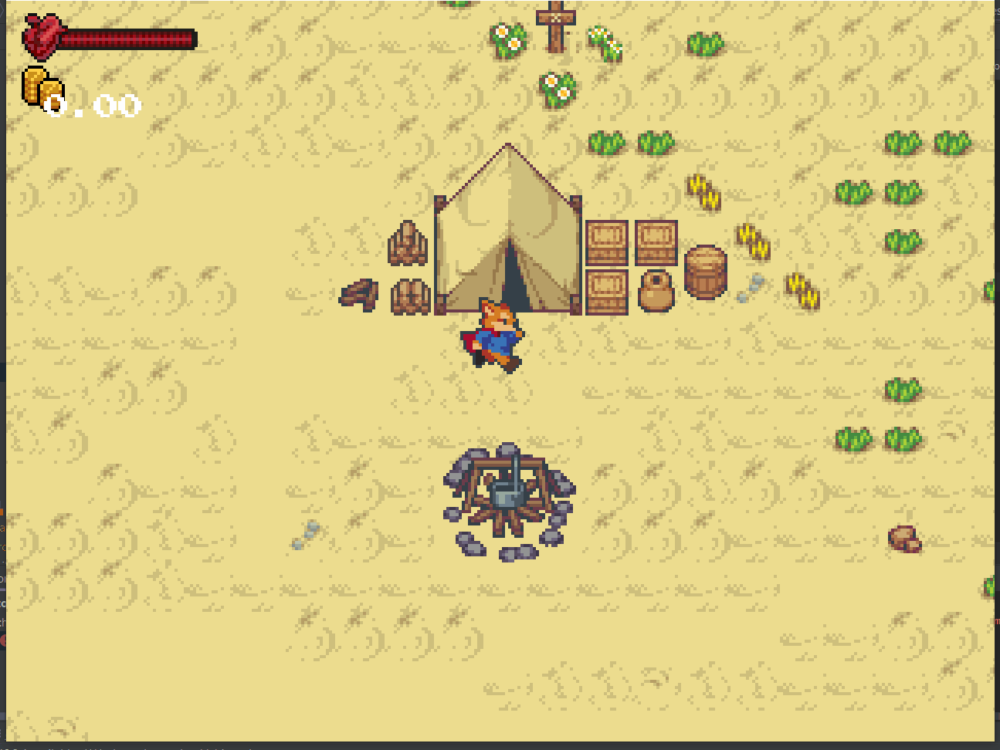

# 11.1 Transition entre les niveaux
> | Téléchargement fichiers référence |
> | ------------- |:-------------:|
> | <a href="" download>desktop.zip</a> |
> | <a href="" download>core.src.zip</a> |
> | <a href="" download>core.assets.zip</a> |

Afin d'ajouter de la profondeur à notre monde, nous voulons avoir plus d'un niveau que le joueur peut explorer. Dans un premier temps nous travaillerons avec le niveau `overworld.tmx`. Il sera question d'ajouter les transitions entre les salles et de charger le niveau dynamiquement lors d'une partie.

### `tilemap_overworld.tmx`


---
> ### Étapes à suivre
> 1. à l'aide de l'éditeur *Tiled*
> 2. remarquerez l'objet `Transition`
> 3. les propriétés requises sont spécifiées à l'aide de l'onglet `Custom Properties`
>     * `Direction` indique quelle direction orienter le joueur lorsqu'il est placé dans le niveau
>     * `Level` indique quelle salle charger lorsque la transition est active
>     * `TransitionID` indique quel emplacement placer l'avatar lorsque le niveau est charge
> 4. il y une transition à l'entrée du donjon, et un autre à l'entrée du magasin

### **Transitions**


La prochaine étape consiste à ajouter le code pour les transitions.

---
> ### Étapes à suivre
> 1. ajoutez la classe `Transition.java`
> 2. ajoutez `FLAG_TRANSITION` à l'intérieur `Collider.java` afin d'effectuer une transition seulement lorsque le joueur entre en collision avec l'objet
> 3. complétez la méthode `update` et implantez la méthode `transition`

```java
/* Transition.java */
package com.tutorialquest.entities;
// import ..

public class Transition extends PhysicalObject
{
    public static final float DISABLE_TIME = 2f;

    private Vector2 size = new Vector2(16, 16);
    private String level;
    public Utils.Direction direction;
    public int id;

    // Destination du joueur lors d'une 
    // transition à l'avant de la transition
    public Vector2 getDestination()
    {
        return position
            .cpy()
            .add(size.cpy().scl(.5f))
            .add(Utils.toVector(direction).scl(size.x));
    }

    public Transition(
        Vector2 position,
        String level,
        int id,
        String direction,
        Vector2 size)
    {
        super(position);
        this.size = size;
    }

    public Transition(
        Vector2 position,
        String level,
        int id,
        String direction) {

        super(position);

        this.id = id;
        this.level = level;
        this.direction = Utils.toDirection(direction);

        // Ajout du `FLAG` pour les transition
        collider = new Collider(
            size,
            Collider.FLAG_TRANSITION | Collider.FLAG_PUSHABLE
        );
    }

    // Chargement du niveau spécifié par la transition
    public void transition(Avatar avatar)
    {
        Game.load(level, id, avatar);
    }

    // Activez la transition lorsque le joueur rentre en contact
    @Override
    public void onPushed(
        PhysicalObject source, 
        Vector2 incomingPushVelocity) 
    {
        if(!(source instanceof Avatar)) return;
        transition((Avatar) source);
    }

    @Override
    public void update(float deltaTime) 
    {
        super.update(deltaTime);
        collider.update(position);
    }
}
```

---
> ### Étapes à suivre
> 1. modifiez la signature de la méthode `load` afin d'accepter le passage d'une instance de `Avatar` d'un entier `transitionID` en paramètre.
> 2. modifiez `Level.java` afin de créer les transitions lorsque le niveau est chargé.

```java
/* Level.java */
package com.tutorialquest;
// import ..

public class Level {
    // ..
    // AJOUT:
    public static final String OBJECT_TRANSITION = "Transition";
    public static final String OBJECT_PROP_TRANSITION_LEVEL = "Level";
    public static final String OBJECT_PROP_TRANSITION_DIRECTION = "Direction";
    public static final String OBJECT_PROP_TRANSITION_ID = "TransitionID";
    // ..

    // AJOUT:
    // Surcharge servant à charger le premier niveau
    public void load()
    {
        load(-1, null);
    }

    // MODIF:
    public void load(int transitionID, Avatar avatar)
    // public void load()
    {
        this.avatar = avatar;
        add(avatar);   
        
        // ...

        for (MapLayer layer : tiledMap.getLayers()) {
            switch (layer.getName()) {
                // ...
                case LAYER_OBJECT:
                    for (int i = 0; i < layer.getObjects().getCount(); i++) {
                        // ...
                        switch (object.getProperties().get(OBJECT_PROP_TYPE, String.class)) {    
                            // ...
                            case OBJECT_TRANSITION:
                                // Creation d'une nouvelle transition
                                Transition transition;
                                add(transition = new Transition(new Vector2(
                                    object.getProperties().get(OBJECT_PROP_X, float.class),
                                    object.getProperties().get(OBJECT_PROP_Y, float.class)),
                                    object.getProperties().get(OBJECT_PROP_TRANSITION_LEVEL, String.class),
                                    object.getProperties().get(OBJECT_PROP_TRANSITION_ID, Integer.class),
                                    object.getProperties().get(OBJECT_PROP_TRANSITION_DIRECTION, String.class)
                                ));

                                // S'il s'agit d'une transition et non d'un chargement initial,
                                // il faut placer l'avatar dans le prochain niveau
                                if (
                                    transition.id == transitionID &&
                                    avatar != null) 
                                {
                                    transition.disable(Transition.DISABLE_TIME);
                                    avatar.position = transition.getDestination();
                                    avatar.direction = Utils.toVector(transition.direction);
                                    avatar.input.disable(.25f);
                                }
                                break;
                        }
                    }
                    break;
            }
        }
    }

    // ..
}
```

---
> ### Étapes à suivre
> 1. ajoutez une nouvelle surcharge pour la méthode `load` qui accepte le passage d'avatar de `transitionID` en paramètre.
> 2. modifiez `Game.java` afin de charger `overworld.tmx` comme niveau par défaut lorsque le programme est exécuté. 

```java
/* Game.java */
package com.tutorialquest;
// import ..

public class Game extends ApplicationAdapter {
    // ..

    // MODIF:
    // Cette surcharge sert au chargement du premier niveau
    public static void load(String levelName) {
        load(levelName, -1, null);
    }

    // AJOUT:
    public static void load(String tilemapPath, int id, Avatar avatar) 
    {
        if (level != null) level.dispose(avatar);
        level = new Level(tilemapPath);
        level.load(id, avatar);
    }

    @Override
    public void create() {
        // ..
        // MODIF:
        // load("levels/dungeon_demo.tmx");
        load("levels/overworld.tmx");        
    }    
}

```
Un problème persiste lorsqu'un niveau est chargé, puisque le joueur est placé à l'emplacement de la transition. Il est donc utile de déactiver la transition pour un instant afin de permettre au joueur de dégager l'emplacement.



---
> ### Étapes à suivre
> 1. ajoutez un *timer* `disabledTime` et `disabledTimeLimit` à la `Transition`
> 2. Empêchez la transition tant que *timer* est actif

```java
/* Transition.java */
package com.tutorialquest.entities;
// import ..

public class Transition extends PhysicalObject
{
    // ADDED:
    public static final float DISABLE_TIME_LIMIT = 2f;    
    private float disabledTime = 0;   
    private float disableTimeLimit = 0; 

    // ADDED:
    public void disable(float disableTime)
    {
        this.disabledTime = 0;
        disableTimeLimit = disableTime;
    }

    public void transition(Avatar avatar)
    {
        // AJOUT:
        // Déactivez la transition lorsque `timer` est actif
        if(disabledTime < disableTimeLimit) return;
        Game.load(level, id, avatar);
    }

    @Override
    public void update(float deltaTime) {
        // ...

        // AJOUT:
        // Mise à jour du `timer`
        if(disabledTime < disableTimeLimit) {
            disabledTime += deltaTime;
            return;
        }

    }
}
```

