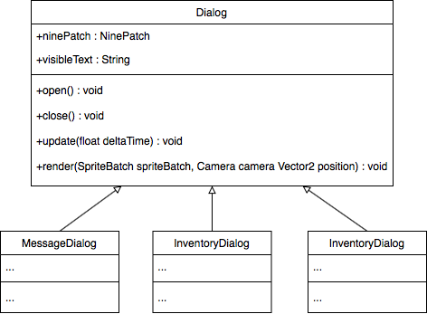
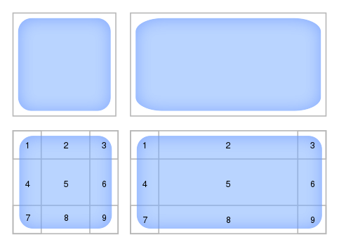
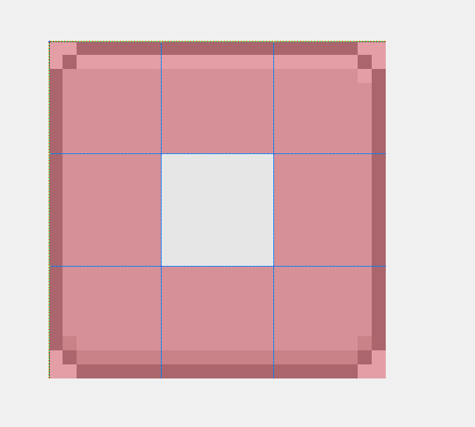
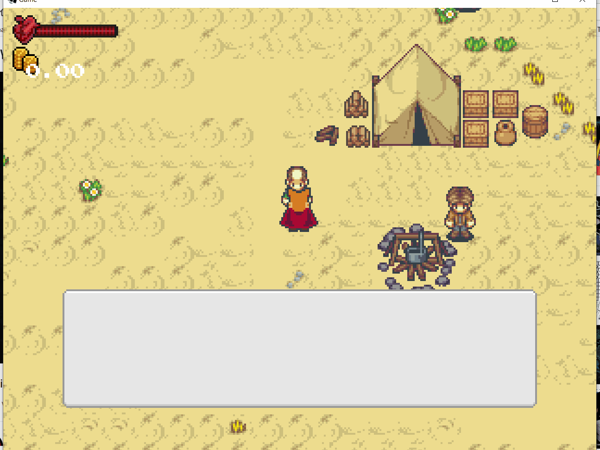

# 13 Boîtes de dialogues
> | Téléchargement fichiers référence |
> | ------------- |:-------------:|
> | <a href="" download>desktop.zip</a> |
> | <a href="" download>core.src.zip</a> |
> | <a href="" download>core.assets.zip</a> |

---

Auparavant, le texte était le seul moyen par lequel l'histoire était transmise. À cet effet les boites de dialogues sont utilisées afin de représenter du texte à l'écran de manière contextuel.


Nous allons programmer une boîte de dialogue comme composante du tableau de bord. La boîte de dialogue peut être réutilisée de plusieurs manières dans le jeu.



## Cadre de la fenêtre
---
La technique que nous utilisons est celle du *Nine Slice* (neuf tranches). Cette technique permet de dessiner une boîte de taille arbitraire tout en préservant la taille des pixels. En se référant à l'image ci-dessous, il est question de dupliquez les sections 2, 4, 6, 8 afin d'obtenir les dimensions désirées tout en préservant les sections 1, 3, 7, 9 dans les coins. 

### **Nine Slice [[0]](https://en.wikipedia.org/wiki/9-slice_scaling)**




---
> ### Étapes à suivre
> 1. Créez la classe `Dialog`
>     * Instanciez la classe `NinePatch` pour définir le cadre
>     * Affichez le `NineSlice`
> 2. Déactivez le contrôle de l'avatar lorsqu'une fenêtre de dialogue est ouverte

```java
package com.tutorialquest.ui.dialogs;
// import ...

public class Dialog {
    public static final int WIDTH = 256;
    public static final int HEIGHT = 128/2;
    public static final int TEXTURE_SIZE = 24;
    public static final float MARGIN = 8;        

    protected NinePatch ninePatch;        
    protected TextureRegion[][] textures;    

    public Dialog()
    {        
        // Séparation de la texture utilise pour le NineSlice en 9 sections
        textures = TextureRegion.split(
            new Texture("ui/rounded.png"), 
            TEXTURE_SIZE/3, 
            TEXTURE_SIZE/3);

        this.ninePatch = new NinePatch(
            textures[0][0], textures[0][1], textures[0][2],
            textures[1][0], textures[1][1], textures[1][2],
            textures[2][0], textures[2][1], textures[2][2]);
    }

    public void open()
    {
        Game.level.avatar.input.disable(-1);
        Game.hud.input.disable(.25f);
        enabled = true;
    }

    public void close()
    {
        enabled = false;
        Game.level.avatar.input.disable(.25f);
        Game.hud.input.disable(-1);
    }

    public void update(float deltaTime)
    {
        if(!enabled) return;
    }

    public void render(
        SpriteBatch spriteBatch,
        Camera camera,
        Vector2 position)
    {
        if(!enabled) return;

        spriteBatch.begin();

        // Affichage du NineSlice
        ninePatch.draw(
            spriteBatch, 
            position.x, 
            position.y, 
            0, 
            0, 
            WIDTH, 
            HEIGHT, 
            1, 
            1, 
            0);

        spriteBatch.end();
    }
}
```

