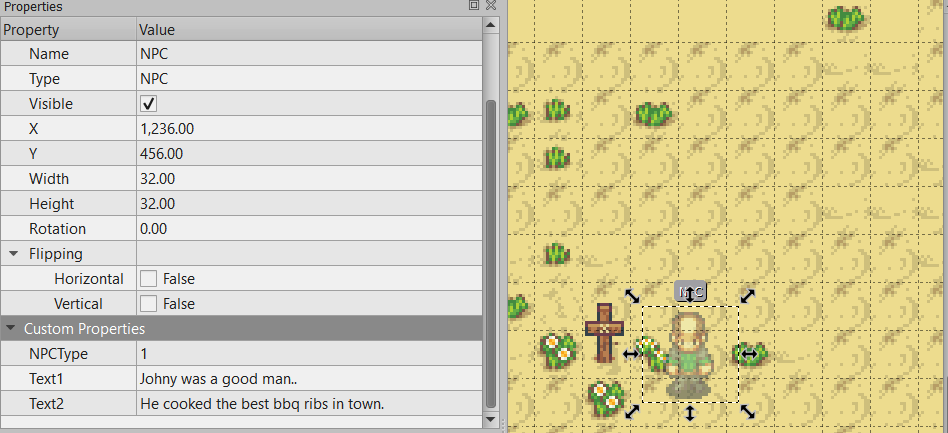

## 12.2 Boîtes de dialogues
---
Il est maintenant temps d'afficher le texte dans le dialogue. Afin de pouvoir réutiliser le dialogue, nous aurons recours à la classe `MessageDialog`.

> ### Étapes à suivre
> 1. modifiez la classe `Dialog` afin de supporter le texte pour les messages.
> 2. Creez la classe `MessageDialog`
>     * `MessageDialog` permet au joueur de terminer le dialogue lorsque le texte à terminé d'être affiche.
>     * Utilisez la méthode `nextText` afin d'afficher le prochain texte du message.
> 3. incorporez l'affichage de la fenêtre de dialogue dans la classe `HUD`

```java
/* Dialog.java */
package com.tutorialquest.ui.dialogs;
// import ..

public class Dialog {

    // ...   
    public static final float ICON_SIZE = 16;
    private static final int FONT_SCALE = 1;

    // ...

    // AJOUT:
    // Ajout des variables pour la gestion du texte
    protected String visibleText = "";
    protected int currentTextIndex = 0;
    protected String currentText;
    protected String[] texts;
    protected Texture arrowTexture;
    protected BitmapFont font;
    protected final static float SPEED = 10;
    protected final static float FAST_FORWARD = 2.5f;
    protected float currentTextProgress = 0;
    protected int currentTextLength = 0;
    protected boolean finished = false;
    protected boolean enabled = false;

    public void reset(String text)
    {
        finished = false;
        currentTextProgress = 0;
        visibleText = "";
        currentText = new String(text);
        currentTextLength = currentText.length();
    }

    public Dialog()
    {
        // ...

        // AJOUT:
        // Chargement de la texture pour l'icône
        arrowTexture = new Texture("ui/arrow_down.png");
        // AJOUT: Chargement de la police de caractères
        font = new BitmapFont(Gdx.files.internal("fonts/player2_small.fnt"));
        font.setColor(Color.DARK_GRAY);
        font.getData().setScale(FONT_SCALE);
    }

    public void update(float deltaTime)
    {
        if(!enabled) return;

        if(
            currentText == null || 
            currentText.equals(""))
            return;

        // AJOUT:
        // Obtenir le texte à afficher de manière progressive       
        currentTextProgress += 
            deltaTime * (Game.hud.input.isInteractPressed() ? 
                SPEED * FAST_FORWARD : 
                SPEED);
        // Borne pour ne pas dépasser la taille du texte        
        currentTextProgress = 
            currentTextProgress < currentTextLength ? 
                currentTextProgress : 
                currentTextLength;

        visibleText = currentText.substring(
            0, 
            (int) currentTextProgress);
    }

    public void render(
        SpriteBatch spriteBatch,
        Vector2 position)
    {
        if(!enabled) return;

        // ...

        // AJOUT:
        // Affichage du text visible
        spriteBatch.begin();
        font.draw(
            spriteBatch,
            visibleText,
            position.x + (MARGIN) * 1,
            position.y + (HEIGHT - MARGIN) * 1,
            (WIDTH - MARGIN * 2) * 1,
            Align.left,
            true);

        spriteBatch.flush();
        spriteBatch.end();

    }
}
```

```java
/* MessageDialog.java */
package com.tutorialquest.ui.dialogs;
// import ..

public class MessageDialog extends Dialog {

    public MessageDialog() {
        super();
    }

    public void open(String[] texts)
    {
        if(texts.length == 0) return;

        open();

        this.texts = texts;
        currentTextIndex = 0;
        reset(texts[0]);
    }

    public void nextText()
    {
        currentTextIndex++;
        if(currentTextIndex > texts.length - 1)
        {
            currentTextIndex = 0;
            close();
            return;
        }

        reset(texts[currentTextIndex]);
    }

    @Override
    public void update(float deltaTime)
    {
        if(!enabled) return;

        super.update(deltaTime);

        if(currentTextProgress >= currentTextLength - 1)
        {
            finished = true;
            currentTextProgress = currentTextLength -1;
            if(Game.hud.input.isInteractJustPressed()) nextText();
            return;
        }
    }

    @Override
    public void render(
        SpriteBatch spriteBatch,        
        Vector2 position)
    {
        if(!enabled) return;

        super.render(spriteBatch, position);

        // Draw arrow icône
        if(finished) {
            spriteBatch.begin();
            spriteBatch.draw(
                arrowTexture,
                position.x + (WIDTH - MARGIN - ICON_SIZE),
                position.y + MARGIN,
                ICON_SIZE,
                ICON_SIZE);

            spriteBatch.end();
        }
    }
}

```

```java
/* HUD.java */
package com.tutorialquest.ui;
// import ..

public class HUD {
    // AJOUT:
    public MessageDialog messageDialog = new MessageDialog();

    public void update(float deltaTime) {
        // ...
        // AJOUT:
        messageDialog.update(deltaTime);
    }

    public void render() {
        // ...        
        // AJOUT:
        position = new Vector2(
            camera.position.x + -Dialog.WIDTH/2,
            camera.position.y + -Dialog.HEIGHT * 1.5f );
        messageDialog.render(
            spriteBatch,
            position);
    }

}
```

Maintenant que nous avons le mécanisme de fenêtre prêt-à être utilisé, nous pouvons ajouter les points d'interactions à notre monde dans lesquels nous voulons ajoutez du texte. L'exemple canonique d'éléments interactif dans les jeux vidéos de rôles est les personnages non jouables souvent appelés *NPC* (*Non-player character*).

---
> ### Étapes à suivre
> 1. ajoutez l'interface `IInteractible.java`
>     * Cette interface définit un point d'interaction dans le monde
> 2. ajoutez la classe `NPC` qui implémente `IInteractible`
>    *  Chaque `NPC` que l'on définit contient du texte qui lui est propre et permet d'ouvrir une fenêtre de dialogue lorsqu'on interagit avec lui.


```java
/* NPC.java */
package com.tutorialquest.entities;
// import ..

public class NPC extends Character implements IInteractible{

    private int WIDTH = 32;
    private int HEIGHT = 32;

    private String[] texts;

    private Sprite sprite;

    public NPC(Vector2 position, int type, String[] texts)
    {
        super(position, -1, -1, -1, -1, -1);
        this.sprite = new Sprite("objects/npc_spritesheet.png", WIDTH, HEIGHT, type, 0);
        this.sprite.origin = new Vector2(WIDTH/2, 0);

        this.collider = new Collider(
            Collider.DEFAULT_SIZE,
            Collider.FLAG_INTERACTIBLE | Collider.FLAG_COLLIDABLE);
        this.collider.origin.set(Collider.DEFAULT_SIZE.x/2, 0);
        this.texts = texts;
    }

    @Override
    public void render(SpriteBatch spriteBatch) {
        super.render(spriteBatch);
        sprite.render(spriteBatch, position);
    }

    @Override
    public void update(float deltaTime) {
        super.update(deltaTime);
        sprite.update(deltaTime);
        collider.update(position);
    }

    @Override
    public void interact(Avatar avatar) {
        Game.hud.messageDialog.open(texts);
    }
}
```
À l'intérieur de `levels/overworld.tmx`, chaque `NPC` définit des champs de texte dans ses propriétés. Nous utiliserons le préfix `Text` à l'avant de tout les propriétés qui serviront de dialogue pour le personnage.



---
> ### Étapes à suivre
> 1. ajoutez le code nécessaire à la création de NPC dans le monde.
> 2. considérez chaque propriété avec le préfixe `Text` comme texte pour le dialogue du personnage.
> 3. ajoutez la méthode `interact` à l'avatar lui permettant d'interagir avec certains objets de son environnement.

```java
/* Level.java */
package com.tutorialquest;
// import ..

public class Level {

    // AJOUT:
    public static final String OBJECT_PROP_TEXT = "Text";
    
    // AJOUT:
    public static final String OBJECT_NPC = "NPC";
    public static final String OBJECT_PROP_NPC_TYPE = "NPCType";

    // MODIF:
    public load(int transitionID, Avatar avatar) {

        // ...
        for (MapLayer layer : tiledMap.getLayers()) {
            switch (layer.getName()) {

                // ...
                case LAYER_OBJECT:
                    for (int i = 0; i < layer.getObjects().getCount(); i++) {
                        // ...
                        switch (object.getProperties().get(OBJECT_PROP_TYPE, String.class)) {
            
                            // AJOUT:
                            case OBJECT_NPC: {
                                // rassemble les valeurs tout les propriétés avec le préfixe 'Text'
                                LinkedList<String> texts = new LinkedList<>();
                                object.getProperties()
                                    .getKeys()
                                    .forEachRemaining(
                                        x -> texts.add(
                                            x.startsWith(OBJECT_PROP_TEXT) ?
                                                object.getProperties().get(x, String.class) :
                                                null));
                                texts.removeIf(x -> x == null);

                                // Création du NPC
                                add(new NPC(new Vector2(
                                    object.getProperties().get(OBJECT_PROP_X, float.class),
                                    object.getProperties().get(OBJECT_PROP_Y, float.class)),
                                    object.getProperties().get(OBJECT_PROP_NPC_TYPE, int.class),
                                    texts.toArray(new String[texts.size()])));
                            }
                            break;

                        }
                    }
                    break;
            }
        }
    }
}

```

```java
/* Avatar.java */
package com.tutorialquest.entities;
// import ..

public class Avatar extends Character {

    // ...

    // AJOUT:
    private static final float INTERACTION_RANGE = 8f;

    @Override
    public void update(float deltaTime) {
        // ...
        // AJOUT:
        interact();

        // ...
    }

    // AJOUT:
    public void interact() {
        // Lorsque le joueur appui sur le bouton d'interaction
        // nous vérifions à l'avant du personnage s'il y à un objet 
        // avec lequel interagir.
        if (
            input.isInteractJustPressed()) {
            Vector2 interactionOffset = 
                new Vector2(direction)
                .scl(INTERACTION_RANGE);

            List<PhysicalObject> results = new LinkedList<>();
            collider.getObjectCollisions(
                this,
                interactionOffset.x,
                interactionOffset.y,
                Collider.FLAG_INTERACTIBLE,
                results);

            // Interaction avec chaque résultat de la collision
            for (PhysicalObject interactible : results) {
                ((IInteractible) interactible).interact(this);
            }
        }
    }
}

```

