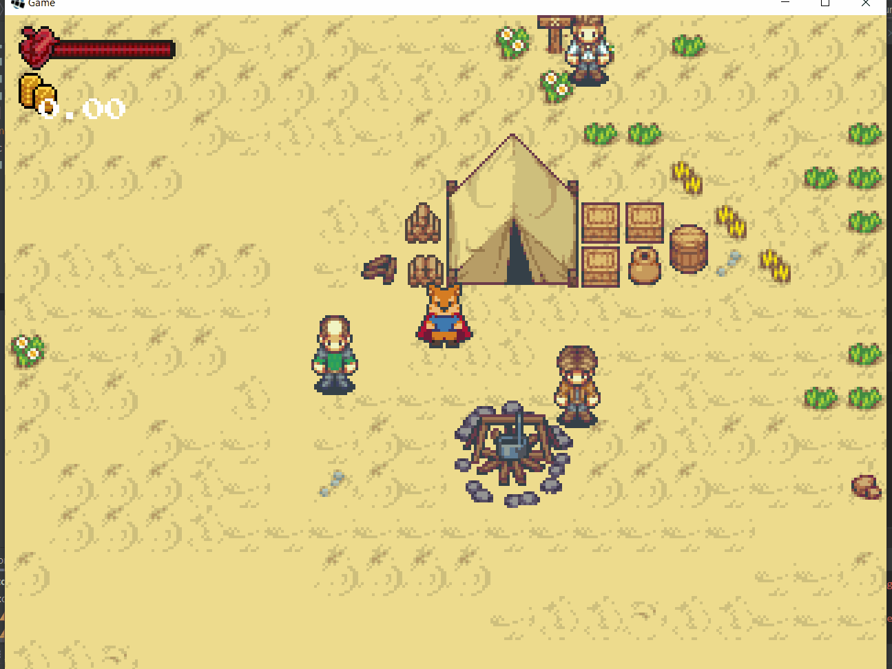

## 13.1. Inventaire
> | Téléchargement fichiers référence |
> | ------------- |:-------------:|
> | <a href="" download>desktop.zip</a> |
> | <a href="" download>core.src.zip</a> |
> | <a href="" download>core.assets.zip</a> |

---

Dans les jeux vidéos du style RPG, les *items* sont réunis dans un espace commun de l'interface utilisateur, que l'on appelle l'inventaire. L'inventaire permet au joueur d'interagir avec le *items* de sa collection. Par exemple, il peut équiper une arme, consommer une potion ou encore utiliser une clé pour ouvrir une porte.



Comme nous avons discuté, la fenêtre de dialogue peut être facilement réutilisée pour visualiser l'inventaire. Cependant l'étape préliminaire est de représenter la structure interne de l'inventaire.

---
> ### Étapes à suivre
> 1. ajoutez la classe `Inventory` qui encapsule les *items* de l'avatar.
> 2. ajoutez la classe `Item` permettant d'utiliser les *items* différemment dépendamment du type.
>     * Chaque `Item` possède:
>         * `name` pour l'affichage
>         * `type` pour identifier l'usage
>         * Un tableau associatif `properties` servant à identifier les propriétés spécifiques à un objet et permet un niveau de flexibilité.

```java
/* Inventory.java */
package com.tutorialquest;
// import ..

public class Inventory {

    private List<Item> items = new ArrayList<>();
    public Item sword;
    public Item shield;

    public List<Item> getItems() {
        return items;
    }

    public void add(Item ... items) {
        for (Item item : items) {
            this.items.add(item);
        }
    }

    public void remove(Item item) {
        items.remove(item);
    }
}
```

```java
/* Item.java */
package com.tutorialquest;
// import ..

public class Item {
    
    public final static String TYPE_EQUIP = "Equip";    
    public final static String TYPE_CONSUMABLE = "Consumable";

    public final static String PROP_HEALTH = "Health";
    public final static String PROP_DAMAGE = "Damage";
    public final static String PROP_KNOCKBACK = "Knockback";    
    public final static String PROP_EQUIP_TYPE = "EquipType";
    public final static String EQUIP_TYPE_SWORD = "Sword";
    public final static String EQUIP_TYPE_SHIELD = "Shield";    
    public final static String PROP_TRANSITION_ID = "TransitionID";
    
    public String name;
    public String type;    
    public MapProperties properties = new MapProperties();

    public Item(
        String name,
        String texturePath,
        String type,        
        MapProperties properties)
    {
        this.name = name;
        this.properties = properties;        
        this.type = type;
        this.texturePath = texturePath;
    }

    public void use(Avatar avatar)
    {
        switch (type)
        {

            case Item.TYPE_EQUIP:
                if(!properties.containsKey(Item.PROP_EQUIP_TYPE))
                    return;

                // Pour utiliser l'item du type `Equipment`
                // on équipe ou retire l'équipement si 
                // l'item est déjà équipe
                switch (getString(Item.PROP_EQUIP_TYPE))
                {
                    case Item.EQUIP_TYPE_SHIELD:
                        avatar.inventory.shield =
                            avatar.inventory.shield == this ?
                            null :
                            this;
            
                    case Item.EQUIP_TYPE_SWORD:
                        avatar.inventory.sword =
                            avatar.inventory.sword == this ?
                            null :
                            this;
                }

                break;

            // Pour utiliser l'item de type `Consumable`
            // on obtient l'attribut à modifier.
            // nous pouvons imaginer d'autres attributs pouvant 
            // être modifie comme les dommages ou les défenses
            case Item.TYPE_CONSUMABLE:
                if(properties.containsKey(PROP_HEALTH))
                {
                    avatar.heal(getFloat(PROP_HEALTH));
                    avatar.inventory.remove(this);
                }

                break;
        }
    }
}
```

---
> ### Étapes à suivre
> 1. ajoutez la méthode `initInventory` afin d'initialiser l'inventaire avec des objets par défaut afin de tester le fonctionnement du système.
> 2. modifiez les méthodes `getDamage` et `getKnockback` afin de prendre en compte l'équipement

```java
/* Avatar.java */
package com.tutorialquest.entities;
// import ..

public class Avatar extends Character {
        
    // AJOUT:
    public Inventory inventory;

    // AJOUT:
    // si une arme est équipée, nous utilisons les dommages 
    // prescrits par l'arme, sinon nous utilisons les dommages du personnage.
    public float getDamage() {
        return
            inventory.sword != null &&
            inventory.sword.hasProperty(Item.PROP_DAMAGE) ?
                inventory.sword.getFloat(Item.PROP_DAMAGE) :
                damage;
    }

    // AJOUT:
    public float getKnockback() {
        return
            inventory.sword != null &&
            inventory.sword.hasProperty(Item.PROP_KNOCKBACK) ?
                inventory.sword.getFloat(Item.PROP_KNOCKBACK) :
                damage;
    }


    // AJOUT:
    public void initInventory() {
        inventory = new Inventory();
        inventory.add(
            new Item() {{
                name = "Gold Sword";
                cost = 10.0f;
                type = Item.TYPE_EQUIP;
                properties.put(Item.PROP_EQUIP_TYPE, Item.EQUIP_TYPE_SWORD);
                properties.put(Item.PROP_DAMAGE, 5f);
                properties.put(Item.PROP_KNOCKBACK, 4f);
            }},
            new Item() {{
                name = "Medium Potion";
                cost = 10.0f;
                type = Item.TYPE_CONSUMABLE;
                properties.put(Item.PROP_HEALTH, 5f);
            }}
            // TODO: Ajout d'autre objets au besoin
        );
    }    

    public Avatar(Vector2 position) {
        super(position, DAMAGE, KNOCKBACK, MAX_HEALTH, SPEED, PUSH_FORCE);
        initSprite();

        // AJOUT:
        // Initialisation de l'inventaire
        initInventory();
    }

    public boolean isEquipped(Item item)
    {
        return
            Game.level.avatar.inventory.sword == item ||
            Game.level.avatar.inventory.shield == item;
    }
}
```