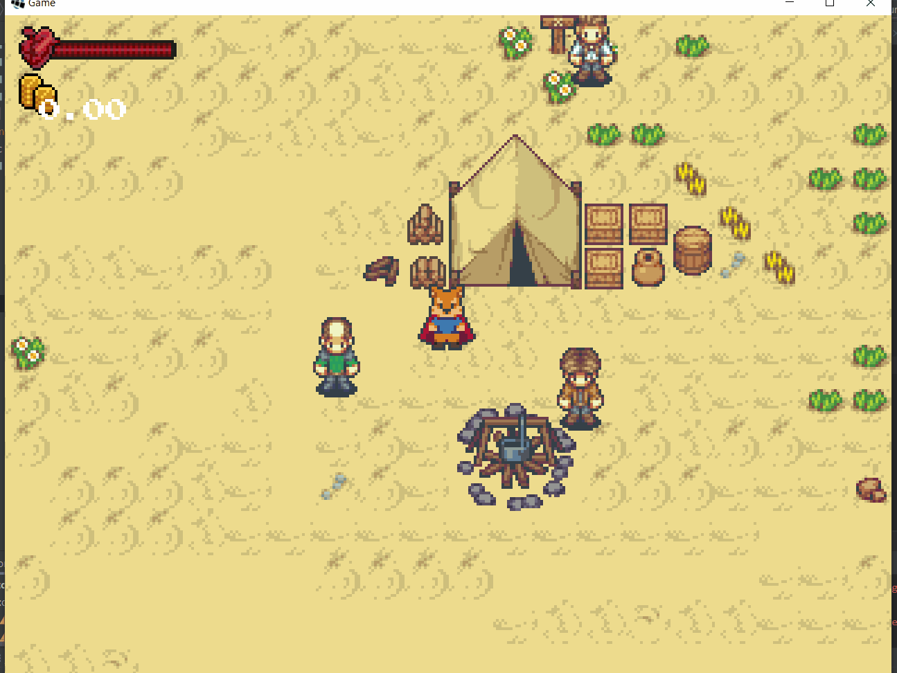
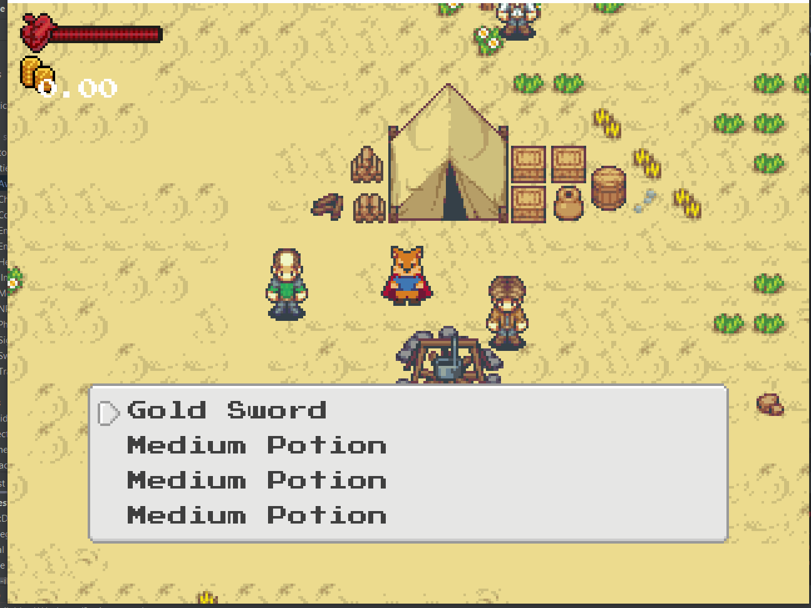

## 13.2. Inventaire
---

Comme nous avons discuté, la fenêtre de dialogue peut être réutilisée pour représenter l'inventaire du personnage. Nous aurons recours aux classes `InventoryDialog` et `InventoryItemDialog` pour représenter l'inventaire.



---
> ### Étapes à suivre
> 1. ajoutez la classe `InventoryDialog` afin d'afficher et permettre au joueur de sélectionner un item
> 2. à l'intérieur de la méthode `render` nous affichons le nom de chaque `item` à l'aide d'une simple boucle


```java
/* InventoryDialog.java */
package com.tutorialquest.ui.dialogs;
// import ..

public class InventoryDialog extends Dialog {

    public static final String NO_ITEM_TEXT = "No items";    
    private Inventory inventory;

    public InventoryDialog() {
        super();        
    }

    public void open(Inventory inventory)
    {
        open();
        this.inventory = inventory;
    }

    @Override
    public void render(
        SpriteBatch spriteBatch,        
        Vector2 position)
    {
        if(!enabled) return;

        super.render(spriteBatch, camera, position);

        Vector2 startPosition = new Vector2(
            position.x + (MARGIN + ICON_SIZE/2),
            position.y + (HEIGHT - MARGIN)
        );

        if(inventory.items.isEmpty())
        {
            spriteBatch.begin();
            font.draw(
                spriteBatch,
                NO_ITEM_TEXT,
                startPosition.x,
                startPosition.y,
                (WIDTH - MARGIN * 2),
                Align.left,
                true);

            spriteBatch.end();
            return;
        }

        for(int i = 0; i < MAX_VISIBLE_ITEMS; i++)
        {
            if(i >= inventory.items.size())
                break;

            Item item = inventory.items.get(i);

            spriteBatch.begin();    
            font.draw(
                spriteBatch,
                item.name,
                startPosition.x,
                startPosition.y - offsetHeight,
                (WIDTH - MARGIN * 2),
                Align.left,
                true);

            font.setColor(Color.DARK_GRAY);
            spriteBatch.end();
        }
    }
}

```
Il n'est pas suffisant d'afficher les éléments de l'inventaire. Nous voulons être capables de les sélectionner.

---
> ### Étapes à suivre
> 1. chargez la texture `ui/side_arrow.png` utilise servant à la sélection.
> 2. ajoutez la méthode `update` modifier `selectionIndex` servant à indiquer la sélection.
> 3. à l'intérieur de la méthode `render` nous utilisons deux décalages afin d'afficher la sélection no
>     * `firstIndexOffset` est un décalage servant à indiquer l'index du premier item à afficher
>     * Le décalage `selectedHeightOffset` calcule à partir de la valeur de `selectionIndex` indique la position du curseur


```java
/* InventoryDialog.java */
package com.tutorialquest.ui.dialogs;
// import ..

public class InventoryDialog extends Dialog {    
    // ...
    public static final int MAX_VISIBLE_ITEMS = 4;

    // AJOUT:
    // Chargement de la texture pour la sélection
    private Texture selectionTexture;

    public InventoryDialog() {
        super();
        selectionTexture = new Texture("ui/arrow_side.png");
        glyphLayout = new GlyphLayout();
    }

    public void open(Inventory inventory)
    {
        open();
        this.inventory = inventory;
    }

    // AJOUT:
    @Override
    public void update(float deltaTime)
    {
        if(!enabled) return;
        super.update(deltaTime);

        // Déplacement de la selection selon 
        // les entrées du joueur
        if(Game.hud.input.isDownJustPressed()) selectedIndex++;
        else if(Game.hud.input.isUpJustPressed()) selectedIndex--;
        else if(Game.hud.input.isInteractJustPressed())
        {
            if(inventory.getItems().size() == 0) return;
            close();
            Item item = inventory.getItems().get(selectedIndex);
            Game.hud.inventoryItemDialog.open(item);
        }
        else if(Game.hud.input.isMenuJustPressed())
        {
            close();
            return;
        }

        // si l'objet est retiré de l'inventaire, 
        // et ceci invalide l'index, nous bornons l'index
        if(selectedIndex >= inventory.getItems().size())
            selectedIndex = inventory.getItems().size() - 1;
        else if(selectedIndex < 0)
            selectedIndex = 0;

    }

    @Override
    public void render(
        SpriteBatch spriteBatch,
        Vector2 position)
    {
        // ...
        
        // AJOUT:
        // Décalage de la position calcule à partir de la valeur de `selectedIndex`    
        float selectedOffsetHeight = 0;

        // AJOUT
        // Decalage de l'index servant à indiquer le début de la liste
        // ce mécanisme permet ainsi d'afficher une liste défilant        
        int firstIndexOffset = 
            selectedIndex < MAX_VISIBLE_ITEMS ? 
                0 : 
                selectedIndex - (MAX_VISIBLE_ITEMS - 1);

        // MODIF:
        for(
            int i = firstIndexOffset; 
            i < firstIndexOffset + MAX_VISIBLE_ITEMS; 
            i++)
        // for(int i = 0; < MAX_VISIBLE_ITEMS; i++)
        {
            if(i >= inventory.getItems().size())
                break;

            Item item = inventory.getItems().get(i);

            spriteBatch.begin();
            font.draw(
                spriteBatch,
                item.name,
                startPosition.x,
                startPosition.y - offsetHeight,
                (WIDTH - MARGIN * 2),
                Align.left,
                true);            
            spriteBatch.end();
            
            glyphLayout.setText(font, item.name);
            offsetHeight += glyphLayout.height*2;
            // AJOUT:
            if(i < selectedIndex) selectedOffsetHeight += glyphLayout.height*2;
        }

        // AJOUT:
        // Affichage du curseur de selection
        Vector2 selectedPosition = new Vector2(
            startPosition.x,
            startPosition.y - selectedOffsetHeight
        );
        spriteBatch.begin();
        spriteBatch.draw(
            selectionTexture,
            selectedPosition.x - ICON_SIZE,
            selectedPosition.y - (ICON_SIZE*.75f),
            ICON_SIZE,
            ICON_SIZE);
        spriteBatch.end();

    }
}
```

