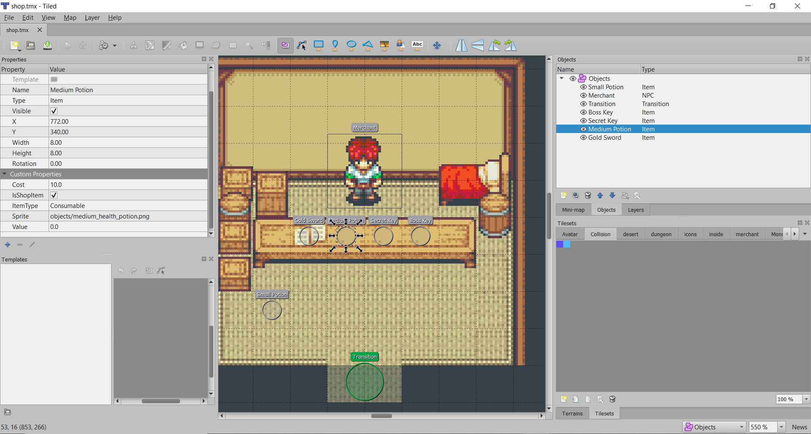

# 14. Magasin
> | Téléchargement fichiers référence |
> | ------------- |:-------------:|
> | <a href="" download>desktop.zip</a> |
> | <a href="" download>core.src.zip</a> |
> | <a href="" download>core.assets.zip</a> |

Bien entendu, il n'est pas suffisant d'initialiser l'inventaire du joueur avec des objets par défaut. Nous voulons permettre au joueur d'obtenir des objets à travers le jeu.

---
> ### Étapes à suivre
> 1. ajoutez la classe `PhysicalItem` qui représente un objet qui existe dans le monde physique
> 2. ajoutez la variable `cost` à la classe `Item` afin de permettre la vente de *item* dans un magasin.
> 3. ajoutez la classe `PhysicalItemDialog` permettant d'interagir avec un objet du monde.
> 4. incorporez `PhysicalItemDialog` dans le tableau de bord `HUD`

```java
/* PhysicalItem.java */
package com.tutorialquest.entities;
// import ..

public class PhysicalItem extends PhysicalObject implements IInteractible {

    public static int WIDTH = 16;
    public static int HEIGHT = 16;

    public Item item;
    private Sprite sprite = null;
    public boolean isShopItem = false;

    protected Sprite getSprite() {
        return sprite;
    }

    public PhysicalItem(
        Vector2 position,
        Item item)
    {
        super(position);

        this.item = item;
        sprite = new Sprite(item.texturePath, WIDTH, HEIGHT, 0, 0);
        collider = new Collider(
            new Vector2(WIDTH, HEIGHT),
            Collider.FLAG_INTERACTIBLE | Collider.FLAG_COLLIDABLE | Collider.FLAG_PUSHABLE);
    }

    public PhysicalItem(
        Vector2 position,
        String name,
        String type,
        String texturePath,
        boolean isShopItem,
        float cost,
        MapProperties properties) {

        super(position);

        this.isShopItem = isShopItem;
        item = new Item(name, texturePath, type, cost, properties);
        sprite = new Sprite(texturePath, WIDTH, HEIGHT, 0, 0);
        collider = new Collider(
            new Vector2(WIDTH, HEIGHT),
            Collider.FLAG_INTERACTIBLE | Collider.FLAG_COLLIDABLE | Collider.FLAG_PUSHABLE);
    }

    @Override
    public void update(float deltaTime)
    {
        super.update(deltaTime);
        move();
        sprite.update(deltaTime);
    }

    @Override
    public void render(SpriteBatch spriteBatch)
    {
        super.render(spriteBatch);
        sprite.render(spriteBatch, position);
    }

    @Override
    public void interact(Avatar avatar) {
        Game.hud.physicalItemDialog.open(this, isShopItem);
    }
}
```

```java
/* Item.java */
package com.tutorialquest;
// import ..

public class Item {

    public float cost;
    // AJOUT
    public String texturePath = "";

    public Item(
        String name,        
        String type,
        MapProperties properties,
        // AJOUT:
        float cost,        
        String texturePath)
    {               
        // AJOUT:
        this.cost = cost;    
    }   
}
```

### `PhysicalItemDialog.java`
```java
package com.tutorialquest.ui.dialogs;
// import ...

public class PhysicalItemDialog extends ItemDialog {

    public static final String TAKE_TEXT = "Take";
    public static final String LEAVE_TEXT = "Leave";
    public static final String PURCHASE_TEXT = "Purchase";
    public static final String ITEM_FOR_SALE_TEXT = "%s - %.2f$";

    private PhysicalItem physicalItem;
    private boolean isShopItem = false;

    public void open(PhysicalItem physicalItem, boolean isShopItem)
    {
        this.physicalItem = physicalItem;
        this.isShopItem = isShopItem;
        open(physicalItem.item);
    }


    public boolean isAvailable()
    {
        return
            !isShopItem ||
            Game.level.avatar.hasEnoughMoney(item);
    }

    public void acceptItem()
    {
        Game.level.remove(physicalItem);
        if(isShopItem) Game.level.avatar.purchaseItem(item);
        else Game.level.avatar.inventory.add(item);
    }


    @Override
    protected String getAcceptText() {
        return isShopItem ?
            PURCHASE_TEXT :
            TAKE_TEXT;
    }

    @Override
    protected String getCancelText() {
        return LEAVE_TEXT;
    }

    @Override
    protected String getItemText() {
        return isShopItem ?
            Compatibility.platform.format(ITEM_FOR_SALE_TEXT, item.name, item.cost):
            Compatibility.platform.format(ITEM_TEXT, item.name);
    }
}

```

---
> ### Étapes à suivre
> 1. ouvrez le niveau `shop.tmx` et observez l'utilisation de `PhysicalItem`
> 2. Chaque `PhysicalItem` doit spécifier
>     * Un type `ItemType`
>     * Un chemin de fichier `Sprite` pour la texture
>     * Un booléen `IsShopItem` pour déterminer si l'item est vendu en magasin
>     * Un cout `cost` pour déterminer la valeur en magasin.
> 3. ajoutez le code nécessaire à la création de `PhysicalItem` dans la classe `Level`



```java
package com.tutorialquest;
// import ...

public class Level {
    
    // ...

    // AJOUT:
    public static final String OBJECT_ITEM = "Item";
    public static final String OBJECT_PROP_ITEM_TYPE = "ItemType";
    public static final String OBJECT_PROP_ITEM_SPRITE = "Sprite";
    public static final String OBJECT_PROP_ITEM_COST = "Cost";
    public static final String OBJECT_PROP_ITEM_IS_SHOP_ITEM = "IsShopItem";
    public static final String OBJECT_PROP_ITEM_VALUE = "Value";


    public load(String tilemapPath) { 
        // ...

        for (MapLayer layer : tiledMap.getLayers()) {
            switch (layer.getName()) {
                // ...                
                case LAYER_OBJECT:
                    for (int i = 0; i < layer.getObjects().getCount(); i++) {
                        // ...
                        switch (object.getProperties().get(OBJECT_PROP_TYPE, String.class)) {

                            // AJOUT:
                            case OBJECT_ITEM:
                                add(new PhysicalItem(
                                    new Vector2(
                                        object.getProperties().get(OBJECT_PROP_X, float.class),
                                        object.getProperties().get(OBJECT_PROP_Y, float.class)),
                                    object.getName(),
                                    object.getProperties().get(OBJECT_PROP_ITEM_TYPE, String.class),
                                    object.getProperties().get(OBJECT_PROP_ITEM_SPRITE, String.class),
                                    object.getProperties().get(OBJECT_PROP_ITEM_IS_SHOP_ITEM, Boolean.class),
                                    object.getProperties().get(OBJECT_PROP_ITEM_COST, Float.class),
                                    object.getProperties()));

                                break;
                        }
                    }
                    break;
            }
        }
    }
}

```

