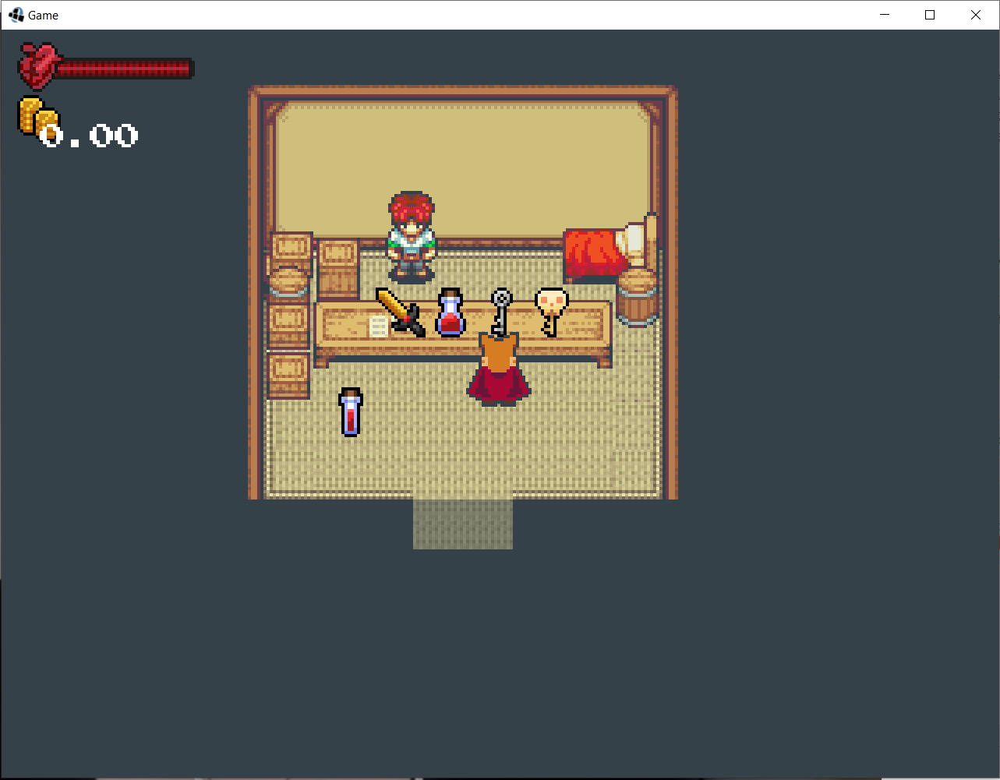
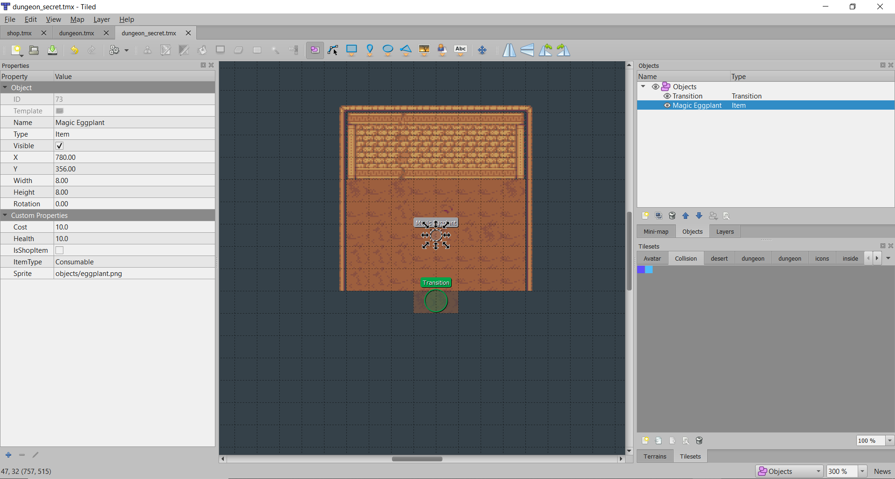
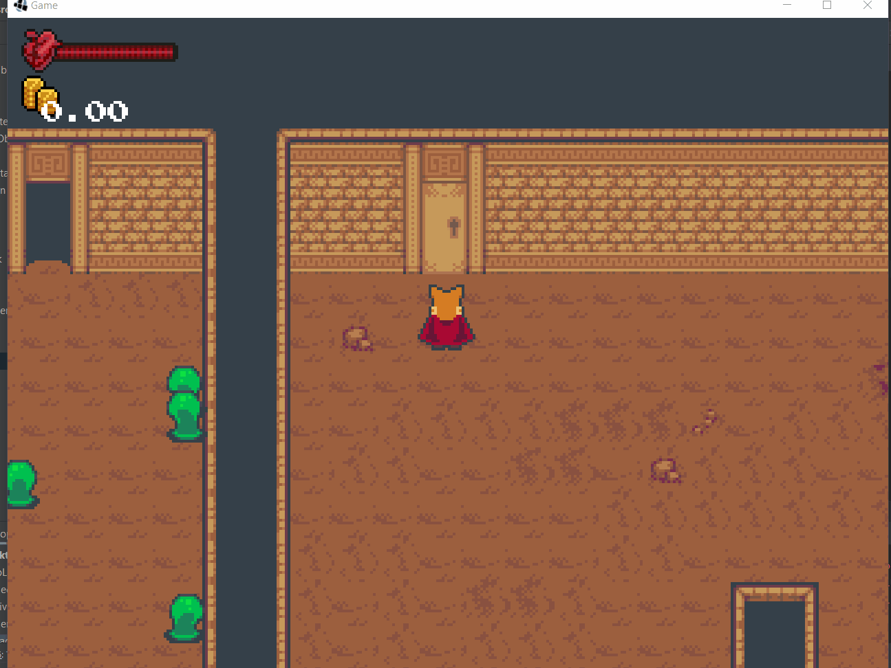

# 15. Portes
> | Téléchargement fichiers référence |
> | ------------- |:-------------:|
> | <a href="" download>desktop.zip</a> |
> | <a href="" download>core.src.zip</a> |
> | <a href="" download>core.assets.zip</a> |

Si vous portez attention, vous remarquez qu'une clé est disponible en magasin. Cependant puisque nos transitions sont automatiques, ce petit objet métallique est présentement complètement inutile!



Plusieurs jeux de rôles incorporent des casse-tête afin d'offrir d'autre sorte de défi pour le joueur. Un mécanisme de clé et porte peut offrir un moyen très pour construire une case tête. Nous pouvons facilement réutiliser le mécanisme d'item et d'objet interactif pour interagir avec une porte.

---
> ### Étapes à suivre
> 1. ajoutez la classe `Door` avec laquelle le joueur peut utiliser une clé.
> 2. chargez la texture correspondant à la porte
> 3. ajoutez la méthode `unlock` qui crée une nouvelle transition dans le monde. 

```java
/* Door.java */
package com.tutorialquest.entities;
// import ..

public class Door extends PhysicalObject {

    public int WIDTH = 48;
    public int HEIGHT = 48;

    private Sprite unlockedSprite;
    private Sprite lockedSprite;
    private Sprite sprite;
    private String level;
    private String direction;
    public int transitionID;
    public Transition transition = null;

    public Door(
        Vector2 position,
        String level,
        int transitionID,
        String direction,
        boolean isLocked)
    {
        super(position);

        this.level = level;
        this.transitionID = transitionID;
        this.direction = direction;

        collider = new Collider(
            new Vector2(WIDTH, HEIGHT),
            Collider.FLAG_DOOR | Collider.FLAG_COLLIDABLE);

        // Chargement des textures
        unlockedSprite = new Sprite(
            "objects/door_open.png",
            (int)WIDTH, (int)HEIGHT, 0, 0);
        lockedSprite = new Sprite(
            "objects/door_closed.png",
            (int)WIDTH, (int)HEIGHT, 0, 0);

        sprite = lockedSprite;

        if(!isLocked) unlock();
    }

    // Déverrouillage de la porte
    public void unlock()
    {
        sprite = unlockedSprite;
        Game.level.add(
            transition = new Transition(
                new Vector2().add(position).add(WIDTH/3, 0),
                level,
                transitionID,
                direction));
    }

    // ...

}

```

---
> ### Étapes à suivre
> 1. ajoutez un nouveau type `Key` à `Item`
>     * Ajoutez l'usage du type `Key` à l'intérieur de la méthode `use`
> 2. à l'intérieur de la classe `Avatar` 
>     * Ajoutez la méthode `unlock` qui sert à ouvrir une porte.
>     * Modifiez la méthode `initInventory` pour y ajouter une clé afin de vérifier le fonctionnement du système

```java
/* Item.java */
package com.tutorialquest;
// import ..

public class Item {
    // ...

    // AJOUT:
    public final static String TYPE_KEY = "Key";
    public final static String PROP_TRANSITION_ID = "TransitionID";
    
    // ...

    public void use(Avatar avatar)
    {
        switch (type)
        {
            // AJOUT:
            case Item.TYPE_KEY:
                if(properties.containsKey(PROP_TRANSITION_ID)) {
                    if(avatar.unlock(getInt(PROP_TRANSITION_ID))) {
                        avatar.inventory.remove(this);
                    }
                }
                break;
        }
    }
}
```

```java
package com.tutorialquest.entities;
// import ...

public class Avatar extends Character {

    // MODIF:
    // Ajout d'une clé pour tester le fonctionnement du système
    public void initInventory() {
        inventory.add(
            // ...
            // AJOUT:
            new Item() {{
                name = "Secret Key";
                type = Item.TYPE_KEY;
                properties.put(Item.PROP_TRANSITION_ID, 1);
            }}
        );
    }

    // AJOUT:
    public boolean unlock(int transitionID) {
        List<PhysicalObject> results = new LinkedList<>();
        Vector2 interactionOffset = new Vector2(direction).scl(INTERACTION_RANGE);

        if (!collider.getObjectCollisions(
            this,
            interactionOffset.x,
            interactionOffset.y,
            Collider.FLAG_DOOR,
            results)) return false;

        PhysicalObject next = results.iterator().next();
        Door door = next instanceof Door ? (Door) next : null;
        if (door == null) return false;
        if (door.transitionID != transitionID) return false;

        door.unlock();
        return true;
    }
}
```


---
> ### Étapes à suivre
> 1. ajoutez le code nécessaire pour la création de `Door` dans la classe `Level`
> 2. tout comme la transition, ajoutez le code afin de définir une position pour le joueur lors d'une transition.



```java
package com.tutorialquest;
// import ...

public class Level {

    // ...
    
    // AJOUT:
    public static final String OBJECT_DOOR = "Door";
    public static final String OBJECT_PROP_DOOR_LEVEL = "Level";
    public static final String OBJECT_PROP_DOOR_DIRECTION = "Direction";
    public static final String OBJECT_PROP_DOOR_LOCKED = "Locked";
    public static final String OBJECT_PROP_DOOR_BOSS = "IsBoss";
    public static final String OBJECT_PROP_DOOR_TRANSITION_ID = "TransitionID";

    // ...

    public void load(int transitionID, Avatar avatar)
    {
        this.avatar = avatar;
        add(avatar);

        for (MapLayer layer : tiledMap.getLayers()) {
            switch (layer.getName()) {
                // ...                
                case LAYER_OBJECT:
                    for (int i = 0; i < layer.getObjects().getCount(); i++) {
                        // ...
                        switch (object.getProperties().get(OBJECT_PROP_TYPE, String.class)) {
                            case OBJECT_DOOR:
                                Door door;
                                add(door = new Door(new Vector2(
                                    object.getProperties().get(OBJECT_PROP_X, float.class),
                                    object.getProperties().get(OBJECT_PROP_Y, float.class)),
                                    object.getProperties().get(OBJECT_PROP_DOOR_LEVEL, String.class),
                                    object.getProperties().get(OBJECT_PROP_DOOR_TRANSITION_ID, Integer.class),
                                    object.getProperties().get(OBJECT_PROP_DOOR_DIRECTION, String.class),
                                    object.getProperties().containsKey(OBJECT_PROP_DOOR_LOCKED) ?
                                        object.getProperties().get(OBJECT_PROP_DOOR_LOCKED, boolean.class) :
                                        true,
                                    object.getProperties().containsKey(OBJECT_PROP_DOOR_BOSS) ?
                                        object.getProperties().get(OBJECT_PROP_DOOR_BOSS, boolean.class) :
                                        false
                                ));
                                
                                // lors d'une transition,
                                // la porte est déverrouillée
                                // le joueur est alors place à la position de la porte
                                if (
                                    door.transitionID == transitionID &&
                                    avatar != null)
                                {
                                    door.unlock();
                                    door.transition.disable(Transition.DISABLE_TIME);
                                    avatar.position = door.transition.getDestination();
                                    avatar.direction = Utils.toVector(door.transition.direction);
                                    avatar.input.disable(.25f);
                                }

                                break;
                            
                            // ...
                        }
                    }
                    break;
            }
        }
    }
}
```

