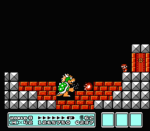
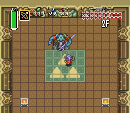
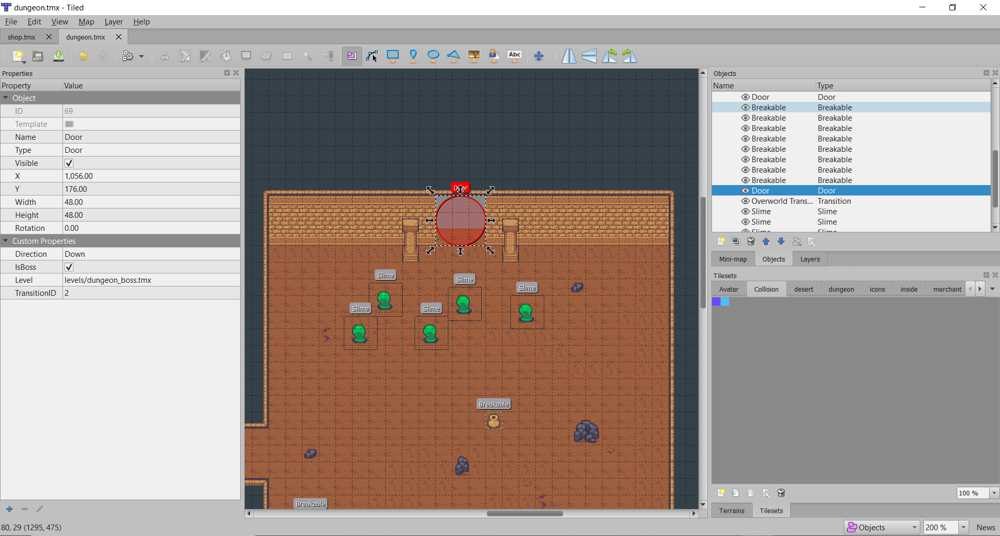
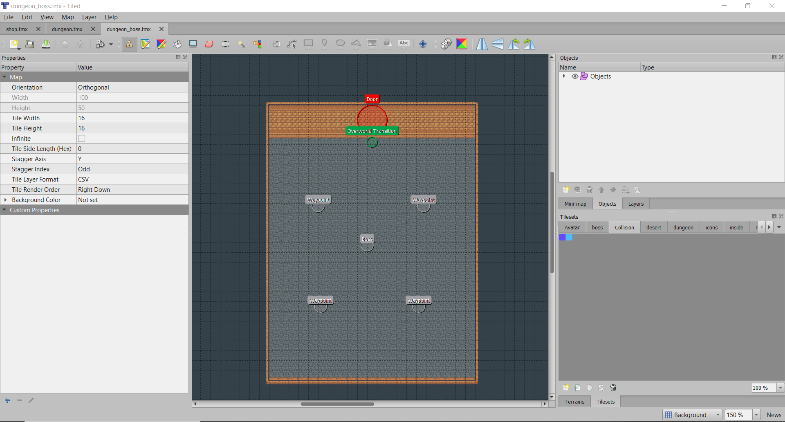

# 17.1. Boss
> | Téléchargement fichiers référence |
> | ------------- |:-------------:|
> | <a href="" download>desktop.zip</a> |
> | <a href="" download>core.src.zip</a> |
> | <a href="" download>core.assets.zip</a> |

Dans les jeux vidéo, le mot *boss* (chef) désigne un ennemi très puissant qui représente habituellement le défi ultime pour le joueur. Le *boss* est le point de culmination du jeu et permettra au joueur de mettre en œuvre son expertise. Tout comme dans un jeu vidéo, ce dernier chapitre dans lequel nous allons programmer un *boss* vous permettra de combiner vos apprentissages!

### **Super Mario Bros. 3 - World 8 Boss**[^1]


### **The Legend of Zelda: A Link to the Past - Ganon**[^2]


---
> ### Étapes à suivre
> 1. à l'intérieur de de `levels/dungeon.tmx`, configurez une porte appartenant à un boss à l'aide de la propriété `IsBoss`.
> 2. à l'intérieur de la classe `Door`
>     * Distinguez la porte du boss de la porte de la porte secrète
> 3. à l'intérieur de la classe `Level` ajoutez la possibilité de créer soit une porte de boss ou une porte normale.
> 4. à l'intérieur de la classe `Avatar` modifiez initInventory pour ajouter une clé `Boss Key` afin de vérifier le fonctionnement du système.




```java
/* Door.java */
package com.tutorialquest.entities;
// import ..

public class Door extends PhysicalObject {
    
    // AJOUT:
    private boolean isBoss = true;
    
    // ...
    public Door(
        Vector2 position,
        String level,
        int transitionID,
        String direction,
        boolean isLocked,
        // AJOUT:
        boolean isBoss)
    {
        super(position);

        this.isBoss = isBoss;
        this.level = level;
        this.transitionID = transitionID;
        this.direction = direction;

        collider = new Collider(
            new Vector2(WIDTH, HEIGHT),
            Collider.FLAG_DOOR | Collider.FLAG_COLLIDABLE);

        // MODIF:
        // Ajout d'un sprite différent 
        // lorsqu'il s'agit d'une porte de `boss`
        unlockedSprite = new Sprite(isBoss ?
            "objects/boss_door_open.png" :
            "objects/door_open.png",
            WIDTH, HEIGHT, 0, 0);

        // MODIF:
        lockedSprite = new Sprite(isBoss ?
            "objects/boss_door_closed.png" :
            "objects/door_closed.png",
            WIDTH, HEIGHT, 0, 0);

        sprite = lockedSprite;

    }
}
```

```java
/* Level.java */
package com.tutorialquest;
// import ..

public static final String OBJECT_DOOR = "Door";
// ...
public static final String OBJECT_BOSS = "Boss";

// ...
case OBJECT_DOOR:
    Door door;
    add(door = new Door(new Vector2(
        object.getProperties().get(OBJECT_PROP_X, float.class),
        object.getProperties().get(OBJECT_PROP_Y, float.class)),
        object.getProperties().get(OBJECT_PROP_DOOR_LEVEL, String.class),
        object.getProperties().get(OBJECT_PROP_DOOR_TRANSITION_ID, Integer.class),
        object.getProperties().get(OBJECT_PROP_DOOR_DIRECTION, String.class),
        object.getProperties().containsKey(OBJECT_PROP_DOOR_LOCKED) ?
            object.getProperties().get(OBJECT_PROP_DOOR_LOCKED, boolean.class) :
            true,
        // AJOUT:
        // Ajout d'une porte de boss si `IsBoss` est évalué à `true`
        object.getProperties().containsKey(OBJECT_PROP_DOOR_BOSS) ?
            object.getProperties().get(OBJECT_PROP_DOOR_BOSS, boolean.class) :
            false
    ));

    break;

    // ...
case OBJECT_BOSS:

    add(boss = new Boss(new Vector2(
        object.getProperties().get(OBJECT_PROP_X, float.class),
        object.getProperties().get(OBJECT_PROP_Y, float.class)))
    );
    break;

// ...
```

```java
/* Avatar.java */
package com.tutorialquest.entities;
// import ..

public class Avatar extends Character {

    // MODIF:
    // Ajout d'une clé pour tester le fonctionnement du system
    public void initInventory() {
        inventory.add(
            // ...
            // AJOUT:
            new Item() {{
                name = "Boss Key";
                type = Item.TYPE_KEY;
                properties.put(Item.PROP_TRANSITION_ID, 2);
            }}
        );
    }
}
```


[^1]: https://www.nintendo.com/games/detail/super-mario-bros-3-3ds/

[^2]: https://www.nintendo.co.uk/Games/Super-Nintendo/The-Legend-of-Zelda-A-Link-to-the-Past-841179.html