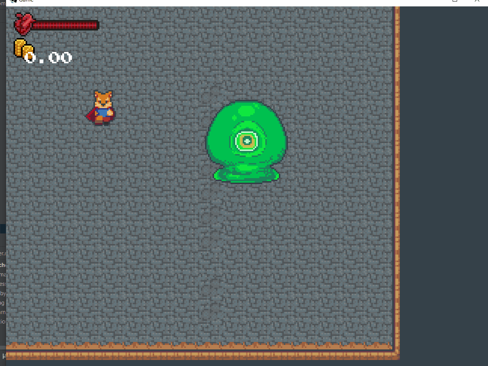
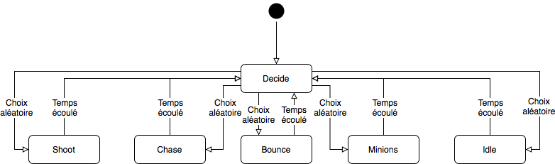
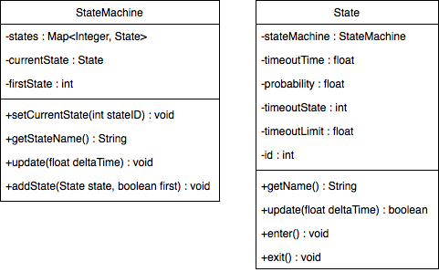

---
slug: tutoquest-machines-a-etats
order: 39
title: 17.2 Machine à états
author: Olivier Perrault
tag: tutorialquest
---

## 17.2. Machine à états
---

Dans un exercice précédent, nous avons amélioré nos ennemis dans le but d'illustrer le concept de comportements avec des **états**. Bien que les états peuvent sembler superflus pour un ennemi simple, l'utilisation d'états est essentielle pour représenter un personnage intelligent complexe comme le *boss*.
Lorsqu'il s'agit du *boss* pour un jeu vidéo, il est typique de vouloir avoir plusieurs phases d'attaque. Voici les différentes phases du combat et états du boss.

### `Shoot`

Dans cet état le *boss* tire une série de projectiles en spirale


### `Chase`

Dans cet était le *boss* pourchasse le joueur de façons similaires au comportement de l'ennemi.


### `Bounce`

Dans cet état le boss rebondit sur les bordures du niveau de plus en plus vite.


### `Minions`

Dans cet état, le *boss* fait apparaitre un groupe d'ennemi pour attaquer le joueur



### `Waypoint`


Dans cet état, le boss se dirige vers un des points de contrôle le plus proche.

En résumé, il est utile de représenter les états par un diagramme.



Lorsque nous avons amélioré nos ennemis, nous avons utilisé un simple *switch statement* afin de représenter leurs comportements. En effet, la méthode `setState` permet de changer et initialiser l'état de l'ennemi. La méthode `updateState` permet de mettre à jour l'ennemi selon l'état de manière assez simple. Cependant lorsqu'il s'agit d'un grand nombre d'états ce simple mécanisme peut être très encombrant.

```java
public class SimpleBossDemo extends Character {

    public class StateUtils
    {
        public static final int SHOOT = 0;
        public static final int CHASE = 1;
        public static final int BOUNCE = 2;
        public static final int MINIONS = 3;
        public static final int WAYPOINT = 4;
        public static final int DECIDE = 5;
        public static final int IDLE = 6;
    }

    public void setState(int state)
    {
        switch (state)
        {
            case StateUtils.SHOOT:
                // Plusieurs lignes de code ...
                break;

            case StateUtils.CHASE:
                // Plusieurs lignes de code ...
                break;

            case StateUtils.MINIONS:
                // Plusieurs lignes de code ...
                break;
            case StateUtils.WAYPOINT:
                // Plusieurs lignes de code ...
                break;

            case StateUtils.DECIDE:
                // Plusieurs lignes de code ...
                break;

            case StateUtils.IDLE:
                // Plusieurs lignes de code ...
                break;
        }

        this.state = state;
    }

    public void updateState(float deltaTime)
    {
        // ...

        switch (state)
        {
            case StateUtils.SHOOT:
                // Plusieurs lignes de code ...
                break;

            case StateUtils.CHASE:
                // Plusieurs lignes de code ...
                break;

            case StateUtils.MINIONS:
                // Plusieurs lignes de code ...
                break;
            case StateUtils.WAYPOINT:
                // Plusieurs lignes de code ...
                break;

            case StateUtils.DECIDE:
                // Plusieurs lignes de code ...
                break;

            case StateUtils.IDLE:
                // Plusieurs lignes de code ...
                break;
        }
    }
}
```

Une meilleure manière de procéder est d'encapsuler chacun des états à l'intérieur de classes. En d'autres mots, il est possible d'utiliser le polymorphisme afin de mettre à jour le *boss* en délégant le travail à une classe de type `State` plutôt qu'au *boss* en tant que tel.

```java
public class State {

    public void enter()
    {
        this.state = state;
    }

    public void update(Boss boss, float deltaTime)
    {
        // ...
        this.state.update(this, deltaTime);
    }
}
```

```java
public class BetterBossDemo extends Character {

    public void setState(State state)
    {
        this.state = state;
    }

    public void updateState(float deltaTime)
    {
        // ...
        this.state.update(this, deltaTime);
    }
}
```

En pratique nous voulons être capables d'effectuer les opérations suivantes:
```
exit state
enter state
set state
get state name
update state
add state
```
Il est donc naturel de vouloir encapsuler le comportement relatif aux états dans une classe appart et non gérer les états à l'intérieur de `Boss`. Une **machine à états** (*State Machine*) est un objet théorique utilisé en informatique et est utilisée précisément pour résoudre le problème de gestion des états et transitions. Les classes `StateMachine` et `State` peuvent êtres utilisés afin de facilement intégrer des états à notre jeu.

 Afin d'ajouter un nouveau comportement à notre personnage, il s'agit que de dériver la classe `State` et d'ajouter une instance au `StateMachine` situe dans le personnage.



---
> ### Étapes à suivre
> 1. ajoutez la classe `Boss`
> 2. chargez la texture `assets/objects/boss_spritesheet.png` et ajoutez les animations nécessaires.
> 3. ajoutez les méthodes `update` et `render` de manière similaire à l'ennemi

```java
/* Boss.java */
package com.tutorialquest.entities.boss;
// import ..

public class Boss extends Character {

    public class SpriteUtils {
        public static final int IDLE_FRONT = Character.SpriteUtils.IDLE_FRONT;
        public static final int WALK_FRONT = Character.SpriteUtils.WALK_FRONT;
        public static final int IDLE_SIDE = Character.SpriteUtils.IDLE_SIDE;
        public static final int WALK_SIDE = Character.SpriteUtils.WALK_SIDE;
        public static final int IDLE_BACK = Character.SpriteUtils.IDLE_BACK;
        public static final int WALK_BACK = Character.SpriteUtils.WALK_BACK;
        public static final int SHOOT = 20;
    }    
    
    public static final int WIDTH = 64;
    public static final int HEIGHT = 64;
    public static final float MAX_HEALTH = 10;
    public static final float DAMAGE = 15;
    public static final float KNOCKBACK = 200f;
    public static final float SPEED = 40f;
    public static final float PUSH_FORCE = 0.8f;

    public Vector2 destination = new Vector2();    
    private StateMachine stateMachine = new StateMachine();

    public void initSprite() {
        sprite = new AnimatedSprite(
            "objects/boss_spritesheet.png", 
            new Vector2(WIDTH, HEIGHT));                    
        sprite.origin = new Vector2(WIDTH/2, 0);

        sprite.addAnimation(
            SpriteUtils.IDLE_FRONT,
            AnimatedSprite.DEFAULT_FRAME_LENGTH,
            Animation.PlayMode.LOOP,
            sprite.frames[0][1]
        );

        sprite.addAnimation(
            SpriteUtils.WALK_FRONT,
            AnimatedSprite.DEFAULT_FRAME_LENGTH,
            Animation.PlayMode.LOOP,
            sprite.frames[0][0],
            sprite.frames[0][1],
            sprite.frames[0][2]
        );

        sprite.addAnimation(
            SpriteUtils.IDLE_SIDE,
            AnimatedSprite.DEFAULT_FRAME_LENGTH,
            Animation.PlayMode.LOOP,
            sprite.frames[2][1]
        );

        sprite.addAnimation(
            SpriteUtils.WALK_SIDE,
            AnimatedSprite.DEFAULT_FRAME_LENGTH,
            Animation.PlayMode.LOOP,
            sprite.frames[2][0],
            sprite.frames[2][1],
            sprite.frames[2][2]
        );

        sprite.addAnimation(
            SpriteUtils.IDLE_BACK,
            AnimatedSprite.DEFAULT_FRAME_LENGTH,
            Animation.PlayMode.LOOP,
            sprite.frames[1][1]
        );

        sprite.addAnimation(
            SpriteUtils.WALK_BACK,
            AnimatedSprite.DEFAULT_FRAME_LENGTH,
            Animation.PlayMode.LOOP,
            sprite.frames[1][0],
            sprite.frames[1][1],
            sprite.frames[1][2]
        );

        sprite.play(SpriteUtils.WALK_FRONT, true);
    }

    public void initCollider()
    {
        collider = new Collider(
            new Vector2(WIDTH/2, 16),
            Collider.FLAG_COLLIDABLE | Collider.FLAG_ENEMY);
        collider.origin = new Vector2(WIDTH/4, 0);

    }

    public void initLootTable()
    {
        lootTable = new LootTable();
        lootTable.add(
            new LootTable.Loot()
            {{
                type = Collectible.Type.Money;
                probability = 1f;
                value = Money.GOLD_STACK_VALUE;
            }},
            new LootTable.Loot()
            {{
                type = Collectible.Type.Money;
                probability = 1f;
                value = Money.DIAMOND_VALUE;
            }}
        );
    }

    public Boss(
        Vector2 position)
    {
        super(position, DAMAGE, KNOCKBACK, MAX_HEALTH, SPEED, PUSH_FORCE);
        initSprite();
        initCollider();
        initLootTable();                
    }

    // Mise à jour de Boss de manière similaire à ennemi
    @Override
    public void update(float deltaTime) {
        super.update(deltaTime);        
        updateVelocity(deltaTime);
        turn();
        push(Collider.FLAG_NONE);
        collisionAttack(Collider.FLAG_AVATAR);
        move();
        collider.update(position);
    }
}

```

---
> ### Étapes à suivre
> 1. ajoutez une machine à état `stateMachine` de type `StateMachine` à `Boss` responsable pour le contrôle des états
>    * Initialiser le contenu à l'intérieur de la méthode `initStateMachine` 
> 1. ajoutez le fichier `BossState.java` dans lequel nous définirons l'état de base ainsi que les identifiants.
> 2. pour commencer, ajoutez les états `IdleState` et `DecisionState`
>     * `DecisionState` permet d'obtenir une transition aléatoire lorsque le temps défini pour un état est écoulé.
>         * Cet état omniprésent est défini dans la classe `StateMachine`
>     * `IdleState` prescrit à l'usager de rester immobile pour la durée de l'état/
> 3. chaque état est construit de la manière suivante:
>     * `StateMachine stateMachine`
>         * référencé à la machine afin de pouvoir changer d'état
>     * `int id`
>         * l'identifiant de l'état courant au sein de la machine
>     * `float probability`
>         * probabilité de transition lors d'une décision `Decision` 
>     * `float timeLimit`
>         * Limite de temps à l'état, `-1` si aucune limite
>     * `int timeoutState`
>         * État de transition lorsque le temps est écoulé 

```java
/* BossState.java */
package com.tutorialquest.entities.boss;
// import ..

public static class BossState extends StateMachine.State 
{
    public static final int STATE_IDLE = 0;
    public static final int STATE_DECIDE = 1;
    public static final int STATE_WAYPOINT = 2;
    public static final int STATE_SHOOT_SPIRAL = 3;
    public static final int STATE_MINIONS = 4;
    public static final int STATE_BOUNCE = 5;
    public static final int STATE_CHASE = 6;

    protected Boss boss;

    public State(
        Boss boss, 
        StateMachine stateMachine, 
        int id, 
        float probability, 
        float timeLimit, 
        int timeoutState) 
    {
        super(
            stateMachine, 
            id, 
            probability, 
            timeLimit, 
            timeoutState);

        this.boss = boss;
    }
}
```

```java
/* IdleState.java */
package com.tutorialquest.entities.boss;
// import ..

public static class IdleState extends BossState 
{
    @Override
    public String getName() {
        return "Idle";
    }

    public IdleState(
        Boss boss, 
        StateMachine 
        stateMachine, 
        int id, 
        float probability, 
        float timeLimit, 
        int timeoutState) 
    {
        super(
            boss, 
            stateMachine, 
            id, 
            probability, 
            timeLimit, 
            timeoutState);
    }

    // Immobilise le personnage
    @Override
    public void enter() {
        super.enter();
        boss.locomotionVelocity.setZero();
        boss.controlAxes.setZero();
    }
}
```

```java
/* Boss.java */
package com.tutorialquest.entities.boss;
// import ..

public class Boss extends Character {

    public void initStateMachine(){
        stateMachine.addState(
            new DecisionState(stateMachine, BossState.STATE_DECIDE, -1, -1, -1), 
            true);    
        stateMachine.addState(
            new IdleState(this, stateMachine, BossState.STATE_IDLE, 0.5f, 1f, BossState.STATE_DECIDE), 
            false);
    }

    public Boss(Vector2 position)
    {
        // ...
        // AJOUT:
        initStateMachine();        
    }

    @Override
    public void update(float deltaTime) {
        super.update(deltaTime);
        // AJOUT:
        stateMachine.update(deltaTime);
        updateVelocity(deltaTime);
        // ...
    }
}

```