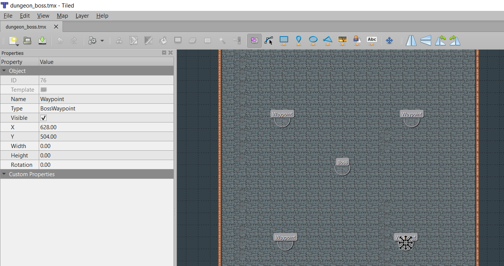

---
slug: tutoquest-points-controles
order: 41
title: 17.4 Points de contrôles
author: Olivier Perrault
tag: tutorialquest
---

## 17.4. Points de contrôles
---

### `Waypoint`


Dans cet état, le boss se dirige vers un des points de contrôle le plus proche. L'utilité de cet état est démontrée lorsque le joueur entraine le boss dans un endroit qui ne serait pas idéal pour commencer une prochaine phase d'attaque. L'idée derrière cet état est donc de retourner à un comportement relativement stable.

Il est nécessaire d'ajouter au niveau au préalable les points de contrôle `Waypoint` afin de guider notre personnage.

---
> ### Étapes à suivre
> 1. ajoutez des objets point de contrôle `Waypoint` à `levels/dungeon_boss.tmx`
> 2. chargez les points de contrôle dans la méthode `load` et passer les en paramètres à `Boss`
> 3. ajoutez une la classe `ChaseState`
> 4. ajoutez une instance de `ChaseState` à l'intérieur de la méthode `initStateMachine` du *boss*



```java    
/* Level.java */
package com.tutorialquest;
// import ..

public class Level {

    public static final String OBJECT_BOSS = "Boss";
    public static final String OBJECT_BOSS_WAYPOINT = "BossWaypoint";

    // ...

    public void load(int transitionID, Avatar avatar)
    {
        // ...
        case OBJECT_BOSS:

            // Chargement des `waypoints` et création du boss
            List<Vector2> waypoints = new LinkedList<>();
            layer.getObjects().forEach(
                x ->
                {
                    if (x.getProperties().get(OBJECT_PROP_TYPE, String.class).equals(
                        OBJECT_BOSS_WAYPOINT)) {
                        Vector2 waypoint = new Vector2(
                            x.getProperties().get(OBJECT_PROP_X, float.class),
                            x.getProperties().get(OBJECT_PROP_Y, float.class));
        
                        waypoints.add(waypoint);
                    }
        
                });
        
            // Passage des `waypoints`
            add(boss = new Boss(new Vector2(
                object.getProperties().get(OBJECT_PROP_X, float.class),
                object.getProperties().get(OBJECT_PROP_Y, float.class)),
                waypoints)
            );
            break;
        // ...
    }
}
```

```java
/* WaypointState.java */
package com.tutorialquest.entities.boss;
// import ..

public class WaypointState extends BossState 
{
    private static final float SPEED = 45f;

    public WaypointState(Boss boss, StateMachine stateMachine, int id, float probability, float timeLimit, int timeoutState) {
        super(boss, stateMachine, id, probability, timeLimit, timeoutState);
    }

    @Override
    public String getName() {
        return "Waypoint";
    }

    @Override
    public void enter() {        
        super.enter();
        
        // Choix de la destination en fonction du `waypoint` le plus proche
        boss.destination
            .set(boss.waypoints.isEmpty() ?
                boss.position :
                boss.waypoints
                    .stream()
                    .min(Comparator.comparing(x -> x.dst(boss.position)))
                    .get());
    }

    // Déplacement en direction du waypoint
    @Override
    public boolean update(float deltaTime) {

        if (!super.update(deltaTime)) return false;

        if (boss.position.epsilonEquals(boss.destination, Boss.DESTINATION_EPSILON)) {
            stateMachine.setCurrentState(STATE_IDLE);
            return true;
        }

        boss.direction
            .set(boss.destination)
            .sub(boss.position)
            .nor();
        boss.controlAxes.set(boss.direction);
        boss.locomotionVelocity
            .set(boss.direction)
            .scl(SPEED);

        return true;
    }
}

```