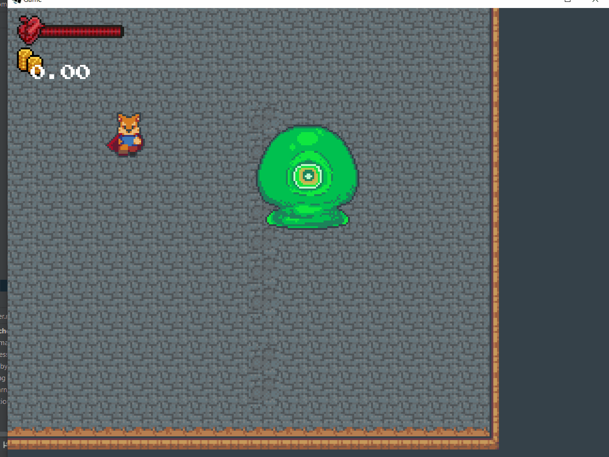

## 17.5. Appeler des renforts
---

### `Minions`



Dans cet état, le *boss* fait apparaître un groupe d'ennemi pour attaquer le joueur. Ce changement est facile à réaliser cependant nous devons modifier la table de récompenses `LootTable` des ennemis puisque nous ne voulons pas créer une nouvelle clé `Boss Key` durant le *boss* lui-même.

---
> ### Étapes à suivre
> 1. ajoutez l'animation SHOOT pour le *boss*.
> 2. ajoutez une la classe `MinionsState`
> 3. dans la méthode `enter` créez les ennemis.
> 4. réinitialiser la table de récompenses de l'ennemi.

```java
/* Boss.java */
package com.tutorialquest.entities.boss;
// import ..

public class Boss extends Character {
    // ...
    public void initStateMachine(){
        // ...
        // AJOUT:
        stateMachine.addState(
            new BossState.MinionsState(
                this, 
                stateMachine, 
                BossState.STATE_MINIONS, 
                0.5f, 
                1f, 
                BossState.STATE_IDLE), 
                false);
    }

    public void initSprite() {
        // ...  
        // AJOUT:
        sprite.addAnimation(
            SpriteUtils.SHOOT,
            AnimatedSprite.DEFAULT_FRAME_LENGTH,
            Animation.PlayMode.LOOP,
            sprite.frames[3][0],
            sprite.frames[3][1],
            sprite.frames[3][2],
            sprite.frames[3][3],
            sprite.frames[3][4],
            sprite.frames[3][5]
        );
    }

    @Override
    // AJOUT:
    // Réécriture de la méthode playAnimation 
    // afin que l'animation SHOOT prenne préséance.
    public void playAnimation(
        int anim, 
        boolean reset, 
        boolean force) 
    {
        
        if(!force)
        {            
            if (
                anim != SpriteUtils.SHOOT &&
                stateMachine.currentState.id == BossStateUtils.STATE_MINIONS) return;
        }

        sprite.play(anim, reset);
    }

}
```

```java    
/* MinionsState.java */
package com.tutorialquest.entities.boss;
// import ..

public class MinionsState extends BossState {

        public static final float PROJECTILE_DISTANCE = 4f;
        public static final int NUM_MINIONS = 3;

        public MinionsState(Boss boss, StateMachine stateMachine, int id, float probability, float timeLimit, int timeoutState) {
            super(boss, stateMachine, id, probability, timeLimit, timeoutState);
        }

        @Override
        public String getName() {
            return "Minions";
        }

        @Override
        public void enter() {
            super.enter();
            boss.playAnimation(Boss.SpriteUtils.SHOOT, true, true);

            for (int i = 0; i < NUM_MINIONS; i++) {
                boss.direction.setToRandomDirection();
                
                Enemy enemy;
                Game.level.add(
                    enemy = new Enemy(
                        new Vector2()
                            .add(boss.direction)
                            .scl(PROJECTILE_DISTANCE)
                            .add(boss.position))
                );
                // réinitialiser la table de récompenses de l'ennemi        
                enemy.lootTable = new LootTable();
            }
        }
    }
```
