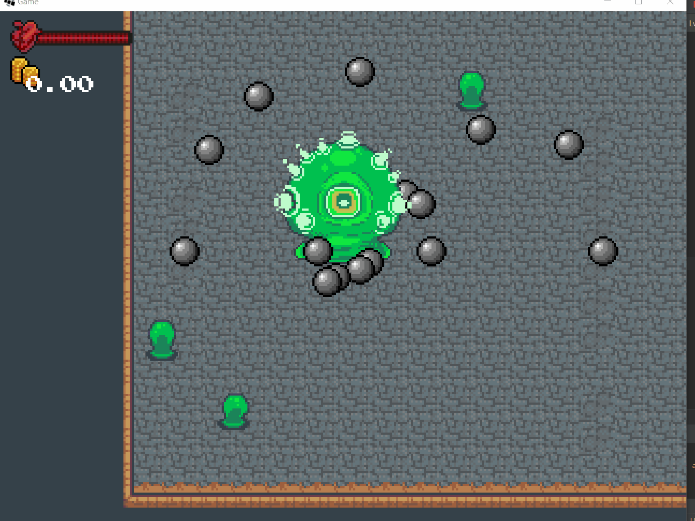

---
slug: tutoquest-projectiles
order: 43
title: 17.6 Projectiles
author: Olivier Perrault
tag: tutorialquest
---

## 17.6. Projectiles
---

### `Shoot`



Dans cet état le *boss* tire une série de projectiles en spirale. Afin de représenter cette attaque, nous aurons besoin d'une nouvelle attaque `ProjectileAttack`. Pour l'effet de spiral, il est simplement question d'appliquer une rotation de manière incrémentale au vecteur de direction du *boss* et de s'en servir pour créer le projectile.

---
> ### Étapes à suivre
> 1. Ajoutez la classe `ProjectileAttack`
> 2. Ajoutez la classe `ShootState`

```java
/* ProjectileAttack.java */
package com.tutorialquest.entities;
// import ..

public class ProjectileAttack extends PhysicalObject implements IAttack
{
    public static float SPEED = 50f;
    public static Vector2 SIZE = new Vector2(16, 16);
    private static final int NUM_HITS = 3;

    private int hits = 0;
    private Vector2 direction;
    private Sprite sprite;
    private List<PhysicalObject> collisionResults = new LinkedList<>();
    private float damage;
    private float knockback;
    private float speed = 1f;

    @Override
    public float getDamage() {
        return damage;
    }

    @Override
    public float getKnockback() {
        return knockback;
    }

    @Override
    public Vector2 getDirection() {
        return direction;
    }

    public ProjectileAttack(
        Vector2 position,
        Vector2 direction,
        float damage,
        float knockback,
        float speed)
    {
        super(position);
        this.sprite = new Sprite("objects/projectile.png", SIZE);
        this.collider = new Collider(SIZE, Collider.FLAG_ENEMY);
        this.direction = direction;
        this.damage = damage;
        this.knockback = knockback;
        this.speed = speed;
        this.locomotionVelocity
            .set(direction)
            .scl(speed);
    }

    @Override
    public void update(float deltaTime) {
        super.update(deltaTime);
        updateVelocity(deltaTime);
        move();
        sprite.update(deltaTime);
        collisionResults.clear();
        if(collider.getObjectCollisions(
            this,
            velocity.x,
            velocity.y,
            Collider.FLAG_AVATAR,
            collisionResults))
        {
            collisionResults.iterator().next().onAttacked(this);
            destroy();
            return;
        }

        if(collider.isColliding(this, velocity, Collider.FLAG_NONE))
        {
            destroy();
        }
    }

    public void destroy()
    {
        Game.level.remove(this);
    }

    @Override
    public void render(SpriteBatch spriteBatch) {
        super.render(spriteBatch);
        sprite.render(spriteBatch, position);
    }

    @Override
    public void onAttacked(IAttack attack)
    {
        sprite.flash();
        onPushed(this, attack.getDirection().scl(attack.getKnockback()));
        hits++;
        if(hits >= NUM_HITS) 
        {
            Game.level.remove(this);
        }
    }
}

```

```java    
/* ShootState.java */
package com.tutorialquest.entities;
// import ..

public class ShootState extends BossState {

    public static final float ROTATION_SPEED = 30f;

    @Override
    public String getName() {
        return "Shoot Spiral";
    }

    public ShootState(
        Boss boss, 
        StateMachine stateMachine, 
        int id, 
        float probability, 
        float timeLimit, 
        int timeoutState) 
    {
        super(
            boss, 
            stateMachine, 
            id, 
            probability, 
            timeLimit, 
            timeoutState);
    }

    @Override
    public boolean update(float deltaTime) {
        if (!super.update(deltaTime)) return false;

        fireRateTime += deltaTime;
        if (fireRateTime >= Boss.FIRE_RATE) {
            fireRateTime = 0;
            Game.level.add(
                new ProjectileAttack(
                    new Vector2()
                        .add(boss.direction)
                        .scl(Boss.PROJECTILE_DISTANCE)
                        .add(boss.position),
                    boss.direction.cpy(),
                    Boss.PROJECTILE_DAMAGE,
                    Boss.PROJECTILE_KNOCKBACK,
                    Boss.PROJECTILE_SPEED)
            );

            boss.direction
                .rotate(ROTATION_SPEED)
                .nor();
        }

        return true;
    }

    @Override
    public void enter() {
        super.enter();
        boss.direction = new Vector2(1, 0);
        boss.playAnimation(Boss.SpriteUtils.SHOOT, true, true);
    }
}
```
