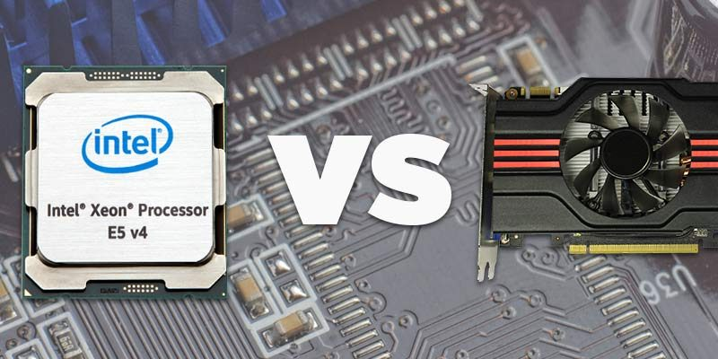
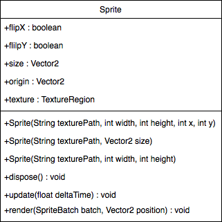
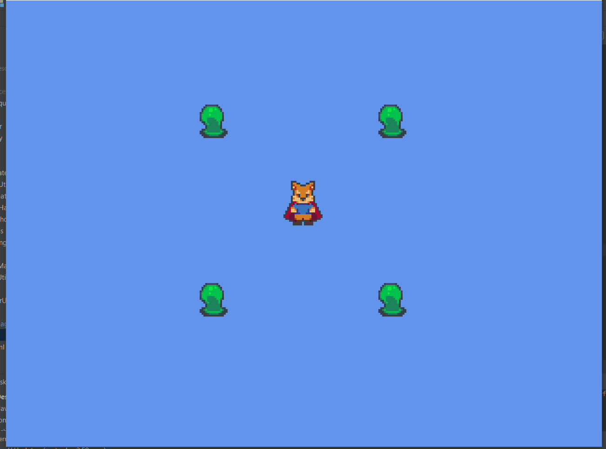
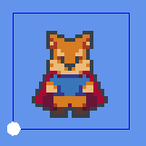
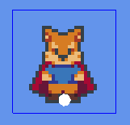

# 2. *Sprites*
> | Téléchargement fichiers référence |
> | ------------- |:-------------:|
> | <a href="" download>desktop.zip</a> |
> | <a href="" download>core.src.zip</a> |
> | <a href="" download>core.assets.zip</a> |

## 2.1. *Sprites* et SpriteBatch
---
Lorsqu'il s'agit des visuels pour les jeux vidéo en 2D, nos entités sont typiquement représentées à l'aide de `sprite`. Le sprite est le mécanisme haut niveau permettant d'encapsuler toutes les fonctionnalités propres à l'affichage d'une image à l'écran, telle la position, rotation, etc.

Étant donné la séparation des composantes physique de notre ordinateur, soit le processeur et la carte graphique, il est avantageux de réduire les interactions entre les deux composantes. À cet effet, LibGDX affiche du contenu à l'écran à l'aide de la classe `SpriteBatch`, qui combine plusieurs dessins dans une même *batch* qui sera envoyé à la carte graphique en un seul coup.

### **CPU vs. GPU**[^1]


---
> ### Étapes à suivre
> 1. créez une instance de `SpriteBatch` dans la classe `Game`
> 4. configurez l'instance `SpriteBatch` à l'aide des matrices de la camera
> 2. passez le `SpriteBatch` en paramètre de la méthode `render` pour le monde et les entités 
> 3. utilisez la classe `Sprite` qui encapsule l'affichage du sprite
> 4. modifiez l'avatar afin qu'il dessine un personnage à la place d'une boîte




```java
/* Game.java */
package com.tutorialquest.entities;
// import ..

public class Game extends ApplicationAdapter {
    // ..
    // AJOUT: référence au sprite batch
    private SpriteBatch spriteBatch;

    @Override
    public void create() {        
        // ..        
        // AJOUT
        spriteBatch = new SpriteBatch();
    }

    @Override
    public void render() {
        // ..        
        // AJOUT
        spriteBatch.setProjectionMatrix(camera.combined);
        level.render(spriteBatch);
    }

}
```


```java
/* Avatar.java */
package com.tutorialquest.entities;
// import ..

public class Avatar extends Entity{
    
    protected static int WIDTH = 32;
    protected static int HEIGHT = 32;

    // ..
    // AJOUT:
    private Sprite sprite = new Sprite("objects/avatar.png", WIDTH, HEIGHT);

    // ..

    @Override
    public void render(SpriteBatch spriteBatch) {
        sprite.render(spriteBatch, position);
    }
    
    // ..
}
```



---
Puisque l'origine de nos images se situe toujours dans le coin en bas à droite, la position du personnage ne correspond pas parfaitement à la position dans le monde.

### Sprite avec origine au coin à gauche par défaut


### Sprite avec origine aux pieds du personnage


---
> ### Étapes à suivre
> Modifiez la valeur de `sprite.origin` afin que la position d'origine soit aux pieds du personnage

```java
/* Avatar.java */
package com.tutorialquest.entities;
// import ..

public class Avatar extends Entity{    
    // ..
    public Avatar(Vector2 position)
    {
        super(position);
        sprite = new Sprite("objects/avatar.png", WIDTH, HEIGHT);
        // AJOUT:
        // Configuration de l'origine du sprite
        sprite.origin = new Vector2(WIDTH/2, HEIGHT/8);
    }
    // ..
}
```
> ## Activité
> ---
> 1. Ajoutez un *sprite* à `Enemy`
> 2. Changez l'affichage de l'ennemi afin qu'il affiche un personnage.


[^1]: https://www.maketecheasier.com/difference-between-cpu-and-gpu/