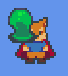
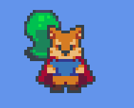
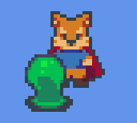
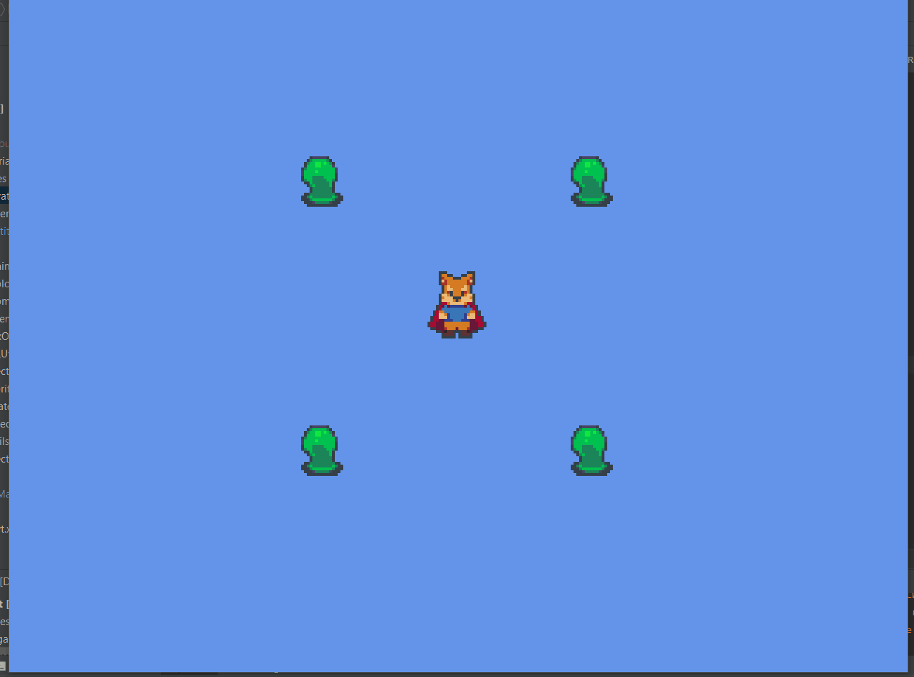

## 2.2. *Sprites* et effet profondeur
---

Comme vous pouvez surement remarqué, la profondeur des *sprite* n'est pas affichée comme on le voudrait.



Plus précisément, nous voudrions que les entités situées plus en bas de l'écran soient affichées à l'avant tandis que les entités au-dessus affichées à l'arrière. Afin d'arriver à cet effet, il est important de comprendre comment la méthode `render` de la classe `SpriteBatch` de *LibGDX* fonctionne.




Lorsqu'un appel à `SpriteBatch.begin` est effectué, l'image n'est pas immédiatement dessinée à l'écran. À la place, la requête pour l'affichage est mise dans une **file d'attente** qui sera ensuite envoyée au GPU. Le GPU traite ensuite les requêtes en ordre d'arrivée dans la file d'attente. Donc dans le but d'afficher les *sprite* plus en bas à l'avant, il sera nécessaire de réordonner les entités dans la liste en fonction de leur `position.y` à chaque fois qu'il y a un changement. 

---
> ### Étapes à suivre
> A l'intérieur de la méthode `update` de la classe `Level`, réordonne la liste des entités en fonction de la valeur `-position.y`.

```java
/* Level.java */
package com.tutorialquest;
// import ...

public class Level {
    // ...
    public void render(SpriteBatch batch) {
        // AJOUT:
        // triage des entites selon leur profondeurs
        entities.sort(Comparator.comparing(x -> -x.position.y));
        for (Entity ent : entities) {
            ent.render(batch);
        }
    }
}
```
