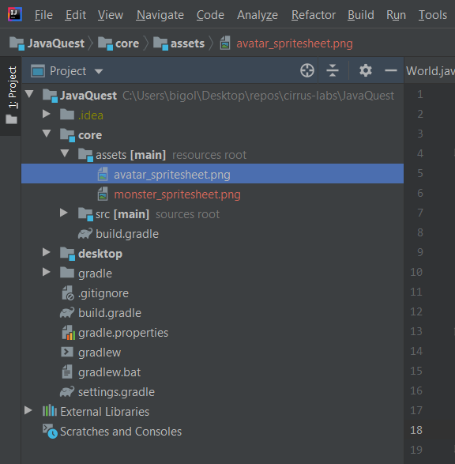
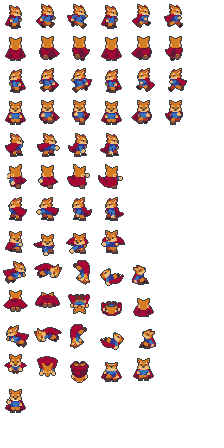
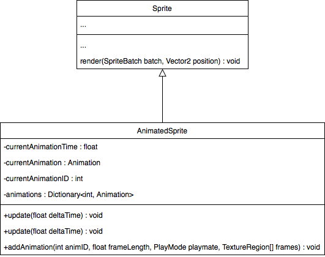

# 3. *Sprites* et animations

> | Téléchargement fichiers référence |
> | ------------- |:-------------:|
> | <a href="" download>desktop.zip</a> |
> | <a href="" download>core.src.zip</a> |
> | <a href="" download>core.assets.zip</a> |


## 3.1. Représentation des et animations
---
Lorsqu'il est plutôt question de dessins animes plutôt que d'images statiques, nous avons besoin d'un moyen pour spécifier une série d'images et pouvoir afficher la séquence telle un *flip book*. La feuille de *sprite* (*sprite sheet*) est l'outil idéal pour résoudre le problème.

Vous retrouverez dans le dossier `asset` du projet, les *sprites sheets* qu'on utilise pour les ennemis et l'avatar.



### ```avatar_spritesheet.png ```


La prochaine étape sera donc d'utiliser la classe `AnimatedSprite` qui va gérer les nombreuses animations propres à notre personnage ainsi que les transformations qu'on applique.



---
> ### Étapes à suivre
> 1. remplacez l'utilisation de `Sprite` par `AnimatedSprite`
> 2. créez la méthode `initSprite` à l'intérieur de `Avatar` afin d'ajouter les animations nécessaires.

```java
package com.tutorialquest.entities;
// AJOUT:
import com.tutorialquest.utils.AnimatedSprite;
// import ...

public class Avatar
{
    // AJOUT:
    // Spécification des identifiants pour chacune des animations
    public static class SpriteUtils {

        public static final float WALK_FRAME_LENGTH = 0.1f;

        public static final int IDLE_FRONT = 1;
        public static final int WALK_FRONT = 2;
        public static final int IDLE_SIDE = 3;
        public static final int WALK_SIDE = 4;
        public static final int IDLE_BACK = 5;
        public static final int WALK_BACK = 6;
    }

    // AJOUT:
    // Remplacement de `Sprite` par `AnimatedSprite`
    private AnimatedSprite sprite;
    // RETIRE:
    // private Sprite sprite;


    public Avatar(Vector2 position) {
        super(position);
        initSprite();
    }

    public void initSprite()
    {
        sprite = new AnimatedSprite(
            "objects/avatar_spritesheet.png", 
            WIDTH, HEIGHT);
        sprite.origin = new Vector2(WIDTH/2, HEIGHT/8);
        sprite.addAnimation(
            SpriteUtils.WALK_FRONT,
            SpriteUtils.WALK_FRAME_LENGTH,
            Animation.PlayMode.LOOP,
            sprite.frames[3][0],
            sprite.frames[3][1],
            sprite.frames[3][2],
            sprite.frames[3][3],
            sprite.frames[3][4],
            sprite.frames[3][5]);

        sprite.addAnimation(
            SpriteUtils.IDLE_FRONT,
            SpriteUtils.WALK_FRAME_LENGTH,
            Animation.PlayMode.LOOP,
            sprite.frames[3][0]);

        sprite.addAnimation(
            SpriteUtils.WALK_SIDE,
            SpriteUtils.WALK_FRAME_LENGTH,
            Animation.PlayMode.LOOP,
            sprite.frames[0][0],
            sprite.frames[0][1],
            sprite.frames[0][2],
            sprite.frames[0][3],
            sprite.frames[0][4],
            sprite.frames[0][5]
        );

        sprite.addAnimation(
            SpriteUtils.IDLE_SIDE,
            SpriteUtils.WALK_FRAME_LENGTH,
            Animation.PlayMode.LOOP,
            sprite.frames[0][0]
        );

        sprite.addAnimation(
            SpriteUtils.WALK_BACK,
            SpriteUtils.WALK_FRAME_LENGTH,
            Animation.PlayMode.LOOP,
            sprite.frames[1][0],
            sprite.frames[1][1],
            sprite.frames[1][2],
            sprite.frames[1][3],
            sprite.frames[1][4],
            sprite.frames[1][5]
        );

        sprite.addAnimation(
            SpriteUtils.IDLE_BACK,
            SpriteUtils.WALK_FRAME_LENGTH,
            Animation.PlayMode.LOOP,
            sprite.frames[1][0]
        );

        sprite.play(SpriteUtils.IDLE_FRONT, true);
    }
}
```
---
> ### Activité
> 1. remplacez l'utilisation de `Sprite` par `AnimatedSprite`
> 2. créez la méthode `initSprite` à l'intérieur de `Avatar` afin d'ajouter les animations nécessaires.

