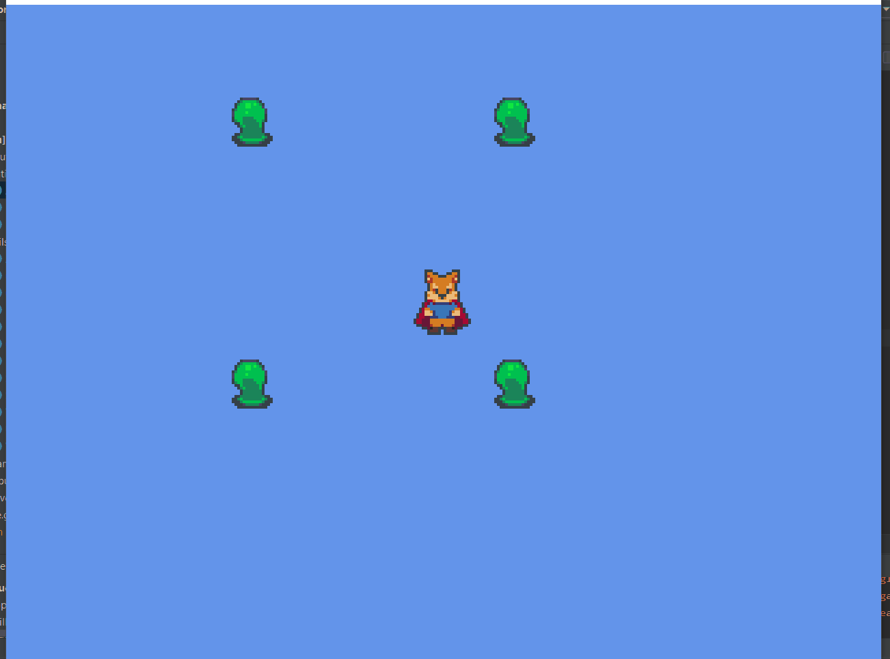

## 3.2. Intégration des *sprites*
---
Maintenant que nous avons le mécanisme requis pour afficher une animation à l'écran, il est maintenant temps d'intégrer les animations dans la classe `Avatar` afin que celles-ci soient jouées aux bons moments.

> ### Étapes à suivre
> 1. ajoutez les variables de direction nécessaires pour déterminer l'orientation du personnage.
> 2. ajoutez la méthode `turn` à l'intérieur de `Avatar` afin de jouer l'animation nécessaire dépendamment de l'orientation.

```java
/* Avatar.java */
package com.tutorialquest.entities;
// import ...

public class Avatar extends Entity {
    
    // ...

    // AJOUT: Constante utilisé pour déterminer un changement de direction
    private static float TURN_EPSILON = 0.5f;
    
    // AJOUT:
    // ajout des variables de direction
    private Vector2 direction = new Vector2(0, -1);
    private Utils.Direction fixedDirection = Utils.Direction.DOWN;    

    // ...

    // AJOUT
    public void turn()
    {        
        // Section qui joue l'animation `IDLE`
        // lorsque l'avatar est immobile
        // lorsque controlAxes est égal à zéro
        // lorsque aucune entrée au clavier
        if (controlAxes.epsilonEquals(Vector2.Zero)) {
            switch (fixedDirection) {
                case LEFT:
                case RIGHT:
                    sprite.play(SpriteUtils.IDLE_SIDE, false);
                    break;

                case UP:
                    sprite.play(SpriteUtils.IDLE_BACK, false);
                    break;

                case DOWN:
                    sprite.play(SpriteUtils.IDLE_FRONT, false);
                    break;
            }

            return;
        }

        // Section pour l'animation `WALK`
        // Lorsque l'entrée au clavier est plus grande que zéro
        // Mise à jour des variables de direction
        if (controlAxes.x > TURN_EPSILON) {
            direction.set(1, direction.y);
            fixedDirection = Utils.Direction.RIGHT;
            sprite.flipX = false;
            sprite.play(SpriteUtils.WALK_SIDE, false);
        } else if (controlAxes.x < -TURN_EPSILON) {
            direction.set(-1, direction.y);
            fixedDirection = Utils.Direction.LEFT;
            sprite.flipX = true;
            sprite.play(SpriteUtils.WALK_SIDE, false);
        }

        if (controlAxes.y > TURN_EPSILON) {
            direction.set(direction.x, 1);
            fixedDirection = Utils.Direction.UP;
            sprite.flipX = false;
            sprite.play(SpriteUtils.WALK_BACK, false);
        } else if (controlAxes.y < -TURN_EPSILON) {
            direction.set(direction.x, -1);
            fixedDirection = Utils.Direction.DOWN;
            sprite.flipX = false;
            sprite.play(SpriteUtils.WALK_FRONT, false);
        }

        // Normalisation du vecteur de direction
        direction.nor();
    }

    @Override
    public void update(float deltaTime) {
        super.update(deltaTime);
        control(deltaTime);
        turn();
        position.add(velocity);
        sprite.update(deltaTime);
    }

    @Override
    public void render(SpriteBatch spriteBatch) {
        sprite.render(spriteBatch, position);
        super.render(spriteBatch);
    }
}
```



---
> ## Activité
> Créez la classe `EnemySprite` dans laquelle vous spécifiez les animations propres à l'ennemi depuis le fichier `assets/monster_sprite.png`
