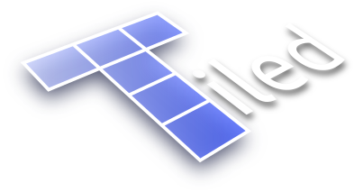
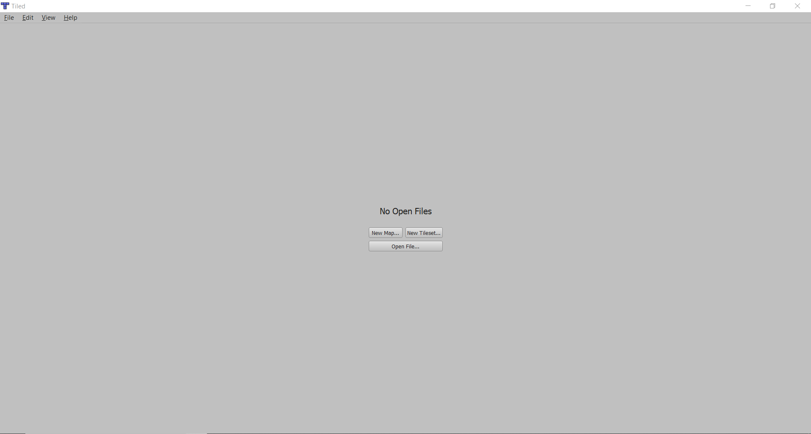
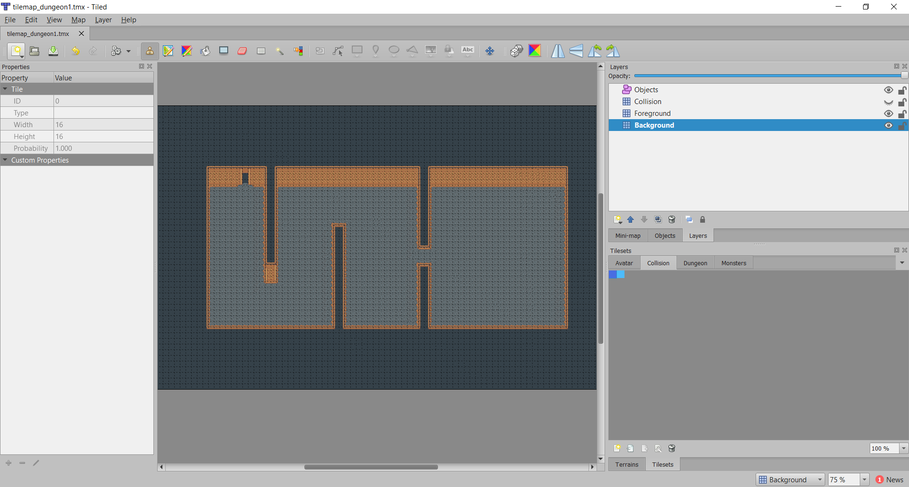
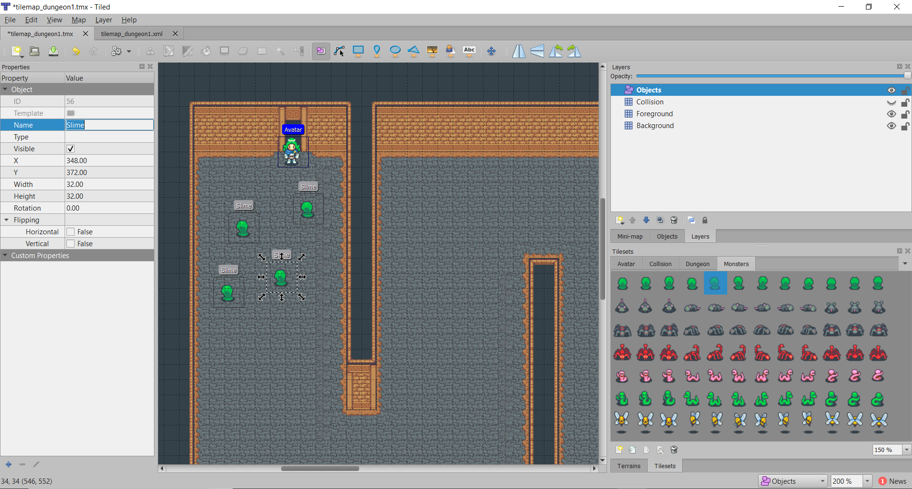

## 4.2 Éditeur de niveaux
---

Puisqu'il n'est pas convenable d'éditer les niveaux de manière textuelle, l'éditeur de niveau qui donne accès à une interface visuelle est l'outil de choix. Dans le cadre de ce projet, nous aurons recours à l'outil [Tiled](https://www.mapeditor.org/) pour modifier nos niveaux.

---
> ### Étapes à suivre
> 1. [Téléchargez Tiled](https://thorbjorn.itch.io/tiled)
> 2. Installez *Tiled*
> 3. Ouvrez l'application

Lorsque vous ouvrez l'application, vous serez accueilli par l'interface suivante. Comme l'accent est mis sur la programmation pour cette activité, un niveau de base est déjà à votre disposition. Vous pouvez le modifier à votre guise. En général, vous y retrouverez trois différents calques (*layer*).

* `Objects`
    * Contient l'information concernant le type et l'emplacement de nos entités dans le monde
* `Collision`
    * Contient des tuiles invisibles servant à calculer les collisions pour notre personnage.
* `Foreground`
    * Contient les tuiles visibles propres à l'avant-plan (les murs)  
* `Background`
    * Contient les tuiles visibles propres à l'arrière-plan (le plancher)

> Ouvrez le fichier `levels/dungeon_demo.xml` fourni dans le projet

---
> ### Étapes à suivre
> 1. ajoutez l'avatar dans le niveau et spécifiez le type `Avatar`
> 2. ajoutez des ennemis dans le niveau et spécifiez le type `Slime`

