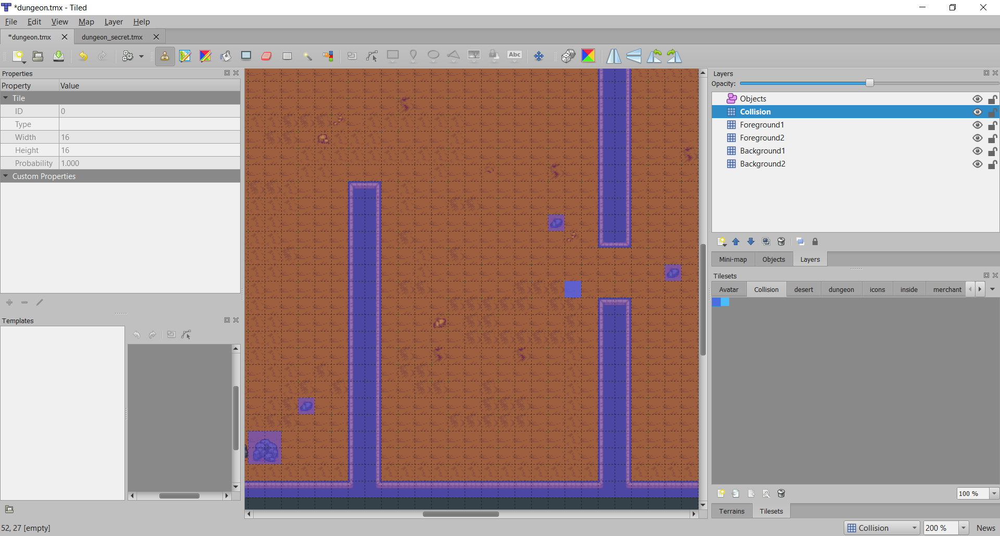
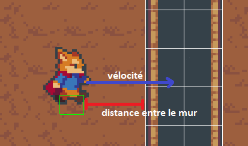
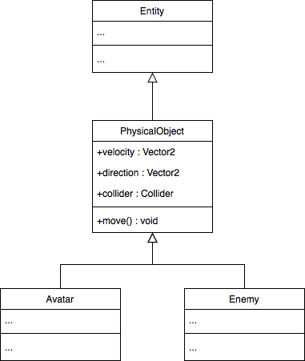

# 5. Collision avec le niveau

> | Téléchargement fichiers référence |
> | ------------- |:-------------:|
> | <a href="" download>desktop.zip</a> |
> | <a href="" download>core.src.zip</a> |
> | <a href="" download>core.assets.zip</a> |

---

Comme vous aurez surement remarqué, bien que nous avons les visuels nécessaires pour notre niveau, il n'y a aucune collision et le personnage est capable de marcher à travers les murs. Afin de remédier à cette situation il est maintenant temps d'ajouter des collisions au niveau et un `Collider` à notre personnage.


## 5.1 Collision avec le niveau
---

La première étape consiste à ajouter les collisions à notre niveau. Comme pour les visuels, il est facile de représenter les zones de collision à l'aide de tuiles.

---
> ### Étapes à suivre
> 1. ajoutez le *layer* appelé `Collision` au niveau
> 2. sauvegardez-le *layer* de collision lors du chargement du niveau.
> 3. affichez les tuiles de collisions pour vérifier le fonctionnement du système



```java
/* Level.java */
package com.tutorialquest;
// import ...

public class Level {

    // Identifiant pour le layer de collision
    public static final String LAYER_COLLISION = "Collision";

    // ...

    // Taille des tuiles pour affichage 'debug'
    public static final int TILE_SIZE = 16;

    public void load(int transitionID, Avatar avatar)
    {
        // ...

        for (MapLayer layer : tiledMap.getLayers()) {
            switch (layer.getName()) {
                
                // Sauvegarde le layer pour les collisions lors du chargement
                case LAYER_COLLISION:
                    collisionLayer = (TiledMapTileLayer) layer;
                    break;
                // ...
            }
        }
    }

    public void render(SpriteBatch batch) {
        // ...

        // Affichage des tuiles pour les collisions 
        // afin de vérifier le fonctionnement du système
        if(!Game.isDebugRenderEnabled) return;
        shapeRenderer.setProjectionMatrix(Game.camera.combined);
        shapeRenderer.begin(ShapeRenderer.ShapeType.Line);
        for(int i = 0; i < collisionLayer.getWidth(); i++)
            for(int j = 0; j < collisionLayer.getHeight(); j++)
                if(collisionLayer.getCell(i, j) != null)
                    shapeRenderer.rect(i * TILE_SIZE, j * TILE_SIZE, TILE_SIZE, TILE_SIZE);
        shapeRenderer.end();
    }
}
```

<br/>

## 5.2 Collision de l'avatar
---

Le `Collider` que l'on associe à l'avatar permet de définir la forme d'un objet afin que cet objet puisse interagir avec le monde physique. Bien souvent un *collider*, qui est invisible, n'a pas besoin d'être de la même forme et la même taille que l'objet initial. Pour les besoins d'un jeu simple en 2D, une approximation à l'aide de boîte est largement suffisant.

La technique que nous allons utiliser pour permettre les collisions comprend les étapes suivantes:
* A chaque appel de `update`
    * Determinez quel côté de l'objet devrais entrer en collision avec le niveau en fonction du signe de la vitesse, i.e          
    ```
        if(velocity.x > 0) collisionSide = right;        
        else if(velocity.x < 0) collisionSide = left;
    ```    
* vérifier si la vélocité applique à un objet entraine une collision
    * Si oui, déplace l'objet jusqu'à tant qu'il soit juste à côté du mur
    * Annule la vitesse courante afin d'empêcher l'objet de passer à travers le mur



---
> ### Étapes à suivre
> 1. créez la classe `PhysicalObject` qui représente un objet qui interagi avec le monde physique
> 2. créez une classe `Collider`
> 3. ajoutez un `Collider` qui se charge de mettre à jour `velocity`
> 4. modifiez `Avatar` afin d'utiliser `Collider`




```java
/* PhysicalObject.java */
package com.tutorialquest.entities;
// import ..

public class PhysicalObject extends Entity {

    public Vector2 velocity = new Vector2();
    public Vector2 direction = new Vector2(0, -1);
    public Collider collider;

    public PhysicalObject(Vector2 position) {
        super(position);
    }

    // Mise à jour de l'objet et de la boîte de collision associée
    public void move() {
        collider.updateObject(this);
        position.add(velocity);
        collider.update(position);
    }

    // ..
}
```

```java
/* Collider.java */
package com.tutorialquest;

import com.badlogic.gdx.math.Rectangle;
import com.tutorialquest.utils.RectangleUtils;
import com.tutorialquest.utils.TiledUtils;
import com.tutorialquest.entities.PhysicalObject;
// import ...

public class Collider {

    // ...
    public Rectangle rect = new Rectangle(0,0,0,0);    
    public Vector2 origin = new Vector2();

    public Collider(Vector2 size)
    {
        this.rect.setSize(size.x, size.y);
    }

    // détermine si la boîte rentre en collision
    // à l'horizontale soit, dans le coin haut, ou le coin bas
    public boolean isCollidingTilemapHorizontal(float xvelocity, float side) {
        return TiledUtils.worldToCell(
            Level.collisionLayer,
            side + xvelocity,
            RectangleUtils.top(rect)) != null ||
        TiledUtils.worldToCell(
            Level.collisionLayer,
            side + xvelocity,
            RectangleUtils.bottom(rect)) != null;
    }
    // détermine si la boîte rentre en collision      
    // à la verticale soit, dans le coin gauche, ou le coin droit
    public boolean isCollidingTilemapVertical(float yvelocity, float side) {
        return
            TiledUtils.worldToCell(
                Level.collisionLayer,
                RectangleUtils.left(rect),
                side + yvelocity) != null ||
            TiledUtils.worldToCell(
                Level.collisionLayer,
                RectangleUtils.right(rect),
                side + yvelocity) != null;
    }

    public Vector2 updateObject(PhysicalObject object)
    {
        //--- Horizontal Collision ---//
        // Calcul de collision effectue à l'aide de l'arrondi
        // afin d'éviter le mouvement interpixel (sub-pixel movement)
        // qui pourrait empêcher de collisionner avec le mur
        float sx = Math.signum(object.velocity.x);
        float sy = Math.signum(object.velocity.y);
        float cvx = MathUtils.ceil(Math.abs(object.velocity.x)) * sx;
        float cvy = MathUtils.ceil(Math.abs(object.velocity.y)) * sy;

        // Détermine si la gauche ou la droite va rentrer en collision
        // en fonction de la vitesse actuelle
        float horizontalSide = cvx > 0 ?
            RectangleUtils.right(rect) :
            RectangleUtils.left(rect);
        float verticalSide = cvy > 0 ?
            RectangleUtils.top(rect) :
            RectangleUtils.bottom(rect);


        // Si l'objet s'apprêtait à collisionner dans le 'update' courant
        if (isCollidingTilemapHorizontal(cvx, horizontalSide)) {
            // Tant que l'object n'entre pas en contact avec le mur
            for (int i = 0; i < Math.abs(cvx); i++) {
                // Je déplace l'objet pixel par pixel 
                // Jusqu'à tant qu'il soit juste à côté du mur.
                if (!isCollidingTilemapHorizontal(sx, horizontalSide)) {
                    object.position.x += sx;
                }
            }

            // J'annule la vélocité de l'objet afin 
            // qu'il ne puisse pas dépasser le mur
            object.velocity.x = 0;
        }

        //--- Vertical Collision ---//
        if (isCollidingTilemapVertical(object, cvy, verticalSide)) {
            for (int i = 0; i < Math.abs(cvy); i++) {
                if (!isCollidingTilemapVertical(object, sy, verticalSide)) {
                    object.position.y +=  sy;
                }
            }

            object.velocity.y = 0;
        }

        return object.velocity;
    }

    public void update(Vector2 position) {
        // Je mets à jour la position du 'Collider' 
        // en fonction de celle de l'objet
        rect.setPosition(
            position.x - origin.x,
            position.y - origin.y);
    }
}


```
```java
/* Avatar.java */
package com.tutorialquest.entities;
// import ...

// MODIF:
// public class Avatar extends Entity {
public class Avatar extends PhysicalObject {

    // ...
    // RETIRE:
    // Nous avons déplacé direction + velocity à l'intérieur de PhysicalObject 
    // public Vector2 velocity = new Vector2();
    // public Vector2 direction = new Vector2(0, -1);

    // AJOUT:
    public void initCollider()
    {
        collider = new Collider(Collider.DEFAULT_SIZE);
        collider.origin = new Vector2(Collider.DEFAULT_SIZE.x / 2, Collider.DEFAULT_SIZE.y / 2);
    }

    public Avatar()
    {
        // AJOUT:
        initCollider();
        // ..
    }

    @Override
    public void update(float deltaTime) {
        super.update(deltaTime);
        control(deltaTime);
        turn();
        // AJOUT:
        move();
        sprite.update(deltaTime);
    }
}
```
---

> ## Activité
> ---
> Effectuez les mêmes changements à la classe `Enemy`


