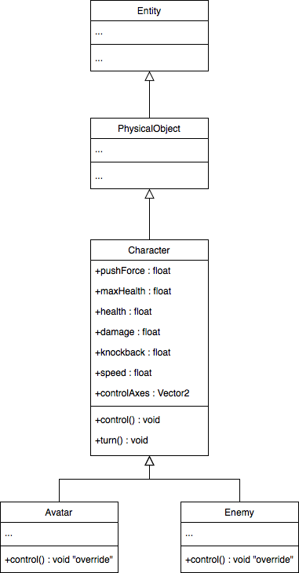

## 6.2. Ennemis
---

Puisque tout bon jeu vidéo consiste à relever un défi, il serait intéressant d'ajouter des ennemis capables de freiner le progrès du joueur dans le niveau.


---
> ### Étapes à suivre
> Créez la classe `Character` qui définit un personnage générique
> * `Character` contiens le code pour jouer l'animation pour chaque orientation
>     * `sprite`
>     * `fixedDirection`
>     * `void turn()`
> * `Character` contient les attributs caractéristiques (*stats*)
>     * `maxHealth`
>     * `health`
>     * `damage`
>     * `knockback`
>     * `speed`



```java
/* Character.java */
package com.tutorialquest.entities;
// import ..

public abstract class Character extends PhysicalObject {

    public class SpriteUtils {
        public static final int IDLE_FRONT = 1;
        public static final int WALK_FRONT = 2;
        public static final int IDLE_SIDE = 3;
        public static final int WALK_SIDE = 4;
        public static final int IDLE_BACK = 5;
        public static final int WALK_BACK = 6;
    }

    private static float TURN_EPSILON = 0.5f;

    public float pushForce = 0.5f;
    public float maxHealth = 100f;
    public float health = maxHealth;
    public float damage = 5f;
    public float knockback = 5f;
    public float speed = 45f;

    public Vector2 controlAxes = new Vector2();
    protected Utils.Direction fixedDirection = Utils.Direction.DOWN;
    protected AnimatedSprite sprite;

    public void turn()
    {
        if (controlAxes.epsilonEquals(Vector2.Zero)) {
            switch (fixedDirection) {
                case LEFT:
                case RIGHT:
                    sprite.play(SpriteUtils.IDLE_SIDE, false);
                    break;

                case UP:
                    sprite.play(SpriteUtils.IDLE_BACK, false);
                    break;

                case DOWN:
                    sprite.play(SpriteUtils.IDLE_FRONT, false);
                    break;
            }

            return;
        }

        if (controlAxes.x > TURN_EPSILON) {
            direction.set(1, direction.y);
            fixedDirection = Utils.Direction.RIGHT;
            sprite.flipX = false;
            sprite.play(SpriteUtils.WALK_SIDE, false);
        } else if (controlAxes.x < -TURN_EPSILON) {
            direction.set(-1, direction.y);
            fixedDirection = Utils.Direction.LEFT;
            sprite.flipX = true;
            sprite.play(SpriteUtils.WALK_SIDE, false);
        }

        if (controlAxes.y > TURN_EPSILON) {
            direction.set(direction.x, 1);
            fixedDirection = Utils.Direction.UP;
            sprite.flipX = false;
            sprite.play(SpriteUtils.WALK_BACK, false);
        } else if (controlAxes.y < -TURN_EPSILON) {
            direction.set(direction.x, -1);
            fixedDirection = Utils.Direction.DOWN;
            sprite.flipX = false;
            sprite.play(SpriteUtils.WALK_FRONT, false);
        }

        direction.nor();
    }

    public Character(
        Vector2 position,
        float damage,
        float knockback,
        float maxHealth,
        float speed,
        float pushForce) {
        super(position);

        this.damage = damage;
        this.knockback = knockback;
        this.pushForce = pushForce;
        this.maxHealth = maxHealth;
        this.health = maxHealth;
        this.speed = speed;
    }
}
```
---
> ### Étapes à suivre
> 1. Modifiez la classe `Enemy` afin qu'elle herite de `Character`
> 2. Modifiez les identifiant pour les animation pour choisir de maniere generique.

```java
/* Enemy.java */
package com.tutorialquest.entities;
// import ...

// MODIF:
// public class Enemy extends PhysicalObject {
public class Enemy extends Character {

    // ...

    // MODIF:
    // Modification des identifiant pour les animations
    public class SpriteUtils {        
        // public static final int IDLE_FRONT = 1;
        public static final int IDLE_FRONT = Character.SpriteUtils.IDLE_FRONT;
        public static final int WALK_FRONT = Character.SpriteUtils.WALK_FRONT;
        // .. side, back, idle, walk 
    
    }

    // AJOUT:
    // Ajout des constante 'stats'
    private static final float MAX_HEALTH = 10f;
    private static final float DAMAGE = 5f;
    private static final float KNOCKBACK = 100f;
    private static final float SPEED = 40;
    private static final float PUSH_FORCE = 0.6f;
    public static final float DETECTION_RANGE = 128f;

    // ...    

    public Enemy(Vector2 position) {
        super(position, DAMAGE, KNOCKBACK, MAX_HEALTH, SPEED, PUSH_FORCE);
        initSprite();
    }
    
    // ..

}
```
---

> ## Activité
> ---
> Effectuez les même changements à `Avatar` afin qu'il dérive aussi `Character`