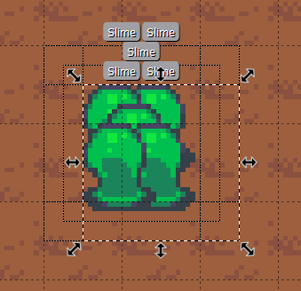
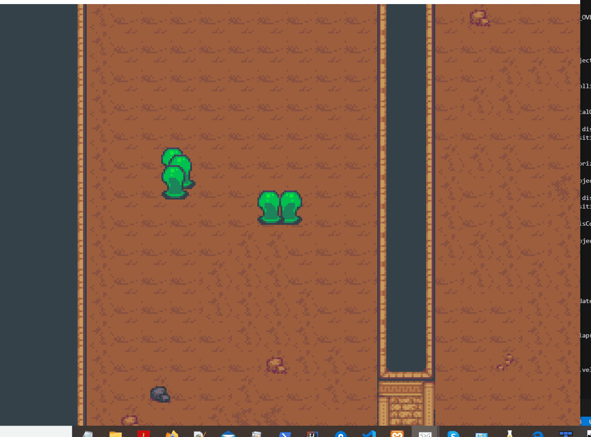

## 6.4. Collisions des ennemis
---

Bien que les collisions avec le niveau sont en place, nous devons gérer les collisions entre les objets afin d'assurer qu'il soit impossible de marcher à travers d'autres objets.

### Aucune collision avec les ennemis


Les collisions avec les objets vont aussi nous permettre d'endommager l'avatar.

Nous sommes capables de réutiliser le code pour les collisions avec le niveau avec quelques modifications afin de pouvoir gérer la collision avec les objets du monde.

---
> ### Étapes à suivre
> 1. ajoutez `getObjectCollisions` à `Collider` pour les collisions objet
> 2. ajoutez `isCollidingHorizontal` et `isCollidingVertical`
>     * Déterminez si collision avec *tilemap* ou objet.
> 3. modifiez la méthode `updateObject` afin de prendre en compte les collisions objets

```java
/* Collider.java */
package com.tutorialquest;
// import ..

public class Collider {

    // ...
    // AJOUT: Résultats de collision
    private List<PhysicalObject> results = new LinkedList<>();

    // ...

    // AJOUT:
    // Méthodes servant aux collisions objet
    public boolean getObjectCollisions(
        PhysicalObject object,
        float ofsx,
        float ofsy,
        List<PhysicalObject> results)
    {
        results.clear();
        PhysicalObject result;        

        for (Entity ent : Game.level.entities) {
            if (ent == object)
                continue;

            // Nous sommes seulement concernés par les objets physiques
            result = ent instanceof PhysicalObject ? (PhysicalObject) ent : null;

            if(result == null)
                continue;

            if(result.collider == null)
                continue;
                
            if (Intersector.overlaps(
                new Rectangle(
                    rect.x + MathUtils.round(ofsx),
                    rect.y + MathUtils.round(ofsy),
                    rect.width,
                    rect.height),
                result.collider.rect))
            {
                results.add(result);
            }
        }

        return !results.isEmpty();
    }

    // AJOUT:
    public boolean isCollidingHorizontal(
        PhysicalObject source, 
        float xvelocity, 
        float side) 
    {
        return
            isCollidingTilemapHorizontal(xvelocity, side) ||
            getObjectCollisions(source, xvelocity, 0, results);
    }

    // AJOUT:
    public boolean isCollidingVertical(
        PhysicalObject object, 
        float yvelocity, 
        float side) 
    {
        return
            isCollidingTilemapVertical(yvelocity, side) ||
            getObjectCollisions(object, 0, yvelocity, results);
    }

    // MODIF:
    public Vector2 updateObject(PhysicalObject object)
    {
        //--- Horizontal Collision ---//
        // MODIF:
        // if (isCollidingTilemapHorizontal(object, cvx, horizontalSide)) {
        if (isCollidingHorizontal(object, cvx, horizontalSide)) {
            for (int i = 0; i < Math.abs(cvx); i++) {         
                // MODIF:       
                // if (!isCollidingTilemapHorizontal(object, sx, horizontalSide)) {
                if (!isCollidingHorizontal(object, sx, horizontalSide)) {
                    object.position.x += sx;
                }
            }

            // J'annule la vélocité de l'objet afin qu'il ne puisse pas dépasser le mur
            object.velocity.x = 0;
        }

        //--- Vertical Collision ---//
        // ...

        return object.velocity;
    }
}

```


Malgré ces améliorations, un problème persiste lorsque les ennemis sont situés les uns sur les autres lors de l'initialisation. 




Nous pouvons facilement corriger ce problème. Il s'agit de détecter si l'objet entre en collision avec un autre et le déplacer par rapport à la distance entre ces deux objets.

---
> ### Étapes à suivre
> 1. ajoutez la méthode `fixObjectOverlap` pour empêcher l'intersection des ennemis lors de l'initialisation
> 2. utilisez `fixObjectOverlap` à l'intérieur de `updateObject`

```java

package com.tutorialquest;
// import ..

public class Collider {

    // ...

    // AJOUT:
    private float FIX_OVERLAP_SPEED = 1f;

    // ...

    // AJOUT:
    public void fixObjectOverlap(PhysicalObject object, )
    {
        if(getObjectCollisions(object, 0, 0, results))
        {
            for(PhysicalObject res : results)
            {
                float distx = Math.signum(object.position.x - res.position.x) * FIX_OVERLAP_SPEED;
                if (!isCollidingTilemapHorizontal(0, horizontalSide)) {
                    object.position.x += distx;
                }
                float disty = Math.signum(object.position.y - res.position.y) * FIX_OVERLAP_SPEED;
                if (!isCollidingTilemapVertical(0, verticalSide)) {
                    object.position.y += disty;
                }
            }
        }
    }

    // MODIF:
    public Vector2 updateObject(PhysicalObject object)
    {
        //AJOUT:
        fixObjectOverlap(object);
        
        // ...

        return object.velocity;
    }
}
```
