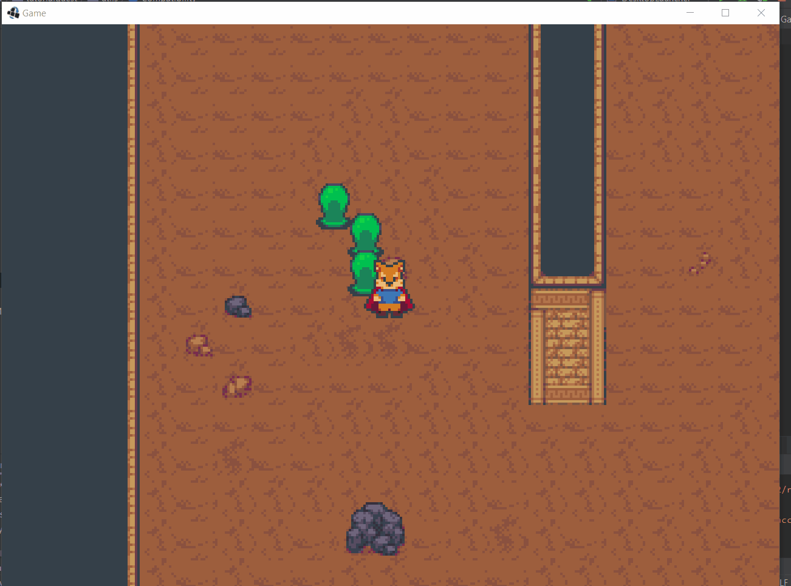

## 6.6. Identification des collisions
---

Afin de résoudre le problème d'identification des collisions, nous utilisons le *bitmask*


## 6.6.1. Bitmask
---
Comme vous le savez peut être, en informatique n'importe quel type de données est représenté à l'aide des *bits* 0 et 1. Par exemple le nombre entier `3` peut être écrit de la manière suivante.

`00000011`

Cependant, il est aussi possible d'utiliser une série de *bits* de manière créative afin de représenter un ensemble de configurations (*flags*) qui sont soit vraies ou fausses. Par exemple le bit le plus à droite peut représenter les collisions avec l'avatar (`FLAG_AVATAR`) Le deuxième bit peut représenter les collisions avec les ennemis (`FLAG_ENEMY`).

Le *masking* ou l'application d'un *bitmask* est une opération de logique binaire utilisée pour sélectionner dans un groupe de bits un sous-ensemble de bits à vérifier. Le pseudocode si dessous illustre les opérations essentielles pour le *masking*

l'opérateur `<<` permet de facilement initialiser des *flags*
```java
// (1 << 0) == 0b00000001
int FLAG_AVATAR = 1 << 0

// (1 << 1) == 0b00000010
int FLAG_ENEMY = 1 << 1

// (1 << 2) == 0b00000100
int FLAG_SOME_OTHER_THING = 1 << 2
```

l'operateur `|` sert à combiner la valeur de masques
```java
// (FLAG_AVATAR | FLAG_ENEMY) == 0b00000011
int CollisionFlags = FLAG_AVATAR | FLAG_ENEMY
```

L'opérateur `&` pour vérifier si les bit sont actifs:
```java
((CollisionFlags & FLAG_AVATAR) != 0) == true
((CollisionFlags & FLAG_ENEMY) != 0) == true
```

Puisque le *flag* de `FLAG_SOME_OTHER_THING` n'est pas actif:
```java
`((CollisionFlags & FLAG_SOME_OTHER_THING) != 0) == false`
```

---
> ### Étapes à suivre
> 1. Ajoutez `collisionFlags` à `Collider` afin d'ajouter un ensemble de *flags*
> 2. modifiez la méthode `getObjectCollisions` afin de collisionner seulement avec les objets spécifiez dans un masque
> 3. ajoutez un masque `COLLISION_AVATAR` au `collider` dans la classe `Avatar`
> 5. ajoutez un masque `COLLISION_ENEMY` au `collider` dans la classe `Enemy`
> 4. dans la méthode `collisionAttack` configurez l'attaque afin de seulement cibler l'avatar

```java
/* Collider.java */
package com.tutorialquest;
// import ..

public class Collider {

    public static final int FLAG_NONE = 0;
    public static final int FLAG_AVATAR = 1 << 0;
    public static final int FLAG_ENEMY = 1 << 1;
    
    // ...

    public int collisionFlags = FLAG_NONE;

    public Collider(
        Vector2 size,
        // AJOUT:
        int flags)
    {
        this();
        this.rect.setSize(size.x, size.y);
        this.collisionFlags = flags;
    }

    public boolean isCollidingHorizontal(
        PhysicalObject source, 
        float xvelocity, 
        float side, 
        // AJOUT:
        int collisionMask) 
    {
        // ..
    }

    // isCollidingVertical ... 

    public boolean getObjectCollisions(
        PhysicalObject object,
        float ofsx,
        float ofsy,
        // AJOUT:
        int collisionMask,
        List<PhysicalObject> results)
    {
        // ...

        // AJOUT:
        if(collisionMask == 0) return false;

        for (Entity ent : Game.level.entities) {
            if (ent == object)
                continue;

            // ...

            // AJOUT: Si le `flag` du masque n'est pas actif, on ignore la collision
            if((result.collider.collisionFlags & collisionMask) == 0)
                continue;

            if (Intersector.overlaps(
                new Rectangle(
                    rect.x + MathUtils.round(ofsx),
                    rect.y + MathUtils.round(ofsy),
                    rect.width,
                    rect.height),
                result.collider.rect))
            {
                results.add(result);
            }
        }

        return !results.isEmpty();
    }

    public Vector2 updateObject(
        PhysicalObject object,
        // AJOUT:
        int collisionMask)
    {
        // ...
        return object.velocity;
    }
}

```

```java
/* Enemy.java */
package com.tutorialquest.entities;
// import ..

public class Enemy extends Character{

    // ..

    public Enemy(Vector2 position) {
        super(position);
        collider = new Collider(
            new Vector2(
                -Collider.DEFAULT_SIZE.x / 2,
                -Collider.DEFAULT_SIZE.y / 10),
            Collider.DEFAULT_SIZE,
            // AJOUT:
            Collider.FLAG_ENEMY);
    }

    // ..

}
```

```java
/* Avatar.java */
package com.tutorialquest.entities;
// import ..

public class Avatar extends Character{

    // ..

    public Avatar(Vector2 position) {
        super(position);
        collider = new Collider(
            new Vector2(
                -Collider.DEFAULT_SIZE.x / 2,
                -Collider.DEFAULT_SIZE.y / 8),
            Collider.DEFAULT_SIZE,
            // AJOUT:
            Collider.FLAG_AVATAR);
    }

    // ..
}
```
Nos pauvres ennemis auront enfin peut-être une chance contre notre valeureux héros!

