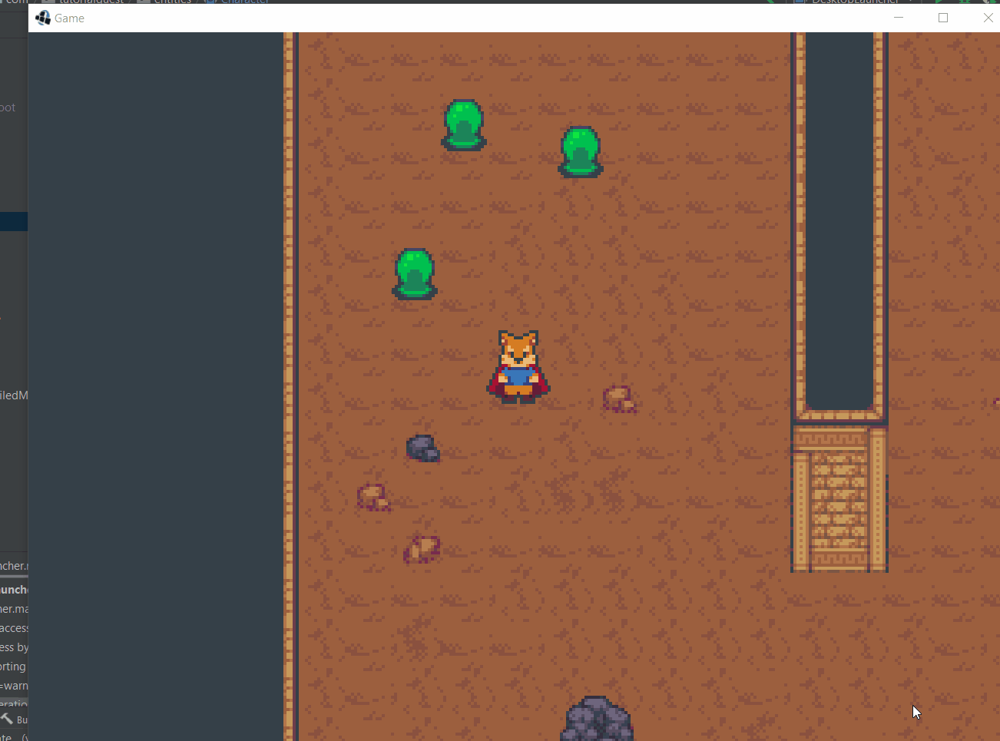

## 6.7 Impact de l'attaque
---

Notre héros ne semble nullement impressionné par les attaques des ennemis; il ne bouge pas d'un poil!



Ajoutons une touche d'agressivité à nos ennemis avec un impact à leurs attaques qui va propulser le joueur.

---
> ### Étapes à suivre
> À l'intérieur de `PhysicalObject`

> 1.  La valeur de `velocity` doit être calculé avec `pushedVelocity` et `locomotionVelocity` 
> 2. Utilisez `PUSH_DECELERATION` afin de réduire `pushedVelocity` lorsqu'aucun contact n'est détecté

```java
/* PhysicalObject.java */
package com.tutorialquest.entities;
// import ..

public class PhysicalObject extends Entity {
    // ...

    // AJOUT:
    private float PUSH_RESISTANCE = 0.25f;
    public static final float PUSH_DECELERATION = 0.4f;
    private static final float UNPUSHED_TIME_LIMIT = 0.05f;

    private float unpushedTime = 0;
    public Vector2 pushedVelocity = new Vector2();
    public Vector2 locomotionVelocity = new Vector2();
    public Vector2 velocity = new Vector2();

    // ...

    // AJOUT:
    // La valeur de `velocity` doit être calcule 
    // avec `pushedVelocity` et `locomotionVelocity` 
    public void updateVelocity(float deltaTime) {
        velocity
            .setZero()
            .add(locomotionVelocity)
            .add(pushedVelocity)
            .scl(deltaTime);
    }

    public void onPushed(PhysicalObject source, Vector2 incomingPushVelocity) {
        unpushedTime = 0;
        incomingPushVelocity.scl(1f - getPushResistance());
        pushedVelocity.set(incomingPushVelocity);
    }

    @Override
    public void update(float deltaTime) {
        if (unpushedTime >= UNPUSHED_TIME_LIMIT) pushedVelocity.lerp(Vector2.Zero, PUSH_DECELERATION);
        else unpushedTime += deltaTime;
    }

}

```

---
> ### Étapes à suivre
> 1. ajoutez la `direction` et `knockback` à `DirectAttack` 
> 2. à l'intérieur de `Character`, modifiez `onAttacked` pour ajouter un `knockback`
> 3. à l'intérieur de `Enemy`, calculez la direction de l'attaque

```java
/* DirectAttack.java */
package com.tutorialquest;
// import ..

public class DirectAttack
{
    public float damage = 10;
    public float knockback = 10f;
    public Vector2 direction;
    
    public DirectAttack(Vector2 direction, float damage, float knockback)
    {
        this.knockback = knockback;
        this.damage = damage;
        this.direction = direction;
    }
}
```

```java
/* Character.java */
package com.tutorialquest.entities;
// import ..

public abstract class Character extends PhysicalObject {

     // MODIF:
    @Override
    public void onAttacked(IAttack attack) {        
        // AJOUT:
        onPushed(
            this,
            new Vector2(attack.getDirection())
                .scl(attack.getKnockback()));

        health -= attack.getDamage();
        if (health <= 0) {
            health = 0;
            onDefeated();
        }
    }
}

```

```java
/* Enemy.java */
package com.tutorialquest.entities;
// import ..

public abstract class Enemy extends Character {

    // ...    
    public void collisionAttack(int mask) {
        List<PhysicalObject> results = new LinkedList<>();
        if (collider.getObjectCollisions(
            this,
            velocity.x,
            velocity.y,
            mask,
            results))
        {
            // AJOUT
            Vector2 collisionDirection = new Vector2(velocity).nor();            
            results.iterator().next()
                .onAttacked(new DirectAttack(
                    damage,
                    // AJOUT:
                    collisionDirection,                   
                    knockback));
        }
    }
}
```
