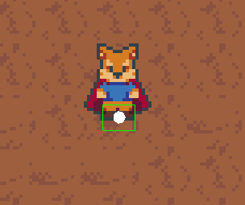
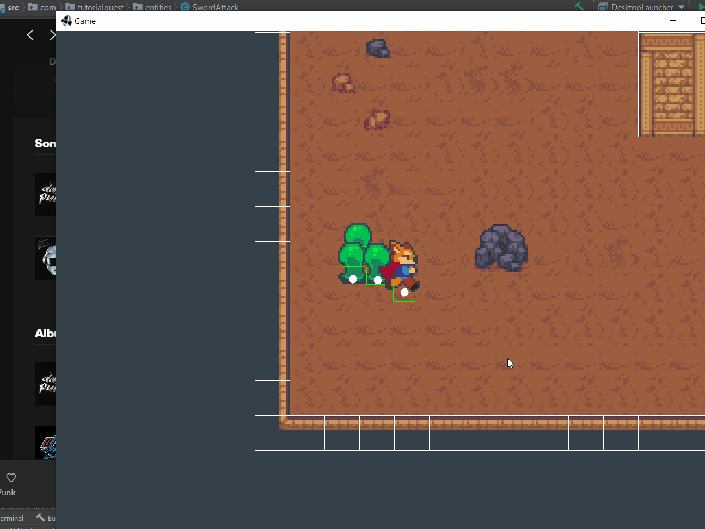

# 7.1 Attaque de l'avatar

> | Téléchargement fichiers référence |
> | ------------- |:-------------:|
> | <a href="" download>desktop.zip</a> |
> | <a href="" download>core.src.zip</a> |
> | <a href="" download>core.assets.zip</a> |

Nous avons déjà créé une classe `Attack` afin de représenter une attaque infligée par un ennemi. Cependant contrairement à la classe `Attack`, l'attaque effectue par l'avatar ne partage pas le même `Collider` que l'avatar lui-même. Une manière naïve d'implémenter cette capacité d'attaque serait de gérer les attaques instantanées (`DirectAttack`) et les attaques physiques (`SwordAttack`) différemment. Cependant, une interface nous permet de résoudre le problème de manière plus élégante.



---
> ### Étapes à suivre
> 1. Ajoutez un interface `IAttack`
> 2. Renommez la classe `Attack` par `DirectAttack`
> 3. Ajoutez la classe `SwordAttack` qui dérive de `Entity` et implantez les composantes de `IAttack`

```java
/* IAttack.java */
package com.tutorialquest;
// import ..

public interface IAttack {
    
    float getDamage();
    float getKnockback();
    Vector2 getDirection();
}
```

```java
/* DirectAttack.java */
package com.tutorialquest;
// import ..

// MODIF:
// public class DirectAttack
public class DirectAttack implements IAttack
{
    // ...
}
```

```java
/* SwordAttack.java */
package com.tutorialquest.entities;
// import ..

public class SwordAttack extends PhysicalObject implements IAttack
{
    protected Vector2 direction;
    private float damage = 10;
    private float knockback = 40f;        

    public float getDamage() {return damage;}
    public float getKnockback() {return knockback; }
    public Vector2 getDirection() { return direction;}

    public SwordAttack(
        Vector2 position,
        Vector2 direction,
        float damage,
        float knockback,
        int mask)
    {
        super(position);
        
        this.collider = new Collider(
            new Vector2(
                WIDTH, 
                HEIGHT),
            Collider.FLAG_NONE);
        
        this.collider.origin = new Vector2(
            WIDTH/2, 
            HEIGHT/2);

        this.knockback = knockback;
        this.damage = damage;
        this.direction = direction;
        this.mask = mask;
    }
}
```
Il est aussi important de s'assurer que chaque attaque ne soit pas effective indéfiniment. Nous devons donc imposer une limite de temps à la classe `SwordAttack` après laquelle l'attaque est retirée du monde.

---
> ### Étapes à suivre
> 1. dans la méthode `update`, vérifiez pour les collisions avec un ennemi
> 2. ajoutez une limite de temps après lequel l'attaque est retirée du monde.

```java
/* SwordAttack.java */
package com.tutorialquest.entities;
// import ..

public class SwordAttack extends PhysicalObject implements IAttack
{   
    // AJOUT:
    // Variables de contrôle pour imposer une limite de temps
    private float timeLimit = 0.2f;
    private float elapsedTime = 0f;

    // AJOUT:
    // `hits` contient les ennemis déjà attaques
    private List<PhysicalObject> hits = new LinkedList<>();

    // ..    
    
    // AJOUT:
    @Override
    public void update(float deltaTime) {
        super.update(deltaTime);
        collider.update(position);
        List<PhysicalObject> collisionResults = new LinkedList<>();
        collider.getObjectCollisions(
            this,
            0,
            0,
            mask,
            collisionResults);

        // Endommagez les objets avec lesquels l'attaque rentre en contact
        for(PhysicalObject result : collisionResults)
        {
            if(hits.contains(result))
                return;

            result.onAttacked(this);
            hits.add(result);
        }

        // Retirez l'attaque si la limite de temps expire
        elapsedTime += deltaTime;
        if(elapsedTime > timeLimit) {
            Game.level.remove(this);
            finished = true;
        }
    }
}
```
Finalement, ajoutons le code qui gère la création de l'attaque depuis l'avatar. Il s'agit d'instancier l'attaque en avant du personnage. Puisque l'attaque n'est sous forme de carre, nous cherchons à redimensionner la boîte de collision dépendamment de l'orientation du personnage.

---
> ### Étapes à suivre
> 1. ajoutez la méthode `attack` dans `Avatar` qui est invoqué dans `update`
> 2. ajoutez la méthode `cancelAttack` afin de permettre qu'une attaque en maintenant. 


```java
package com.tutorialquest.entities;
//import ..

public class Avatar extends Character {
    // ...
    private static final float ATTACK_RANGE = 8f;    
    protected static final float DAMAGE = 4f;
    protected static final float KNOCKBACK = 200;    
    
    // AJOUT:
    private SwordAttack attack;
    // ...
    public void attack() { 
        // On annule l'attaque 
        // lorsque le personnage change de direction
        if (
            attack != null && 
            !attack.direction.epsilonEquals(Utils.toVector(fixedDirection)))
        {
            cancelAttack();
        }

        // On détermine les dimensions et la position de l'attaque          
        // selon la direction du personnage
        
        // Pour la position:
        Vector2 attackOffset =
            fixedDirection == Utils.Direction.LEFT ||
                fixedDirection == Utils.Direction.RIGHT ?
                new Vector2(ATTACK_RANGE, 0)
                    .scl(fixedDirection == Utils.Direction.RIGHT ? 2 : -2) :
                new Vector2(0, ATTACK_RANGE)
                    .scl(fixedDirection == Utils.Direction.UP ? 2 : -2);
        
        // Pour la dimension:
        Vector2 attackSize =
            fixedDirection == Utils.Direction.LEFT ||
                fixedDirection == Utils.Direction.RIGHT ?
                new Vector2(SwordAttack.HEIGHT, SwordAttack.WIDTH) :
                new Vector2(SwordAttack.WIDTH, SwordAttack.HEIGHT);

        // Ajoute une attaque dans le monde lorsque
        // le joueur appui sur la touche requise
        if (input.isAttackJustPressed()) 
        {
            cancelAttack();
            Game.level.add(
                attack = new SwordAttack(
                    new Vector2(position).add(attackOffset),
                    Utils.toVector(fixedDirection),
                    damage,
                    knockback,
                    Collider.FLAG_ENEMY
                ));
        }

        if (attack != null) {
            if (attack.finished) {
                cancelAttack();
                return;
            }

            attack.position
                .set(position)
                .add(attackOffset);
            attack.resize(attackSize);
        }
    }

    public void cancelAttack() {
        if (attack != null) {
            Game.level.remove(attack);
            attack = null;
        }
    }


    @Override
    public void update(float deltaTime) {
        super.update(deltaTime);
        control(deltaTime);
        turn();
        updateVelocity(deltaTime);
        push(Collider.FLAG_PUSHABLE);
        move();
        // AJOUT:
        attack();
    }
}
```

