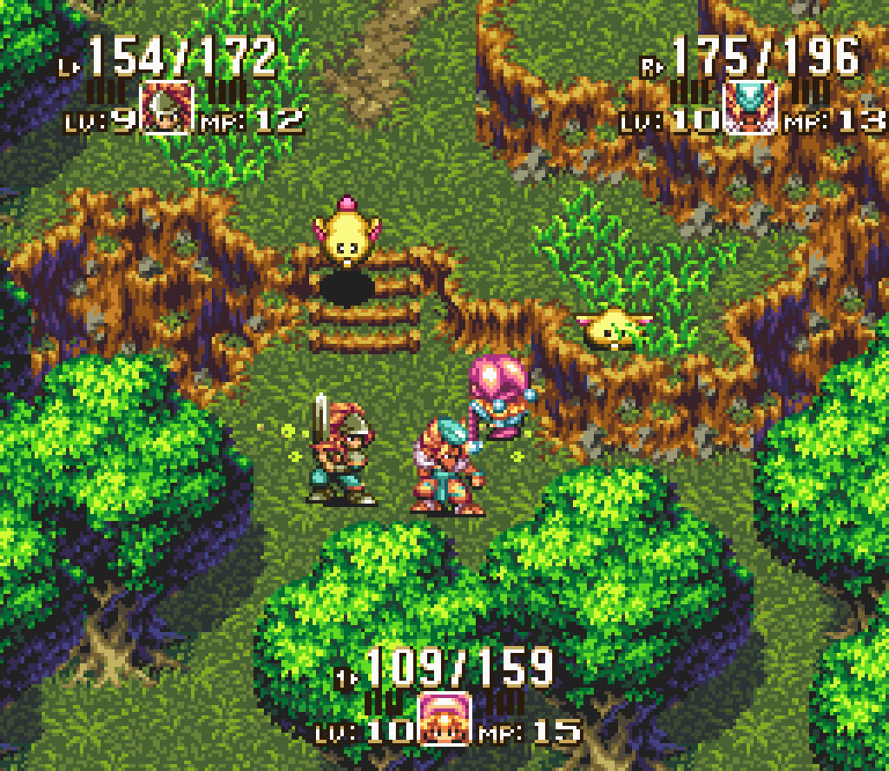
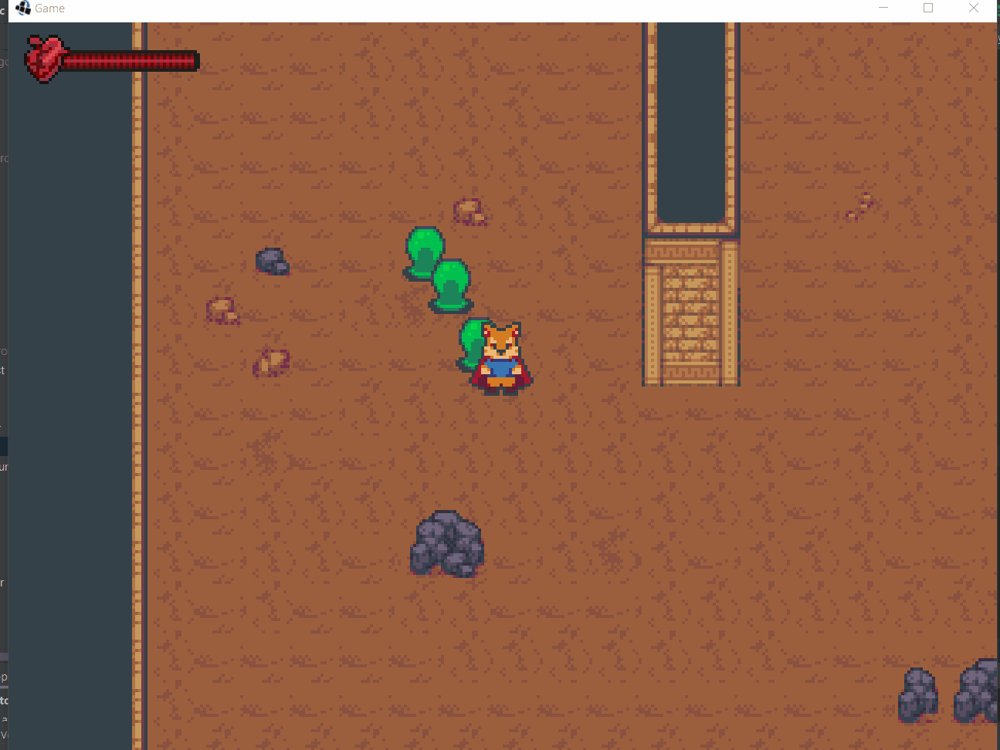

# 9.1 HUD
> | Téléchargement fichiers référence |
> | ------------- |:-------------:|
> | <a href="" download>desktop.zip</a> |
> | <a href="" download>core.src.zip</a> |
> | <a href="" download>core.assets.zip</a> |

L'interface graphique, rassemble les composantes essentielles à la compréhension du jeu, mais qui n'existe pas dans le monde jeu. En particulier, nous désignons le tableau de bord *HUD* (*Head-up display*) comme l'ensemble des informations affichées en périphérie de l'écran et renseignant le joueur concernant le score, points de vie de son personnage, nombre de munitions restantes, etc.

### **Interface graphique Secret of Mana**[^1]


Afin de maintenir le tableau de bord à l'écran, il est avantageux d'utiliser une camera secondaire fixe différente de celle qui suit le personnage. Par la suite, il est simplement question d'afficher le résultat des deux caméras l'un par-dessus l'autre.

---
> ### Étapes à suivre
> 1. créez la classe `HealthBar` utilise pour représenter la barre de vie
>    * Utilisez deux textures pour afficher le conteneur et le contenu de la barre de vie.
>    * Utilisez la classe `TextureRegion` afin d'afficher une région proportionnelle aux nombres de points de vie restant à l'avatar
> 2. à l'intérieur de la classe `HUD`
>    * créez la camera responsable pour le rendu de l'interface 
>    * créez une nouvelle instance de `SpriteBatch` réservé à l'interface
>    * Incorporez l'élément `HealthBar` au tableau de bord
> 3. incorporez l'interface à l'intérieur de `Game`

```java
/* HealthBar.java */
package com.tutorialquest.ui;
// import ..

public class HealthBar {

    private TextureRegion[][] healtBarTextures;
    private Texture hearthTexture;
    private float fillAmount = 1;

    public HealthBar(){
        // Chargement des textures
        healtBarTextures = TextureRegion.split(new Texture("ui/health_spritesheet.png"), 64, 16);
        hearthTexture = new Texture("objects/heart_icon.png");
    }

    public void render(SpriteBatch spriteBatch, Vector2 position)
    {
        spriteBatch.begin();
        
        // Affichage de l'arrière (Conteneur)
        spriteBatch.draw(
            healtBarTextures[0][0],
            position.x,
            position.y,
            64,
            16);
        
        // Création de la région proportionnelle
        // a la valeur de `fillAmount`
        TextureRegion fillRegion = new TextureRegion(
            healtBarTextures[0][1],
            0,
            0,
            (int) (healtBarTextures[0][1].getRegionWidth() * fillAmount),
            healtBarTextures[0][1].getRegionHeight());

        // Affichage du contenu (Contenu)
        spriteBatch.draw(
            fillRegion,
            position.x,
            position.y,
            fillRegion.getRegionWidth(),
            fillRegion.getRegionHeight());

        // Affichage de l'icône
        spriteBatch.draw(
            hearthTexture,
            position.x - 4,
            position.y,
            16,
            16);

        spriteBatch.end();
    }

    // Mise à jour du bar de vie proportionnellement aux points de vie restants
    public void onAvatarHealthChanged(Character character) {
        fillAmount = character.health / character.maxHealth;
    }

}
```
```java
/* HUD.java */
package com.tutorialquest.ui;
// import ..

public class HUD {

    // Création d'une camera secondaire pour l'interface 
    private OrthographicCamera camera;
    // Création du SpriteBatch
    private SpriteBatch spriteBatch = new SpriteBatch();
    // Création de la bar de vie
    private HealthBar healthBar = new HealthBar();    

    public float getScaledWidth(){
        return Game.VIEWPORT_WIDTH * camera.zoom;
    }

    public float getScaledHeight(){
        return Game.VIEWPORT_HEIGHT * camera.zoom;
    }

    public HUD() {
        // Configuration de la caméra (dimensions + zoom)     
        camera = new OrthographicCamera(
            Game.VIEWPORT_WIDTH, 
            Game.VIEWPORT_HEIGHT);
        camera.zoom = 1f/4f;
    }

    public void update(float deltaTime) {
        camera.update();
    }

    public void render() {

        spriteBatch.setProjectionMatrix(camera.combined);

        Vector2 position;

        // Puisque la camera désigne le centre de l'écran, calcul de la position dans le coin haut à gauche
        position = new Vector2(
            camera.position.x - (getScaledWidth()/2) + 8 ,
            camera.position.y + (getScaledHeight()/2) - 12);
        
        // Affichage de la barre de vie
        healthBar.render(
            spriteBatch,
            position);
    }

    public void onAvatarHealthChanged(Character character) {
        healthBar.onAvatarHealthChanged(character);
    }
}
```

```java
/* Game.java */
package com.tutorialquest;
// AJOUT:
import com.tutorialquest.ui.HUD;
// import ...

public class Game extends ApplicationAdapter {

    // ...
    
    // AJOUT:
    public static HUD hud;

    @Override
    public void create() {
        Gdx.graphics.setWindowedMode(VIEWPORT_WIDTH, VIEWPORT_HEIGHT);
        // AJOUT:
        hud = new HUD();    
    }

    @Override
    public void render() {
        GLUtils.glClearColor(CORNFLOWER_BLUE);
        Gdx.gl.glClear(GL20.GL_COLOR_BUFFER_BIT);

        // ...

        // AJOUT:
        hud.update(Gdx.graphics.getDeltaTime());

        // ...

        // AJOUT:
        hud.render();
    }
}

```



[^1]: https://store.steampowered.com/app/637670/Secret_of_Mana/