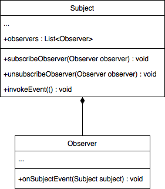
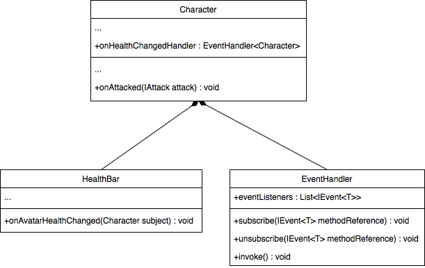

## 9.2 HUD
---
La deuxième étape concernant l'interface est de connecter les visuels à la logique de jeu. Entre autres cela concerne mettre à jour la barre de vie lorsque le joueur est endommage.

Une technique répandue pour résoudre ce genre de problème est d'utiliser le modèle **du sujet et de l'observateur**.



Le modèle de l'observateur permet la gestion simplifiée d'observateurs multiples sur un même sujet observable. Il s'agit d'enregistrer les instances de `Observer` à l'intérieur de `Subject` à l'aide d'une méthode `subscribe`. Lorsqu'un événement d'intérêt survient, notifier les observateurs à l'aide d'une méthode `invoke`.

Nous adaptons ce modèle à notre interface graphique. La barre de vie (`HealthBar`) réagit aux changements des points de vie de l'avatar (`Character`). Afin de faciliter l'enregistrement, des observateurs nous utilisons `onHealthChangedHandler` de la classe `EventHandler`.



```java
/* Character.java */
package com.tutorialquest.entities;
// import ..

public abstract class Character extends PhysicalObject {    
    // ...
    @Override
    public void onAttacked(IAttack attack) {        
        // ...
        health -= attack.getDamage();

        // AJOUT:
        onHealthChangedHandler.invoke(this);
        if (health <= 0) {
            health = 0;
            onDefeated();
        }
    }

    public void heal(float value) {
        // ...
        health += value;
        if (health >= maxHealth) health = maxHealth;
        
        // AJOUT:
        onHealthChangedHandler.invoke(this);
    }
}
```

```java
/* Avatar.java */
package com.tutorialquest.entities;
// import ..

public class Avatar extends Character {

    // ..

    // AJOUT:
    @Override
    public void start() {
        super.start();

        // AJOUT:
        // Enregistrement de `HealthBar` afin l'élément 
        // soit mis à jour lorsque les points de vie changent
        onHealthChangedHandler.subscribe(Game.hud::onAvatarHealthChanged);
    }

    // ..
}
```

```java
/* HUD.java */
package com.tutorialquest.ui;
// import ..

public class HUD
{
    // ...
    
    // AJOUT:
    public void onAvatarHealthChanged(Character character) {
        healthBar.onAvatarHealthChanged(character);
    }

    // ...
}
```

```java
/* HealthBar */
package com.tutorialquest.ui;
// import ..

public class HealthBar
{
    private float fillAmount = 1;

    // ... 

    public void render(SpriteBatch spriteBatch, Vector2 position, float scale)
    {
        // ...

        TextureRegion fillRegion = new TextureRegion(
            healtBarTextures[0][1],
            0,
            0,
            // MODIF:
            // healtBarTextures[0][1].getRegionWidth(),
            (int) (healtBarTextures[0][1].getRegionWidth() * fillAmount),
            healtBarTextures[0][1].getRegionHeight());
    
        // ...    
    }

    public void onAvatarHealthChanged(Character character) {
        fillAmount = character.health / character.getMaxHealth();
    }

    // ...
}
```

